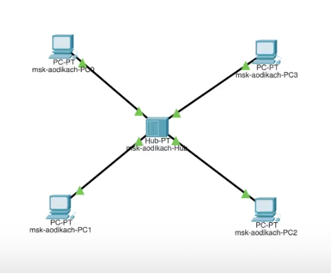
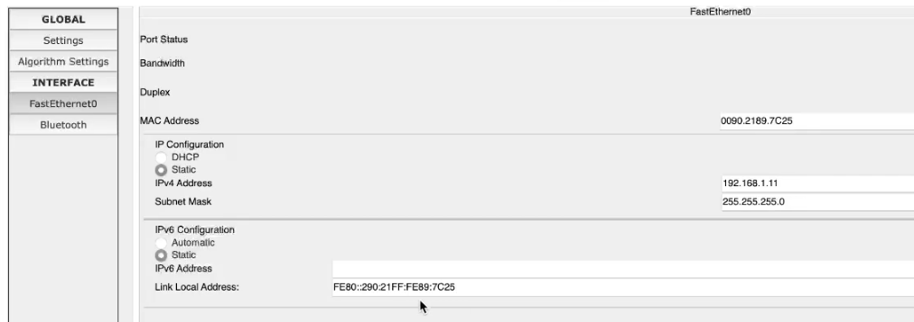
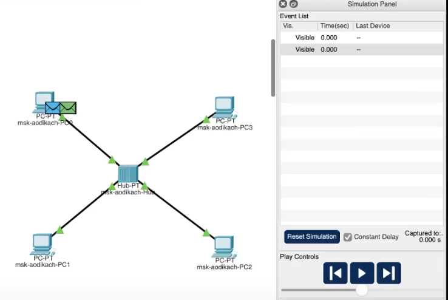
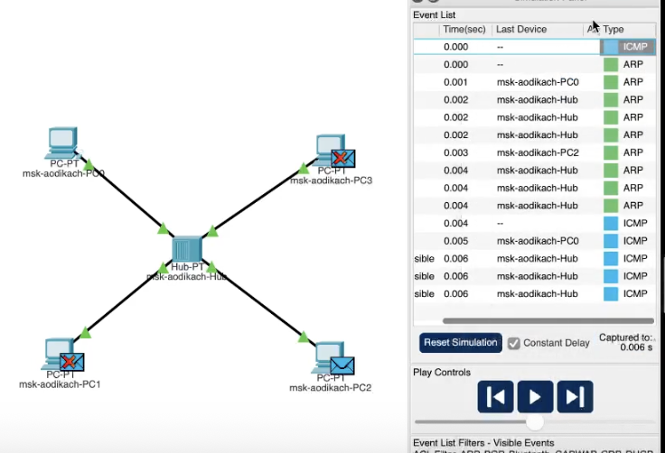

---
## Front matter
lang: ru-RU
title: Лабораторная работа №1
subtitle: Администрирование локальных сетей
author:
  - Дикач А.О.
institute:
  - Российский университет дружбы народов, Москва, Россия
date: 15 февраля 125

## i18n babel
babel-lang: russian
babel-otherlangs: english

## Formatting pdf
toc: false
toc-title: Содержание
slide_level: 2
aspectratio: 169
section-titles: true
theme: metropolis
header-includes:
 - \metroset{progressbar=frametitle,sectionpage=progressbar,numbering=fraction}
---

# Информация

## Докладчик

  * Дикач Анна Олеговна
  * НПИбд-01-22 (1132222009)
  * Российский университет дружбы народов
  * <https://github.com/chelibos?tab=repositories>

## Цель работы

Установка инструмента моделирования конфигурации сети Cisco Packet Tracer, знакомство с интерфейсом.

# Выполнение лабораторной работы

## Воссаздаю топологию из лабораторной работы, задаю статичные IP-адреса

{#fig:001 width=30%}

{#fig:002 width=30%}

## Перехожу в режим симуляции, выбираю на панели инструментов мышкой «Add Simple PDU (P)» и щёлкаю сначала на PC0, затем на PC2

{#fig:003 width=50%}

## Запуск симуляции

{#fig:004 width=50%}

