---
## Front matter
title: "Лабораторная работа №1"
subtitle: "Админимстрирование локальных сетей"
author: "Дикач Анна Олеговна НПИбд-01-22"

## Generic otions
lang: ru-RU
toc-title: "Содержание"

## Bibliography
bibliography: bib/cite.bib
csl: pandoc/csl/gost-r-7-0-5-2008-numeric.csl

## Pdf output format
toc: true # Table of contents
toc-depth: 2
lof: true # List of figures
lot: true # List of tables
fontsize: 12pt
linestretch: 1.5
papersize: a4
documentclass: scrreprt
## I18n polyglossia
polyglossia-lang:
  name: russian
  options:
	- spelling=modern
	- babelshorthands=true
polyglossia-otherlangs:
  name: english
## I18n babel
babel-lang: russian
babel-otherlangs: english
## Fonts
mainfont: IBM Plex Serif
romanfont: IBM Plex Serif
sansfont: IBM Plex Sans
monofont: IBM Plex Mono
mathfont: STIX Two Math
mainfontoptions: Ligatures=Common,Ligatures=TeX,Scale=0.94
romanfontoptions: Ligatures=Common,Ligatures=TeX,Scale=0.94
sansfontoptions: Ligatures=Common,Ligatures=TeX,Scale=MatchLowercase,Scale=0.94
monofontoptions: Scale=MatchLowercase,Scale=0.94,FakeStretch=0.9
mathfontoptions:
## Biblatex
biblatex: true
biblio-style: "gost-numeric"
biblatexoptions:
  - parentracker=true
  - backend=biber
  - hyperref=auto
  - language=auto
  - autolang=other*
  - citestyle=gost-numeric
## Pandoc-crossref LaTeX customization
figureTitle: "Рис."
tableTitle: "Таблица"
listingTitle: "Листинг"
lofTitle: "Список иллюстраций"
lotTitle: "Список таблиц"
lolTitle: "Листинги"
## Misc options
indent: true
header-includes:
  - \usepackage{indentfirst}
  - \usepackage{float} # keep figures where there are in the text
  - \floatplacement{figure}{H} # keep figures where there are in the text
---

# Цель работы

Установка инструмента моделирования конфигурации сети Cisco Packet Tracer, знакомство с интерфейсом.

# Выполнение лабораторной работы

1. Воссаздаю топологию из лабораторной работы, задаю статичные IP-адреса (рис. [-@fig:001]) (рис. [-@fig:002]).

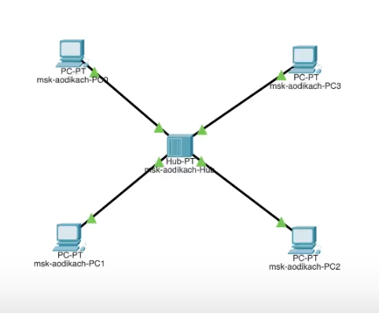{#fig:001 width=50%}

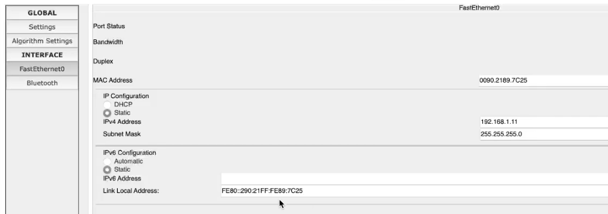{#fig:002 width=50%}

2. Перехожу в режим симуляции, выбираю на панели инструментов мышкой «Add Simple PDU (P)» и щёлкаю сначала на PC0, затем на PC2.
Запускаю симуляцию. (рис. [-@fig:003]) (рис. [-@fig:004]).

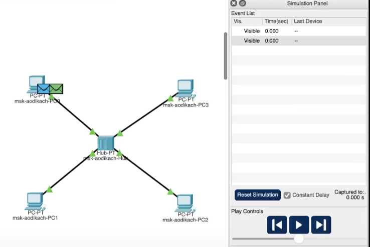{#fig:003 width=50%}

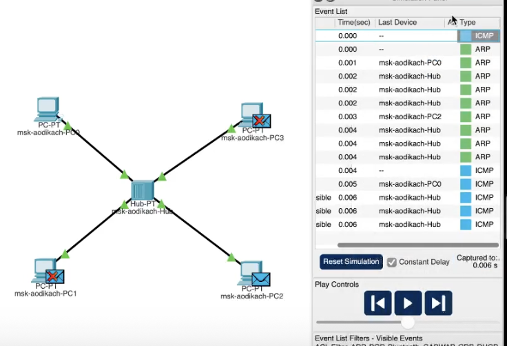{#fig:004 width=50%}

3. Анализируем инфрмацию из окна OSI. Вначале пакет передаётся концетратору, далее рассылается остальным пк (рис. [-@fig:005]).

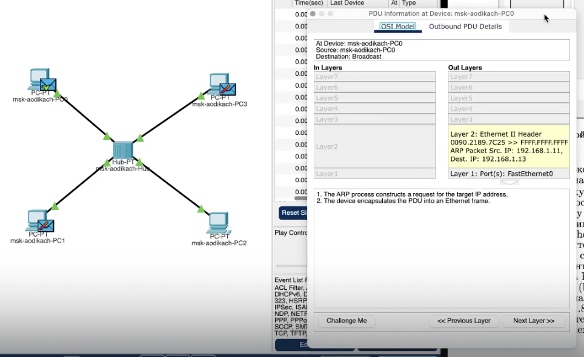{#fig:005 width=50%}

4. Открываю окно с информацией о PDU в котором рассказывается про пакет ICMP. В вкладке отображается преамбула, SFD, адрес получателя,
MAC-адрес 0080.2189.7C25, тип протокола уровня и frame check sequence.  (рис. [-@fig:006]).

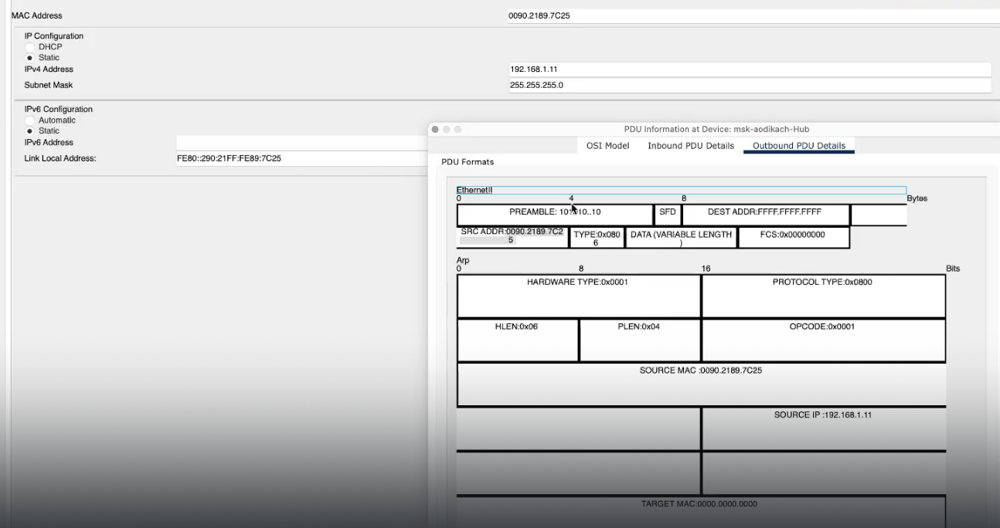{#fig:006 width=50%}

5. Очищаю сценарий и использую инструмент «Add Simple PDU (P)» не только на 1 и 2 пк, но и на 2 и 1.
В результате данных действий при запуске сценария появляются коллизии (=> потеря данных). Это из-за того что концетратор может передавать только 1 пакет (рис. [-@fig:007]) (рис. [-@fig:008]).

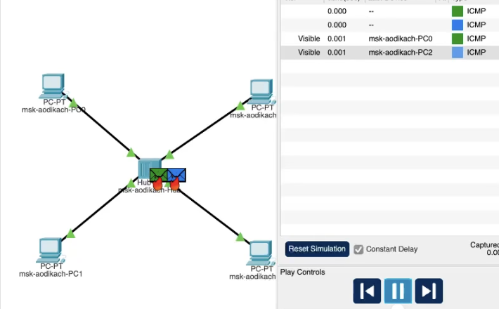{#fig:007 width=50%}

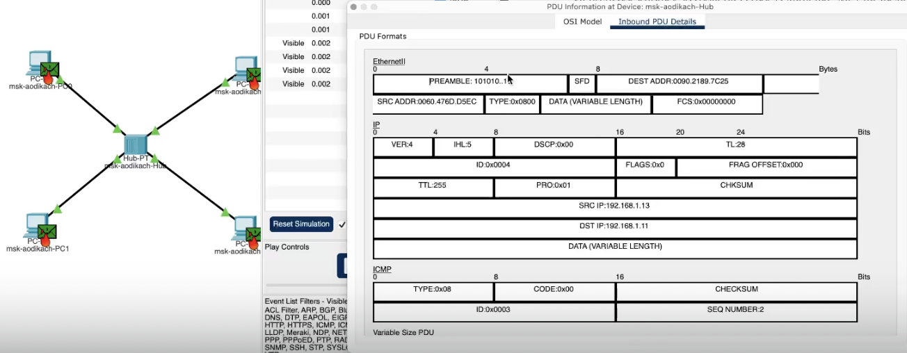{#fig:008 width=50%}

6. Выхожу из режима реального времени и добавляю новую топологию с коммутатором. Назначаю IP-адреса (рис. [-@fig:009]) (рис. [-@fig:010]).

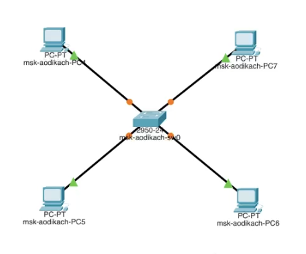{#fig:009 width=50%}

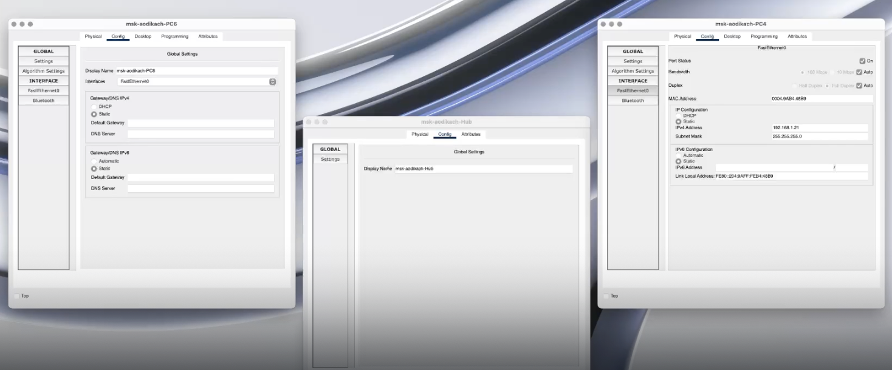{#fig:010 width=50%}

7. Перехожу в режим симуляции и добавляю «Add Simple PDU (P)» на 4 и 6 пк. Запускаю сценарий. В отличии от работы с концетратором направляется только устройству назначения.
Исследуем структуру ICMP-пакета. Сначала в PDU содержится заголовок IP с адресами источника и назначения, а также заголовок ICMP, включающий тип пакета, код, контрольную сумму, идентификатор и порядковый номер. Эти заголовки остаются неизменными при передаче.
Далее в Ethernet-кадре мы видим преамбулу, SFD, адрес назначения и источника, тип протокола, последовтельность. Данный пакет должен отправлять на коммутатор с MAC-адресом.
Очищаю сценарий и использую инструмент «Add Simple PDU (P)» не только на 4 и 6 пк, но и на 6 и 4. Колизий не возникает так как коммутатор может сразу передавать несколько пакетов (рис. [-@fig:011])(рис. [-@fig:013])(рис. [-@fig:015]). 

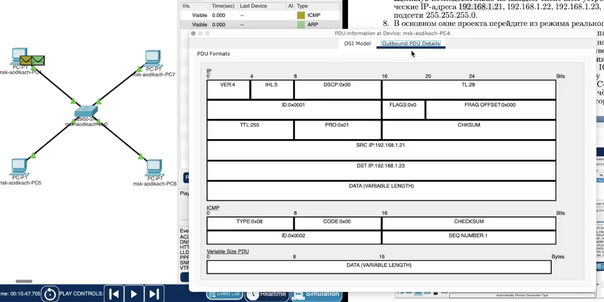{#fig:011 width=50%}

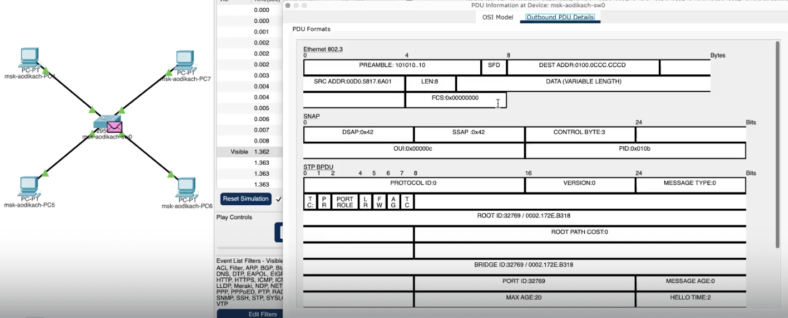{#fig:013 width=50%}

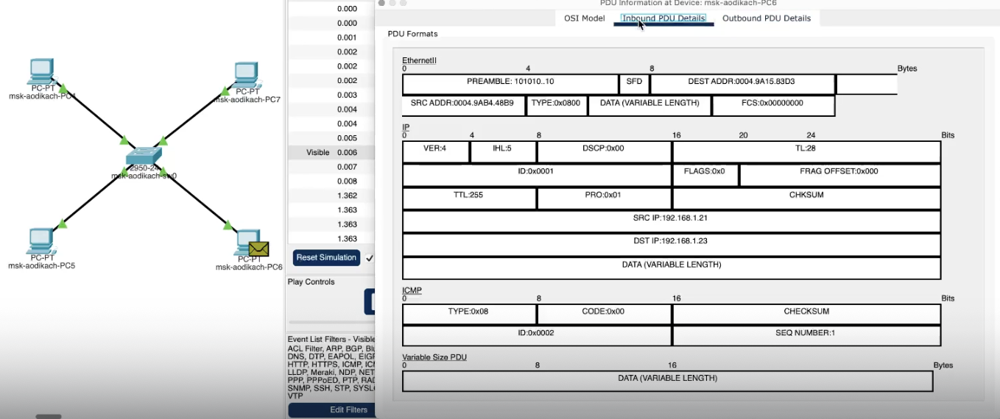{#fig:015 width=50%}

8.Перехожу в режим реального времени. Соединяю концетратор и коммутатор. Пакет, отправленый от концетратора исчезает, в то время как пакет отправленный через коммутатор остаётся на месте.
 (рис. [-@fig:017]). 

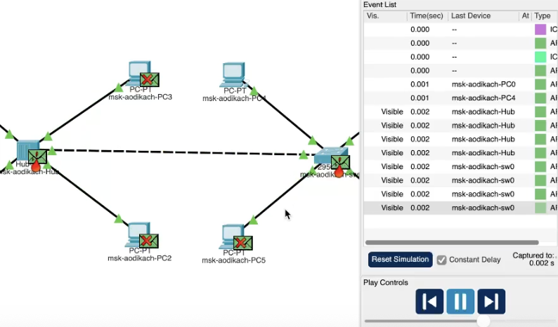{#fig:017 width=50%}

9. Очищаю сценарий и запускаю его заново чтобы получить пакеты STP. В них указаны преамбула и mac-адреса.(рис. [-@fig:018]). 

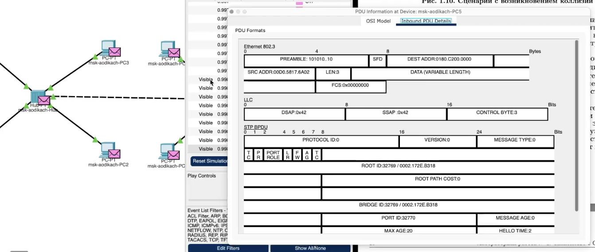{#fig:018 width=50%}

10. Очищаю сценарий и добавляю маршрутизатор. Назначаю IP-адрес и активируем порт. Перехожу в режим моделирования (рис. [-@fig:019]) (рис. [-@fig:020]). 

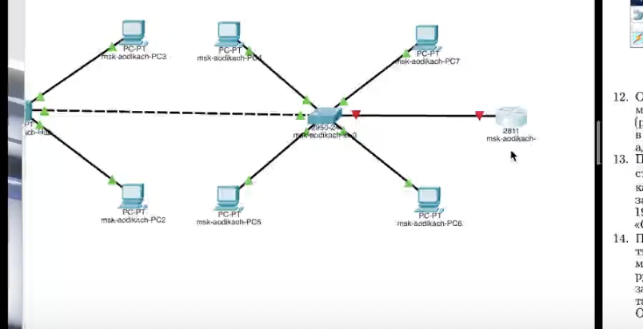{#fig:019 width=50%}

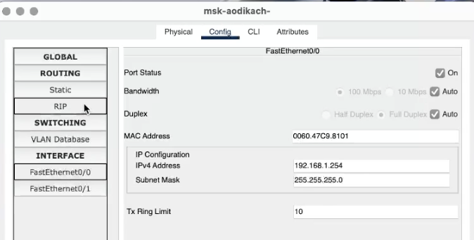{#fig:020 width=50%}

11. Изучаю структуру ARP, ICMP, STP и CDP. Она совпадает со структурой выше (рис. [-@fig:022]). 

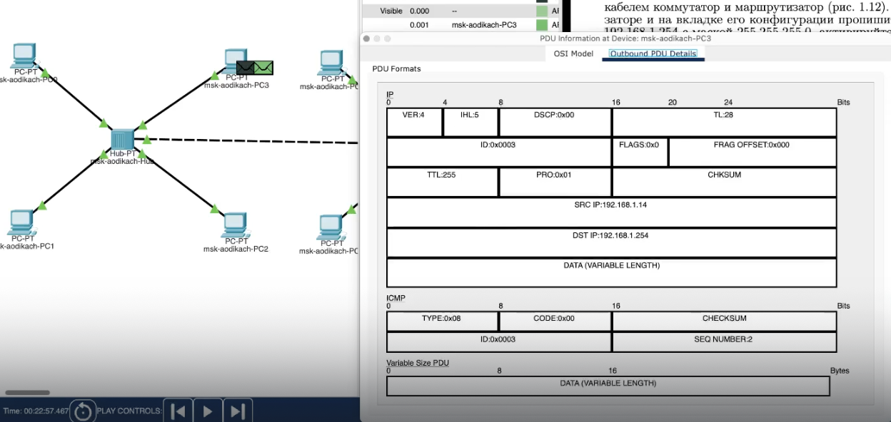{#fig:022 width=50%}

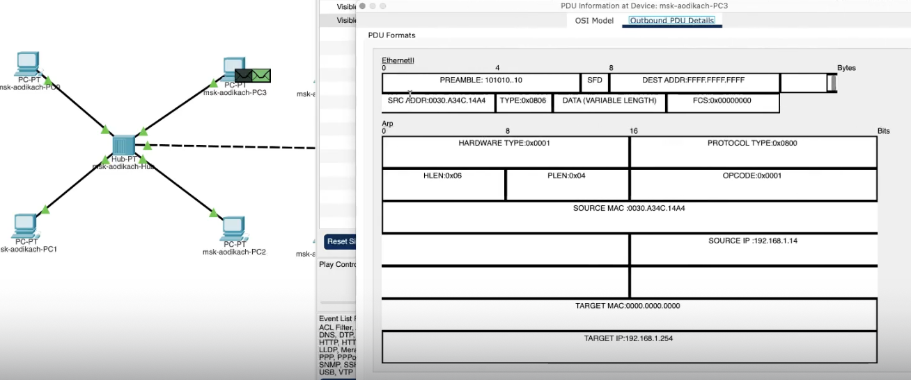{#fig:023 width=50%}

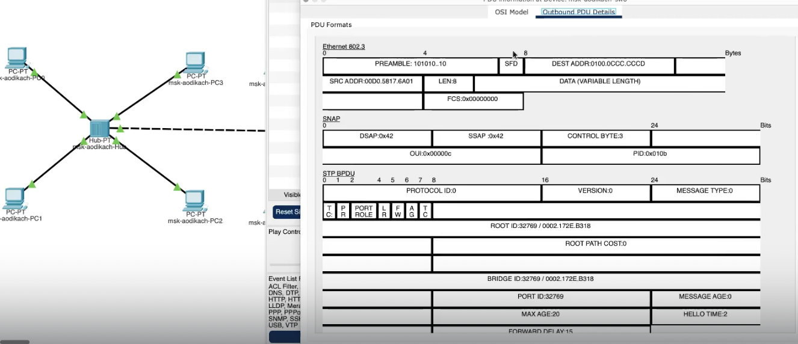{#fig:025 width=50%}

# Вывод
Установила инструмент моделирования конфигурации сети Cisco Packet Tracer, ознакомилась с интерфейсом.

# Ответ на вопросы

• Концентратор (Hub): Устройство, которое соединяет несколько Ethernet-устройств в одной сети, передавая данные ко всем портам. Используется в простых сетях, но неэффективен из-за отсутствия фильтрации трафика.

  
• Коммутатор (Switch): Устройство, которое соединяет устройства в сети и направляет данные только к нужному порту, что повышает эффективность. Используется в локальных сетях для уменьшения коллизий.

• Маршрутизатор (Router): Устройство, которое соединяет различные сети и управляет трафиком между ними, определяя наилучший путь для передачи данных. Используется для подключения к интернету и между различными сетями.

• Шлюз (Gateway): Устройство, которое служит точкой входа в другую сеть и может выполнять преобразование протоколов. Используется для связи между сетями с разными протоколами.

• IP-адрес: Уникальный адрес, присвоенный каждому устройству в сети для его идентификации и маршрутизации данных.

• Сетевая маска: Параметр, который определяет, какая часть IP-адреса относится к сети, а какая — к устройству. Используется для разделения адресного пространства.

• Broadcast-адрес: Специальный адрес, используемый для отправки данных всем устройствам в сети одновременно. Обычно имеет все единицы в части адреса хоста.

Для проверки доступности узла сети можно использовать команду ping, которая отправляет ICMP-запросы на указанный IP-адрес и проверяет, отвечает ли узел.
