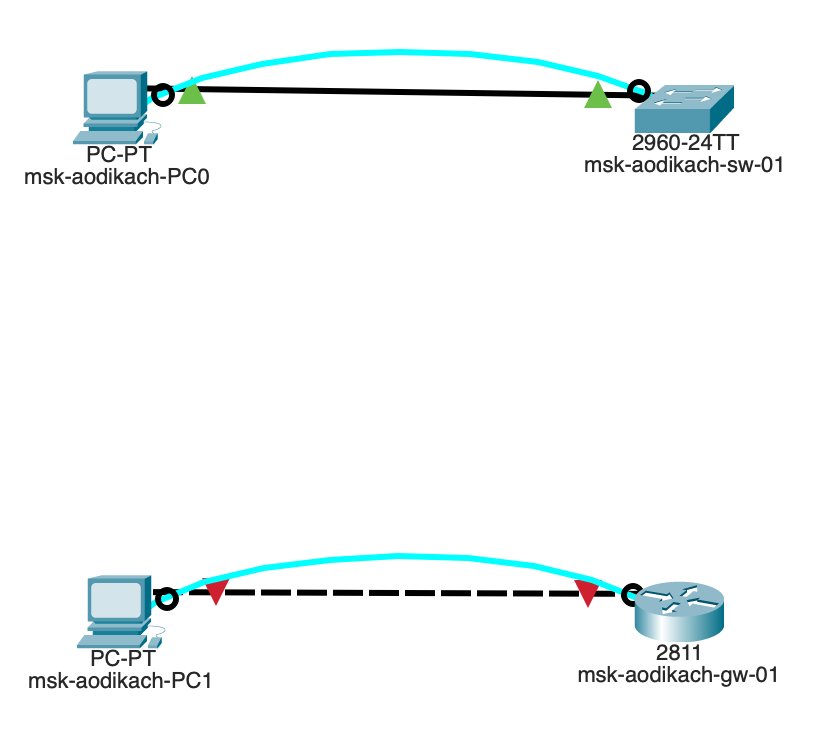
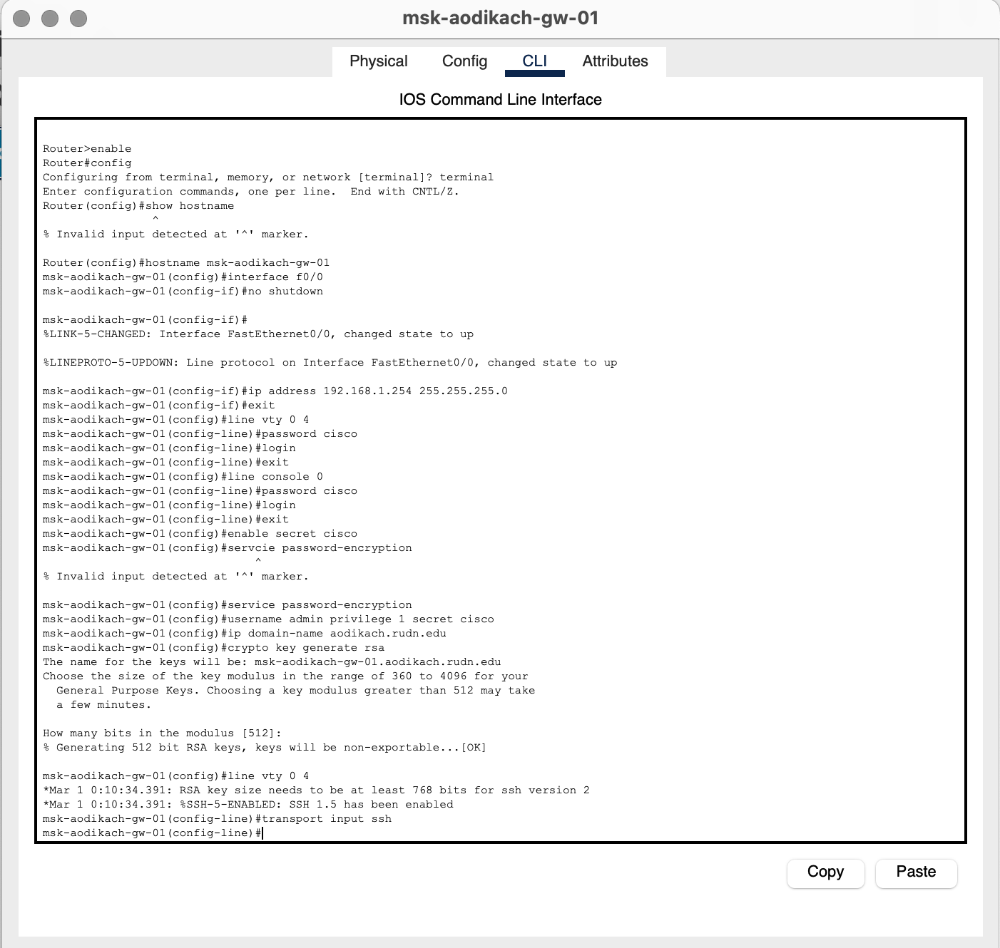
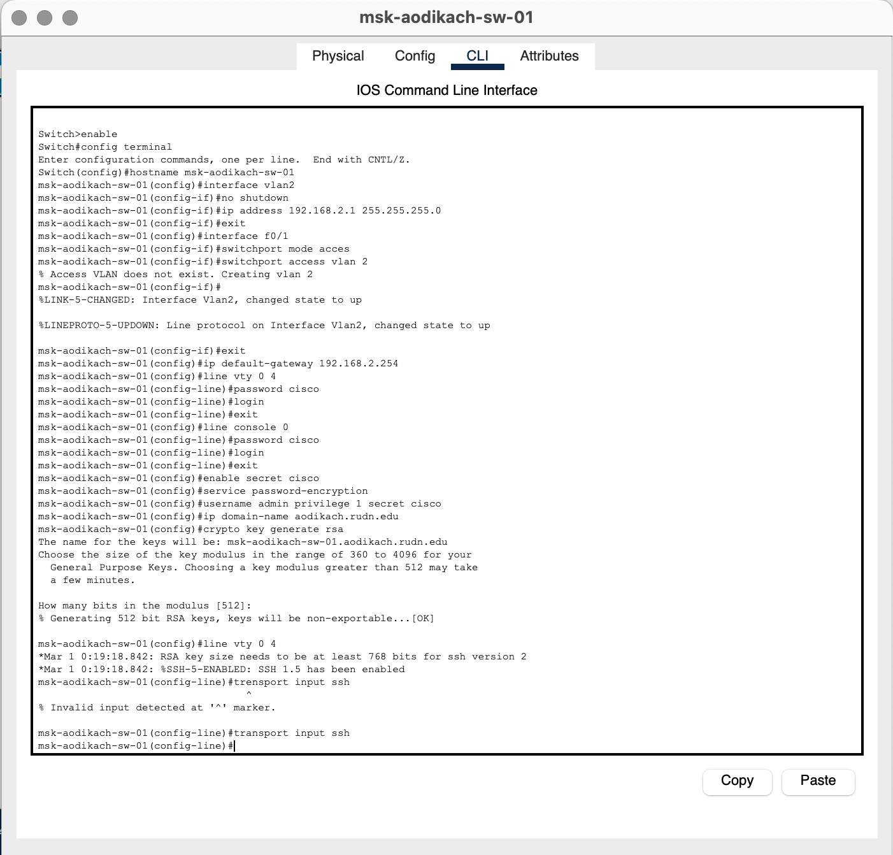
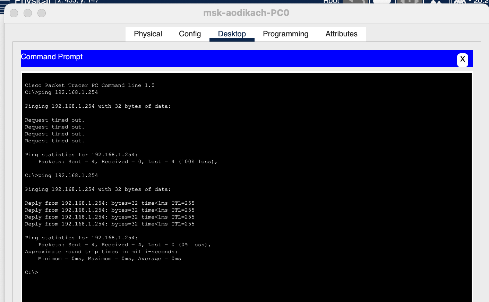
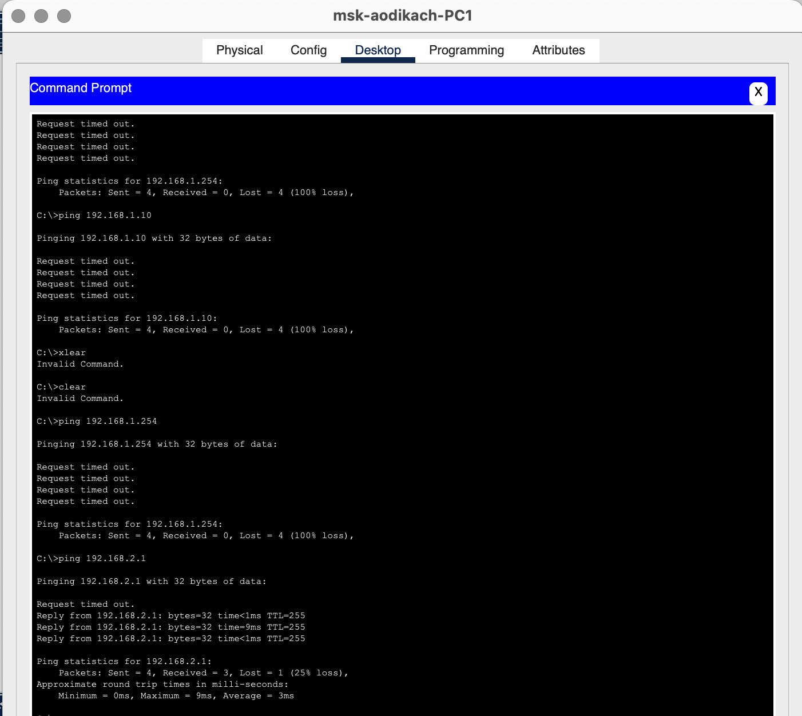
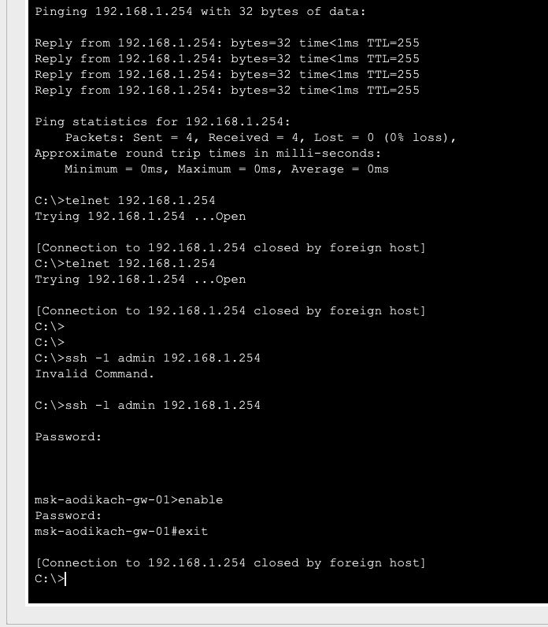
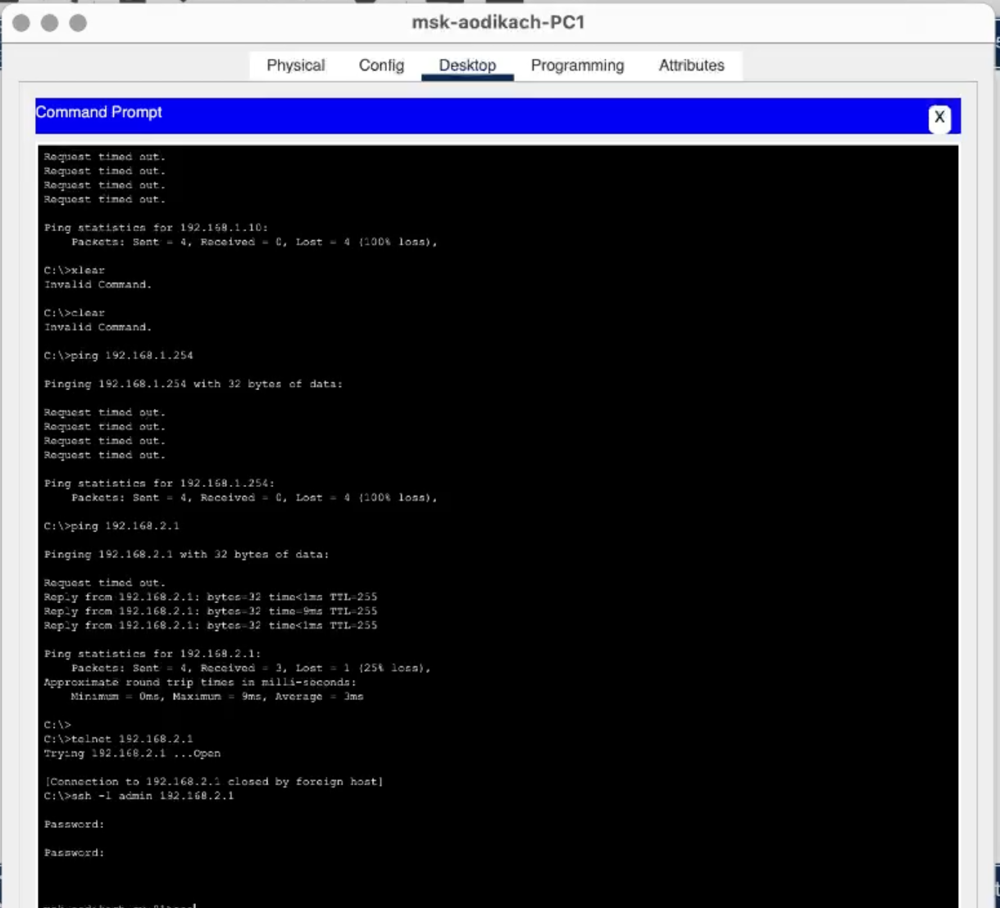

---
## Front matter
lang: ru-RU
title: Лабораторная работа №2
subtitle: Администрирование локальных сетей
author:
  - Дикач А.О.
institute:
  - Российский университет дружбы народов, Москва, Россия
date: 18 февраля 2025

## i18n babel
babel-lang: russian
babel-otherlangs: english

## Formatting pdf
toc: false
toc-title: Содержание
slide_level: 2
aspectratio: 169
section-titles: true
theme: metropolis
header-includes:
 - \metroset{progressbar=frametitle,sectionpage=progressbar,numbering=fraction}
---

# Информация

## Докладчик

  * Дикач Анна Олеговна
  * НПИбд-01-22 (1132222009)
  * Российский университет дружбы народов
  * <https://github.com/chelibos?tab=repositories>

## Цель работы

Получить основные навыки по начальному конфигурированию оборудования Cisco.

# Выполнение лабораторной работы

## Воссоздаю топологию из текста лабораторной работы. Использую 2 пк, маршрутизатор и коммутатор

{#fig:001 width=50%}

## Провожу настройку маршрутизатора. Задаю имя, ip-адрес и маску, пароль, задаю доступ через telnet и ssh и сохраняю конфигурацию в отдельный файл

{#fig:002 width=60%}

## Провожу настройку коммутатора. Задаю имя, ip-адрес и маску, привязываю интерфейс Fast Ethernet с номером 1 к vlan 2, задаю адрес шлюза, пароль, задаю доступ через telnet и ssh, доступ 1-го уровня по паролю и сохраняю конфигурацию в отдельный файл

{#fig:003 width=60%}

## Проверяю работоспособность соединия между ПК0 и маршрутизатором 

{#fig:004 width=50%}

## Проверяю работоспособность соединия между ПК1 и коммутатора

{#fig:005 width=50%}

## Пробую подключиться к маршрутизатору с помощью telnet и ssh 

{#fig:006 width=50%}

## Пробую подключиться к коммутатору с помощью telnet и ssh

{#fig:007 width=50%}

## Вывод

Получила основные навыки по начальному конфигурированию оборудывания Cisco.

