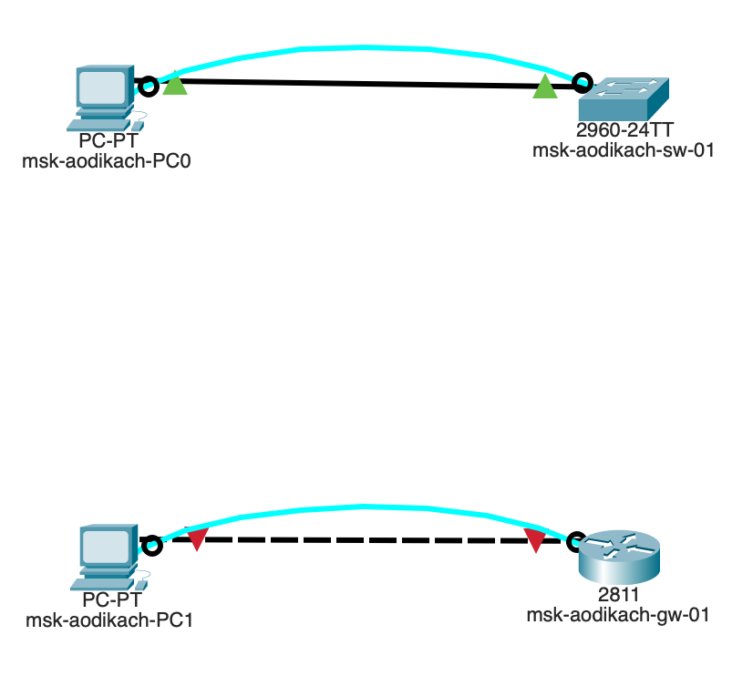
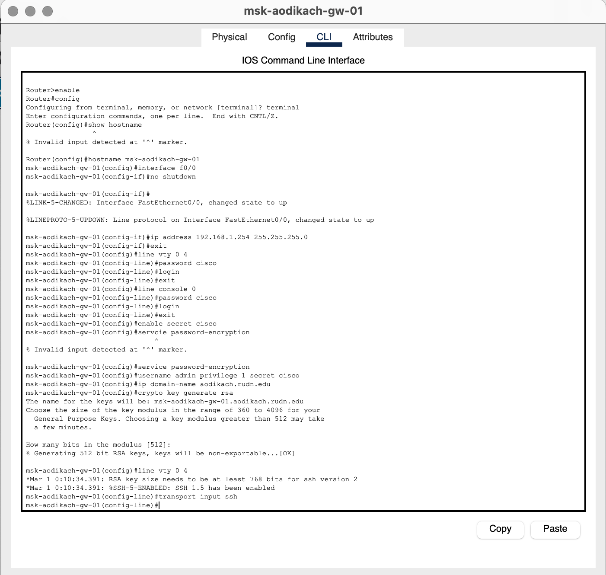
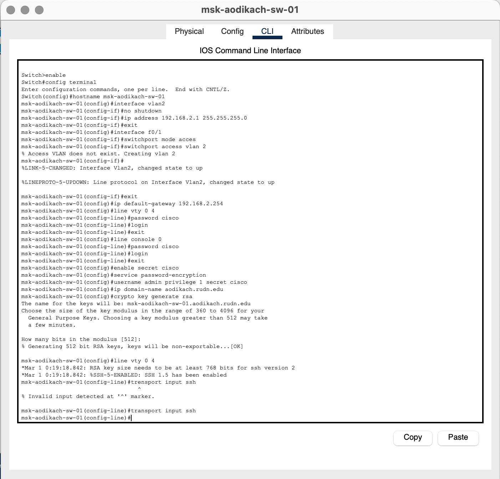
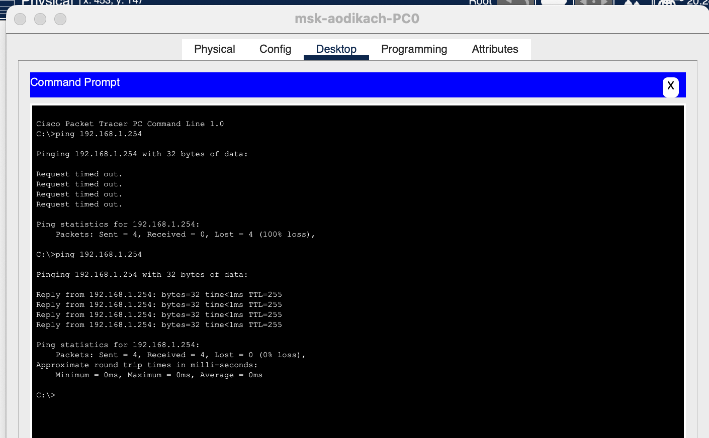
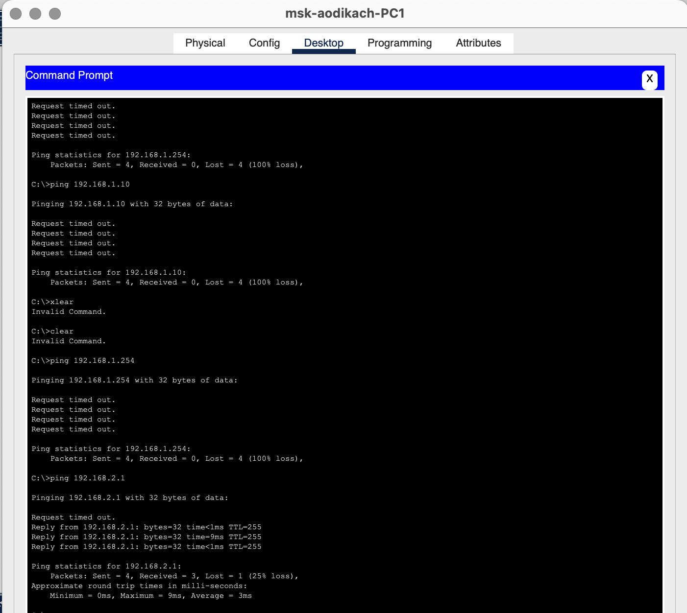
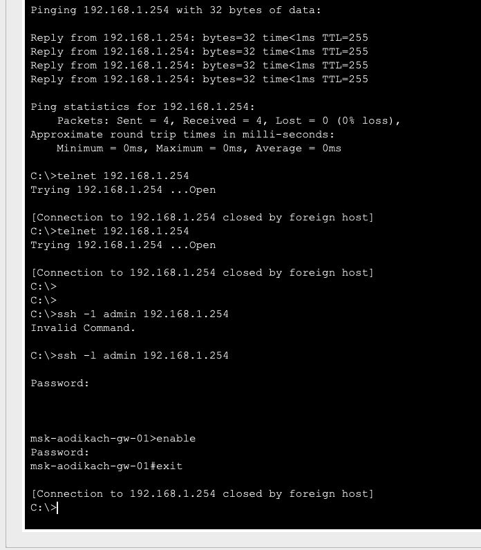
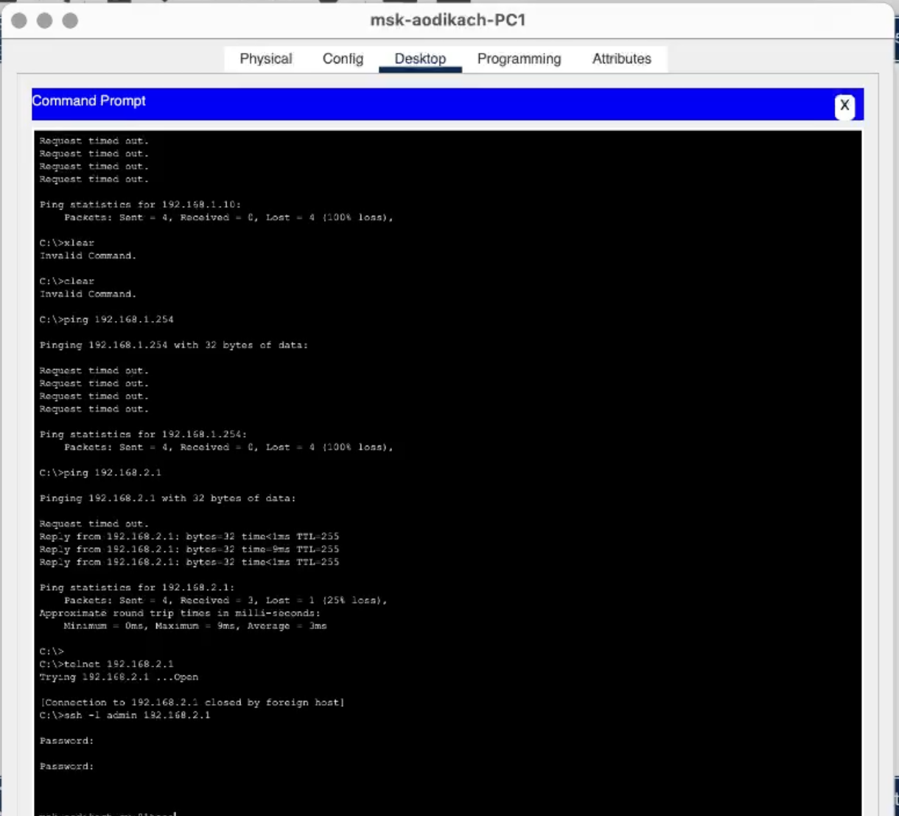

---
## Front matter
title: "Лабораторная работа №2"
subtitle: "Админимстрирование локальных сетей"
author: "Дикач Анна Олеговна НПИбд-01-22"

## Generic otions
lang: ru-RU
toc-title: "Содержание"

## Bibliography
bibliography: bib/cite.bib
csl: pandoc/csl/gost-r-7-0-5-2008-numeric.csl

## Pdf output format
toc: true # Table of contents
toc-depth: 2
lof: true # List of figures
lot: true # List of tables
fontsize: 12pt
linestretch: 1.5
papersize: a4
documentclass: scrreprt
## I18n polyglossia
polyglossia-lang:
  name: russian
  options:
	- spelling=modern
	- babelshorthands=true
polyglossia-otherlangs:
  name: english
## I18n babel
babel-lang: russian
babel-otherlangs: english
## Fonts
mainfont: IBM Plex Serif
romanfont: IBM Plex Serif
sansfont: IBM Plex Sans
monofont: IBM Plex Mono
mathfont: STIX Two Math
mainfontoptions: Ligatures=Common,Ligatures=TeX,Scale=0.94
romanfontoptions: Ligatures=Common,Ligatures=TeX,Scale=0.94
sansfontoptions: Ligatures=Common,Ligatures=TeX,Scale=MatchLowercase,Scale=0.94
monofontoptions: Scale=MatchLowercase,Scale=0.94,FakeStretch=0.9
mathfontoptions:
## Biblatex
biblatex: true
biblio-style: "gost-numeric"
biblatexoptions:
  - parentracker=true
  - backend=biber
  - hyperref=auto
  - language=auto
  - autolang=other*
  - citestyle=gost-numeric
## Pandoc-crossref LaTeX customization
figureTitle: "Рис."
tableTitle: "Таблица"
listingTitle: "Листинг"
lofTitle: "Список иллюстраций"
lotTitle: "Список таблиц"
lolTitle: "Листинги"
## Misc options
indent: true
header-includes:
  - \usepackage{indentfirst}
  - \usepackage{float} # keep figures where there are in the text
  - \floatplacement{figure}{H} # keep figures where there are in the text
---

# Цель работы

Получить основные навыки по начальному конфигурированию оборудования Cisco.

# Выполнение лабораторной работы

1. Воссоздаю топологию из текста лабораторной работы. Использую 2 пк, маршрутизатор и коммутатор (рис. [-@fig:001]).

{#fig:001 width=50%}

2. Провожу настройку маршрутизатора. Задаю имя, ip-адрес и маску, пароль, задаю доступ через telnet и ssh и сохраняю конфигурацию в отдельный файл (рис. [-@fig:002]).

{#fig:002 width=80%}

3. Провожу настройку коммутатора. Задаю имя, ip-адрес и маску, привязываю интерфейс Fast Ethernet с номером 1 к vlan 2, задаю адрес шлюза, пароль, задаю доступ через telnet и ssh, доступ 1-го уровня по паролю и сохраняю конфигурацию в отдельный файл (рис. [-@fig:003]).

{#fig:003 width=80%}

4. Проверяю работоспособность соединия между ПК0 и маршрутизатором (рис. [-@fig:004]).

{#fig:004 width=70%}

5. Проверяю работоспособность соединия между ПК1 и коммутатора (рис. [-@fig:005]).

{#fig:005 width=70%}

6. Пробую подключиться к маршрутизатору с помощью telnet и ssh (рис. [-@fig:006]).

{#fig:006 width=70%}

7. Пробую подключиться к коммутатору с помощью telnet и ssh (рис. [-@fig:007]).

{#fig:007 width=70%}

# Вывод

Получила основнфе навыки по начальному конфигурированию оборудывания Cisco.

# Ответ на вопросы

1. Возможные способы подключения к сетевому оборудованию: 

   • Проводное (Ethernet, оптоволокно).

   • Беспроводное (Wi-Fi, Bluetooth).

2. Для подключения оконечного оборудования пользователя к маршрутизатору следует использовать витую пару (категория 5e или выше), так как она обеспечивает хорошую скорость передачи данных и стабильное соединение.

3. Для подключения оконечного оборудования пользователя к коммутатору также используется витая пара (категория 5e или выше) по тем же причинам.

4. Для подключения коммутатора к коммутатору рекомендуется использовать витую пару (категория 6 или выше) или оптоволоконный кабель, так как они обеспечивают высокую пропускную способность и минимальные потери сигнала на больших расстояниях.

5. Возможные способы настройки доступа к сетевому оборудованию по паролю:

   • Локальный доступ через консольный порт.

   • Удаленный доступ через SSH или Telnet.

6. Возможные способы настройки удалённого доступа к сетевому оборудованию: 

   • SSH (предпочтительнее из-за шифрования).

   • Telnet (менее безопасен).

   • VPN (для защищенного доступа). 
   Предпочтительнее SSH, так как обеспечивает безопасное шифрование данных.