---
## Front matter
lang: ru-RU
title: Лабораторная работа №3
subtitle: Администрирование локальных сетей
author:
  - Дикач А.О.
institute:
  - Российский университет дружбы народов, Москва, Россия
date: 25 февраля 2025

## i18n babel
babel-lang: russian
babel-otherlangs: english

## Formatting pdf
toc: false
toc-title: Содержание
slide_level: 2
aspectratio: 169
section-titles: true
theme: metropolis
header-includes:
 - \metroset{progressbar=frametitle,sectionpage=progressbar,numbering=fraction}
---

# Информация

## Докладчик

  * Дикач Анна Олеговна
  * НПИбд-01-22 (1132222009)
  * Российский университет дружбы народов
  * <https://github.com/chelibos?tab=repositories>

## Цель работы

Познакомится с принципами планирования локальной сети организации.

# Выполнение лабораторной работы

## Физические устройства сети с номерами портов

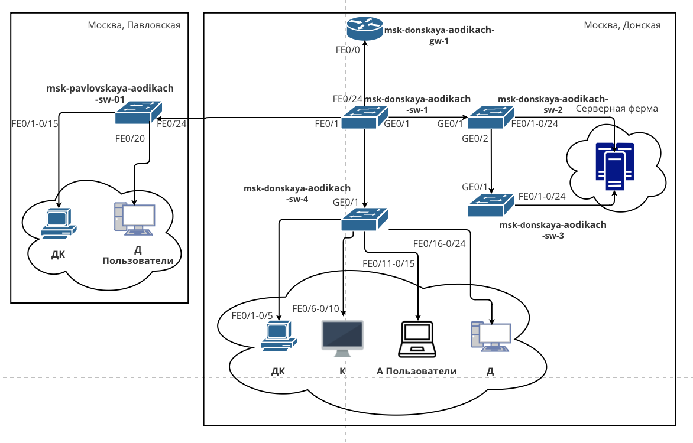{#fig:001 width=50%}

## Схема VLAN сети

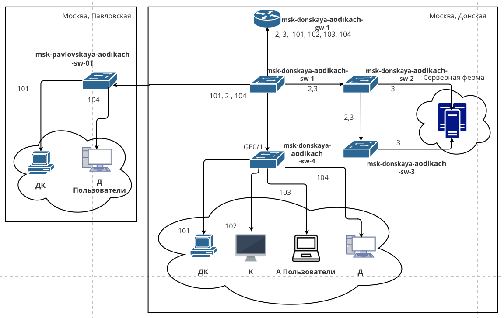{#fig:002 width=50%}

## Схема маршрутизации сети

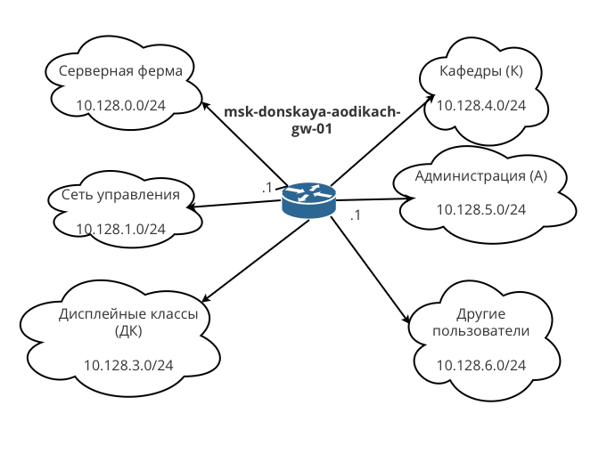{#fig:003 width=50%}

## Таблица VLAN

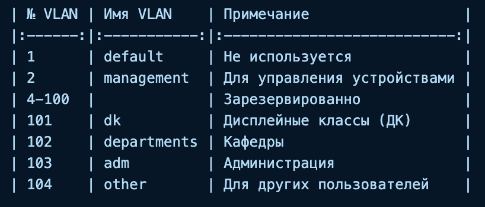{#fig:004 width=50%}

## IP-адресация

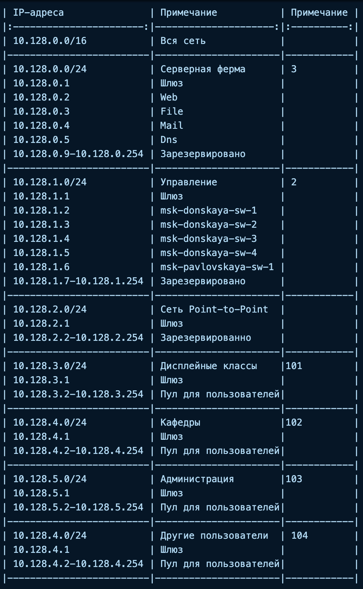{#fig:005 width=50%}

## Подключение портов  

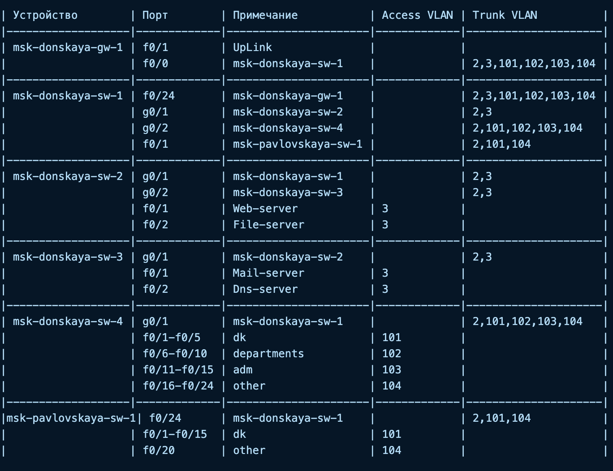{#fig:006 width=50%}

## Физические устройства сети с номерами портов

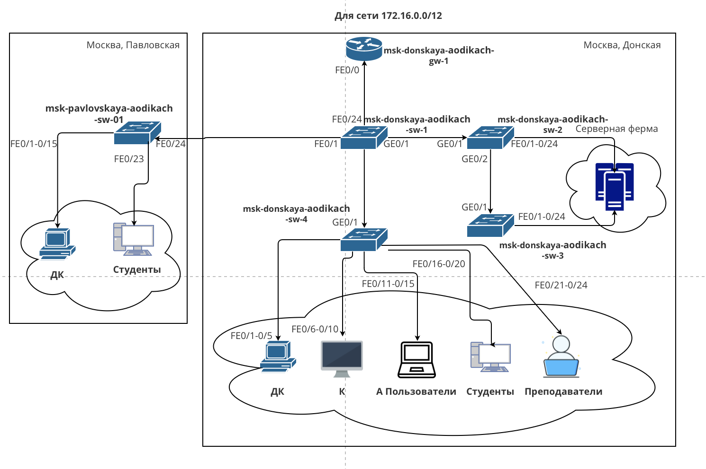{#fig:007 width=50%}

## Схема VLAN сети

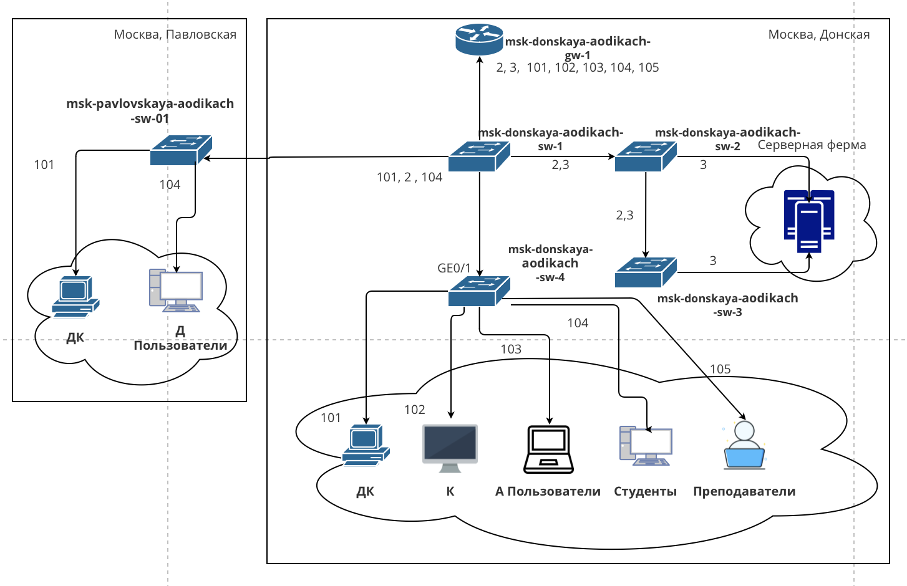{#fig:008 width=50%}

## Схема маршрутизации сети

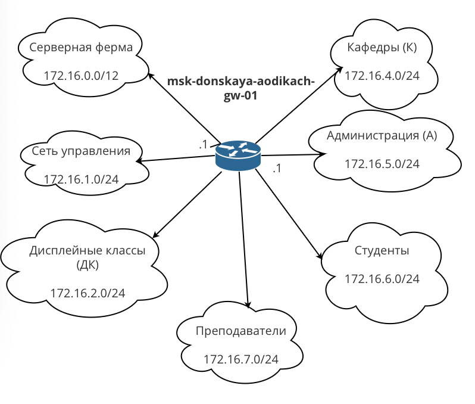{#fig:009 width=50%}

## Таблица VLAN

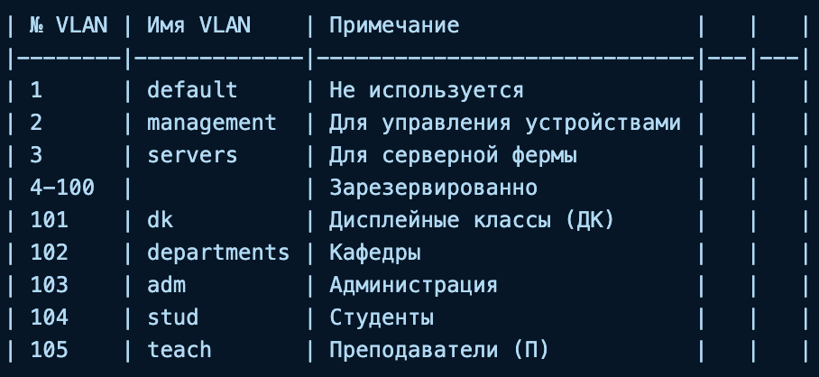{#fig:010 width=50%}

## IP-адресация

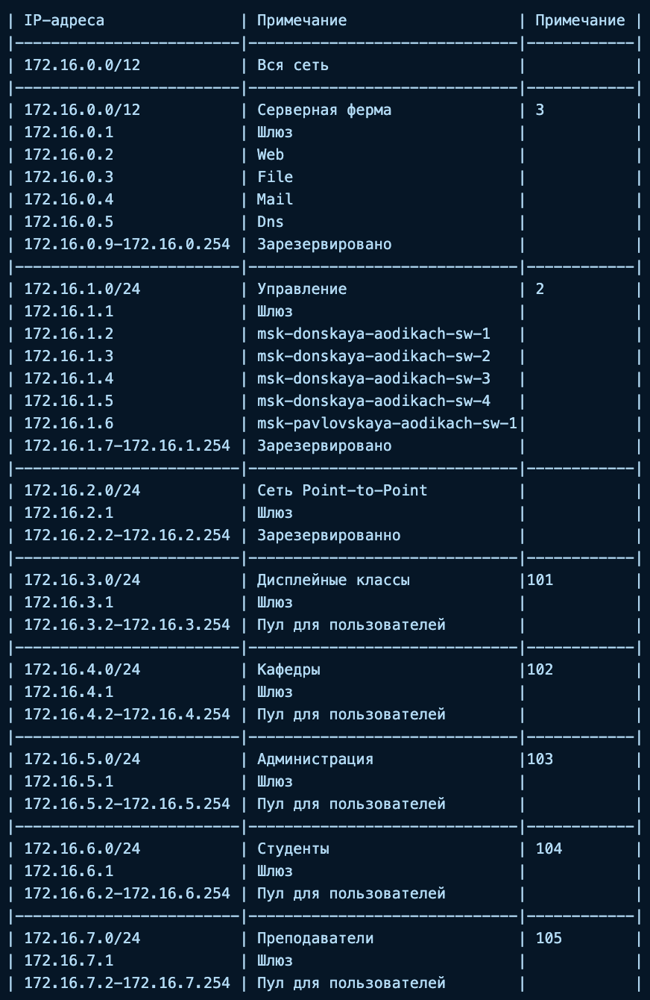{#fig:011 width=50%}

## Подключение портов

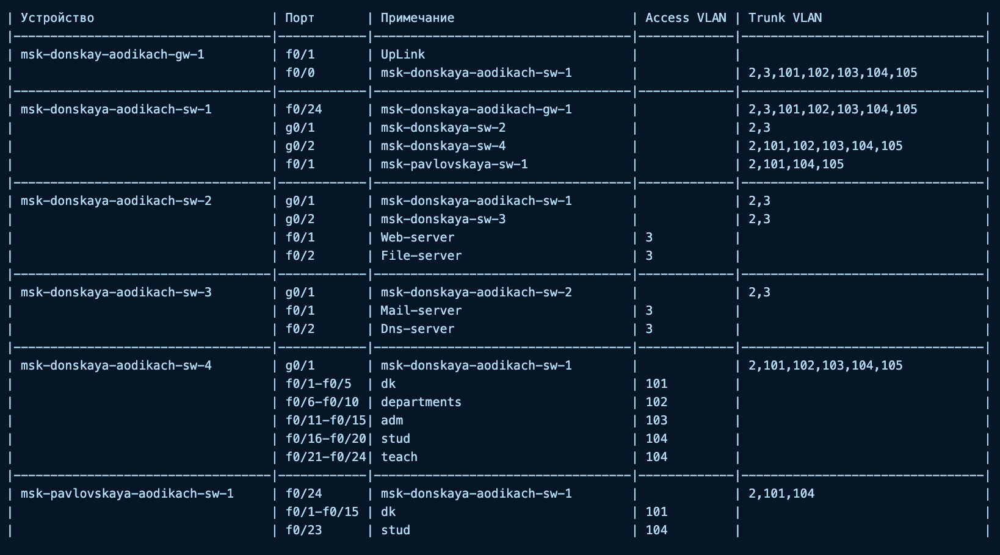{#fig:012 width=50%}

## Физические устройства сети с номерами портов

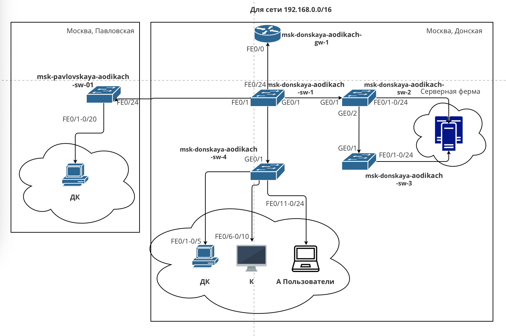{#fig:014 width=50%}

## Схема VLAN сети

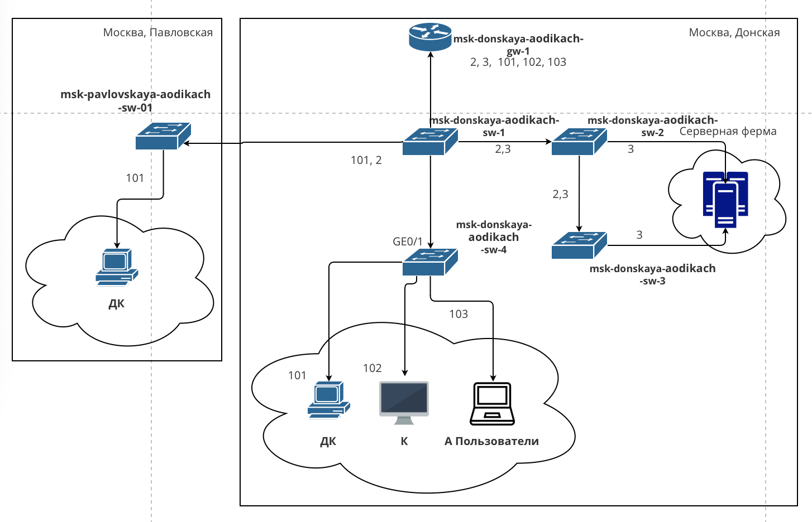{#fig:013 width=50%}

## Схема маршрутизации сети

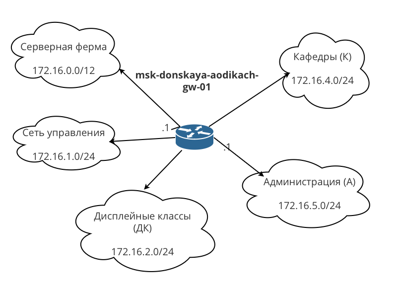{#fig:015 width=50%}

## Таблица VLAN

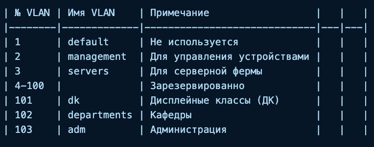{#fig:016 width=50%}

## IP-адресация

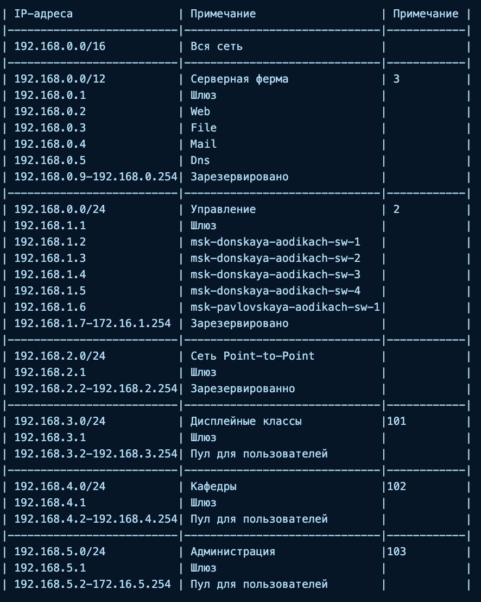{#fig:017 width=50%}

## Подключение портов

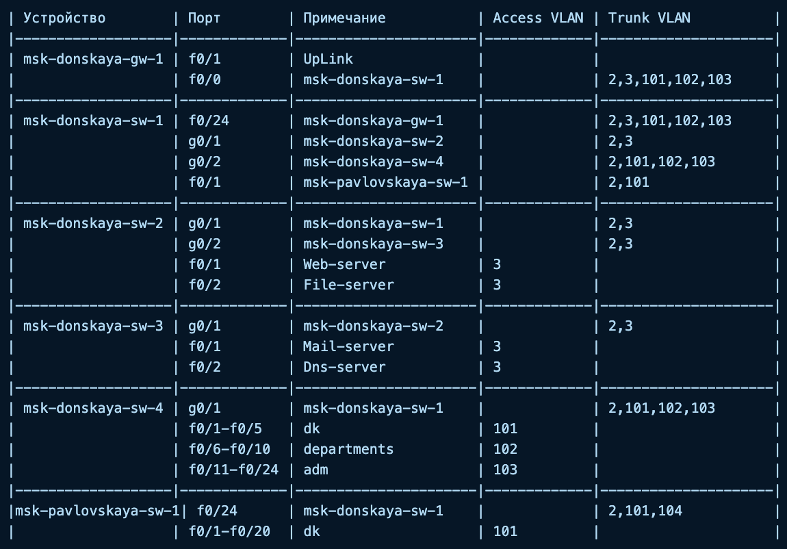{#fig:018 width=50%}

## Вывод

Познакомилась с организацией адресного пространства для локальной сети организации.

