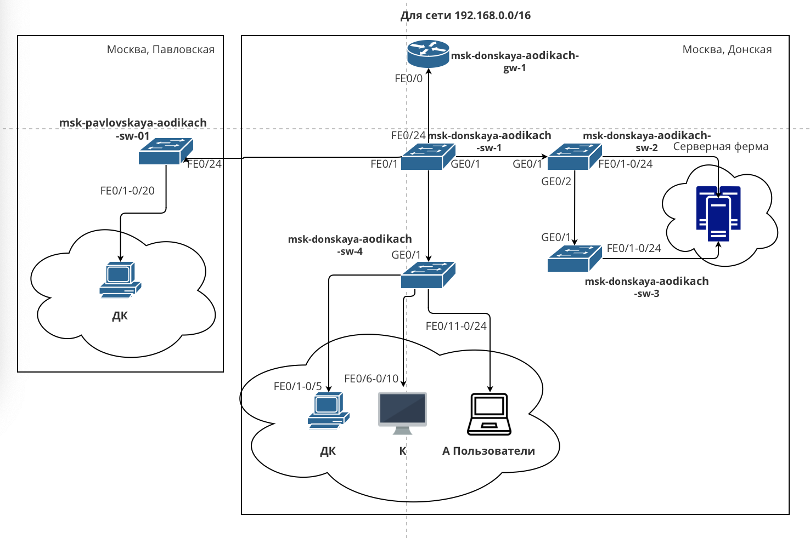

---
## Front matter
title: "Лабораторная работа №3"
subtitle: "Админимстрирование локальных сетей"
author: "Дикач Анна Олеговна НПИбд-01-22"

## Generic otions
lang: ru-RU
toc-title: "Содержание"

## Bibliography
bibliography: bib/cite.bib
csl: pandoc/csl/gost-r-7-0-5-2008-numeric.csl

## Pdf output format
toc: true # Table of contents
toc-depth: 2
lof: true # List of figures
lot: true # List of tables
fontsize: 12pt
linestretch: 1.5
papersize: a4
documentclass: scrreprt
## I18n polyglossia
polyglossia-lang:
  name: russian
  options:
	- spelling=modern
	- babelshorthands=true
polyglossia-otherlangs:
  name: english
## I18n babel
babel-lang: russian
babel-otherlangs: english
## Fonts
mainfont: IBM Plex Serif
romanfont: IBM Plex Serif
sansfont: IBM Plex Sans
monofont: IBM Plex Mono
mathfont: STIX Two Math
mainfontoptions: Ligatures=Common,Ligatures=TeX,Scale=0.94
romanfontoptions: Ligatures=Common,Ligatures=TeX,Scale=0.94
sansfontoptions: Ligatures=Common,Ligatures=TeX,Scale=MatchLowercase,Scale=0.94
monofontoptions: Scale=MatchLowercase,Scale=0.94,FakeStretch=0.9
mathfontoptions:
## Biblatex
biblatex: true
biblio-style: "gost-numeric"
biblatexoptions:
  - parentracker=true
  - backend=biber
  - hyperref=auto
  - language=auto
  - autolang=other*
  - citestyle=gost-numeric
## Pandoc-crossref LaTeX customization
figureTitle: "Рис."
tableTitle: "Таблица"
listingTitle: "Листинг"
lofTitle: "Список иллюстраций"
lotTitle: "Список таблиц"
lolTitle: "Листинги"
## Misc options
indent: true
header-includes:
  - \usepackage{indentfirst}
  - \usepackage{float} # keep figures where there are in the text
  - \floatplacement{figure}{H} # keep figures where there are in the text
---

# Цель работы

Познакомится с принципами планирования локальной сети организации.

# Выполнение лабораторной работы

1. Используя графический редактор повтаряю схемы из текста лаборатоной работы, а также переношу таблицы VLAN, IP-адресов и подключения портов оборудывания (рис. [-@fig:001]) (рис. [-@fig:002]) (рис. [-@fig:003]) (рис. [-@fig:004]) (рис. [-@fig:005]) (рис. [-@fig:006]).

{#fig:001 width=50%}

{#fig:002 width=50%}

{#fig:003 width=50%}

{#fig:004 width=50%}

{#fig:005 width=50%}

{#fig:006 width=50%}

2. Создаю план адресного пространства для чети 172.16.0.0/12 (рис. [-@fig:007]) (рис. [-@fig:008]) (рис. [-@fig:009]) (рис. [-@fig:010]) (рис. [-@fig:011]) (рис. [-@fig:012]).

{#fig:007 width=50%}

{#fig:008 width=50%}

{#fig:009 width=50%}

{#fig:010 width=50%}

{#fig:011 width=50%}

{#fig:012 width=50%}

3. Создаю план адресного пространства для чети 192.168.0.0/16 (рис. [-@fig:013]) (рис. [-@fig:014]) (рис. [-@fig:015]) (рис. [-@fig:016]) (рис. [-@fig:017]) (рис. [-@fig:018]).

{#fig:014 width=50%}

{#fig:013 width=50%}

{#fig:015 width=50%}

{#fig:016 width=50%}

{#fig:017 width=50%}

{#fig:018 width=50%}

# Вывод

Познакомилась с организацией адресного пространства для локальной сети организации.

# Ответ на вопросы

1. Модель взаимодействия открытых систем (OSI) — это концептуальная модель, описывающая, как данные передаются по сети. Уровни модели OSI:

   • Физический: передача битов.

   • Канальный: передача кадров, управление доступом к среде.

   • Сетевой: маршрутизация пакетов.

   • Транспортный: надежная передача данных, управление потоком.

   • Сеансовый: управление сессиями связи.

   • Представительский: преобразование форматов данных.

   • Прикладной: интерфейс для приложений.

2. Коммутатор выполняет функции:

   • Переключение кадров между устройствами в локальной сети.

   • Уменьшение коллизий за счет создания отдельных коллизийных доменов.

   • Фильтрация и перенаправление трафика на основе MAC-адресов.

3. Маршрутизатор выполняет функции:

   • Маршрутизация пакетов между различными сетями.

   • Определение наилучшего пути для передачи данных.

   • Подключение к интернету и управление трафиком.

4. Отличие коммутаторов третьего уровня от второго уровня:

   • Коммутаторы второго уровня работают на канальном уровне и используют MAC-адреса для переключения.

   • Коммутаторы третьего уровня работают на сетевом уровне и могут маршрутизировать трафик между VLAN, используя IP-адреса.

5. Сетевой интерфейс — это точка подключения устройства к сети, которая может быть как аппаратной (например, сетевая карта), так и программной (например, виртуальный интерфейс).

6. Сетевой порт — это логическая или физическая точка доступа на сетевом устройстве, через которую происходит обмен данными (например, Ethernet-порт).

7. Технологии Ethernet:

   • Ethernet: базовая технология с максимальной скоростью 10 Мбит/с.

   • Fast Ethernet: улучшенная версия с максимальной скоростью 100 Мбит/с.

   • Gigabit Ethernet: ещё более быстрая версия с максимальной скоростью 1 Гбит/с.

8. IP-адрес (IPv4-адрес) — уникальный адрес для устройства в сети. 

   • Сеть — группа устройств с общим префиксом IP-адреса.

   • Подсеть — часть сети, выделенная для управления трафиком.

   • Маска подсети — определяет, какая часть IP-адреса относится к сети, а какая — к узлам.

   • Служебные IP-адреса включают адреса, такие как 0.0.0.0 (неизвестный адрес) и 127.0.0.1 (localhost).

   • Пример разбиения: сеть 192.168.1.0/24 на две подсети 192.168.1.0/25 (126 узлов) и 192.168.1.128/25 (126 узлов).

9. VLAN (виртуальная локальная сеть) — это логическая подгруппа в сети, позволяющая разделить сеть на сегменты независимо от физического расположения устройств. 

   • Применяется для улучшения безопасности и управления трафиком.

   • Преимущества: уменьшение широковещательного трафика, улучшение безопасности, упрощение управления сетью.

   • Пример: отделы компании могут находиться в одной физической сети, но быть в разных VLAN для разделения трафика.

10. Отличие Trunk Port от Access Port:

    • Access Port: подключает одно устройство и передает трафик только одной VLAN.

    • Trunk Port: подключает устройства, которые могут передавать трафик нескольких VLAN одновременно.
