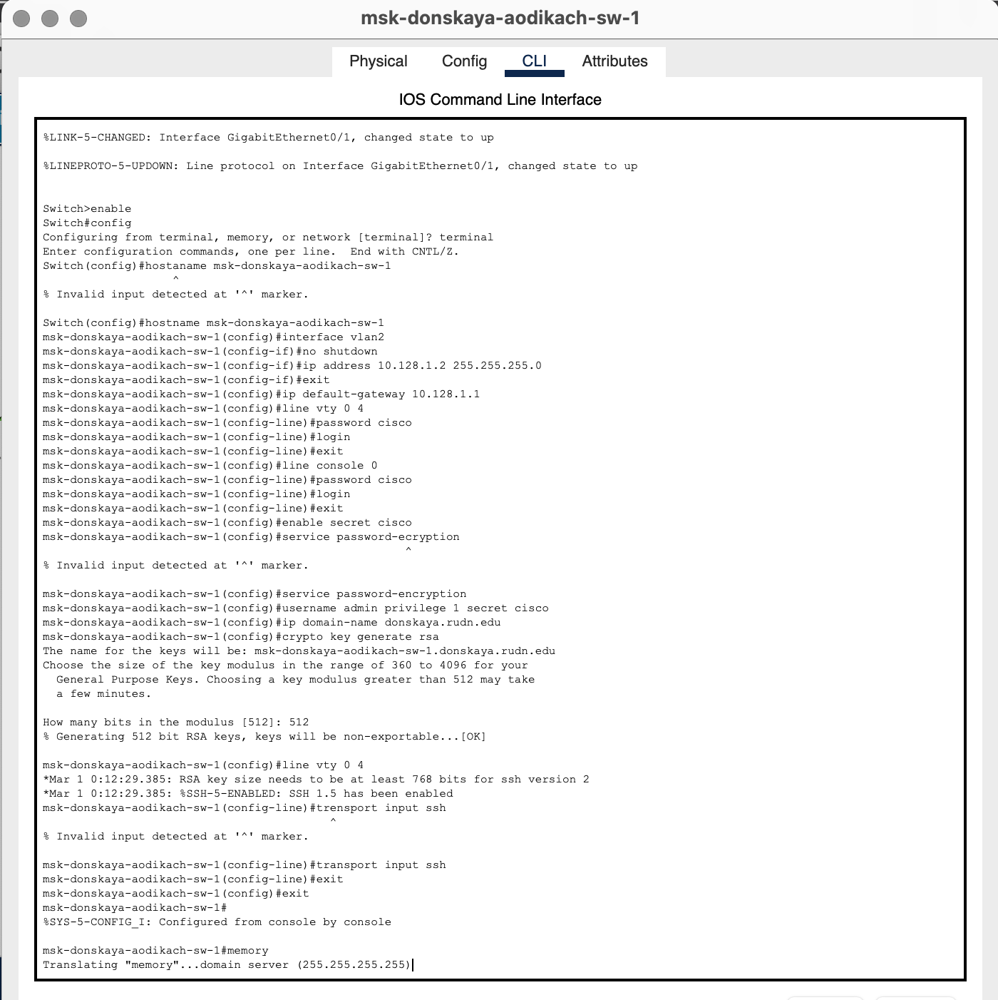
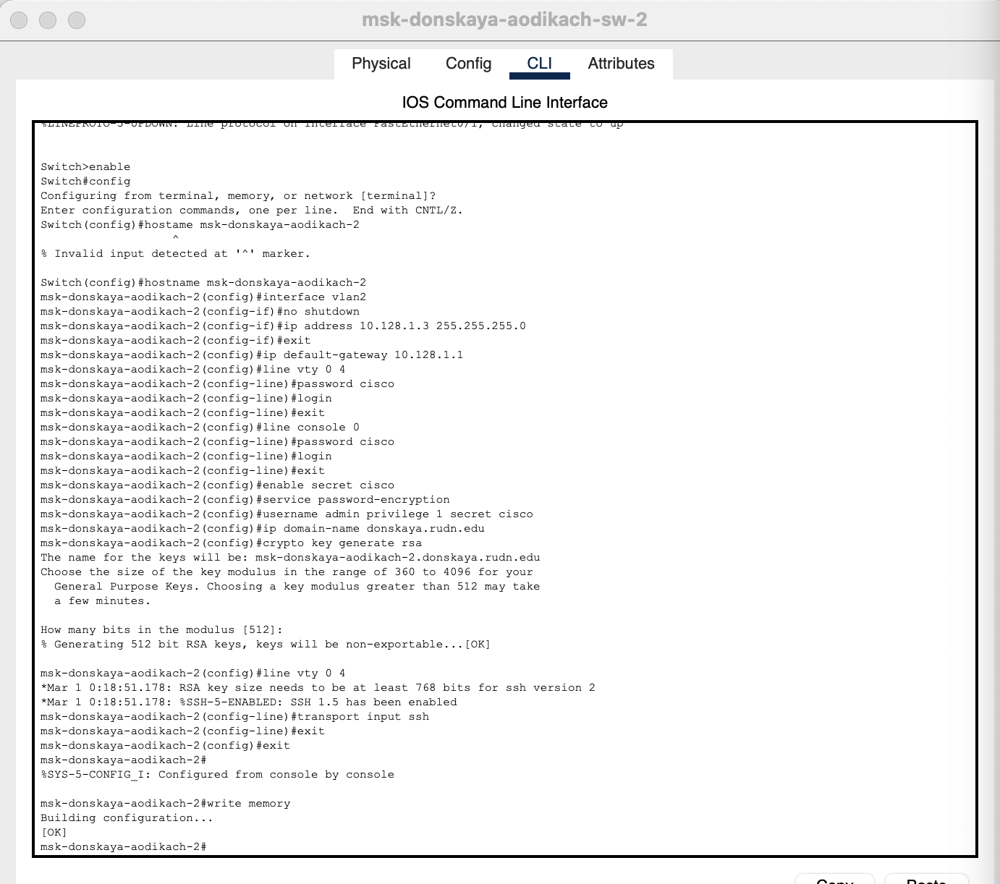
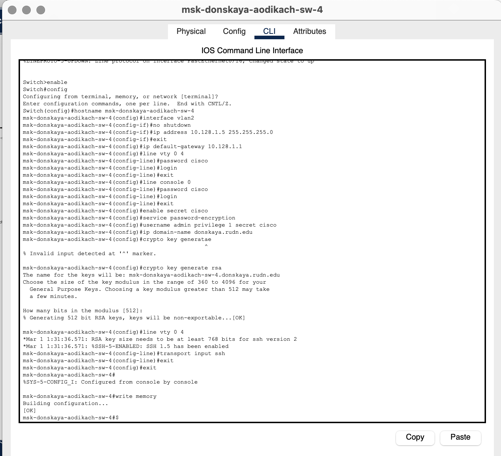

---
## Front matter
title: "Лабораторная работа №4"
subtitle: "Админимстрирование локальных сетей"
author: "Дикач Анна Олеговна НПИбд-01-22"

## Generic otions
lang: ru-RU
toc-title: "Содержание"

## Bibliography
bibliography: bib/cite.bib
csl: pandoc/csl/gost-r-7-0-5-2008-numeric.csl

## Pdf output format
toc: true # Table of contents
toc-depth: 2
lof: true # List of figures
lot: true # List of tables
fontsize: 12pt
linestretch: 1.5
papersize: a4
documentclass: scrreprt
## I18n polyglossia
polyglossia-lang:
  name: russian
  options:
  - spelling=modern
  - babelshorthands=true
polyglossia-otherlangs:
  name: english
## I18n babel
babel-lang: russian
babel-otherlangs: english
## Fonts
mainfont: IBM Plex Serif
romanfont: IBM Plex Serif
sansfont: IBM Plex Sans
monofont: IBM Plex Mono
mathfont: STIX Two Math
mainfontoptions: Ligatures=Common,Ligatures=TeX,Scale=0.94
romanfontoptions: Ligatures=Common,Ligatures=TeX,Scale=0.94
sansfontoptions: Ligatures=Common,Ligatures=TeX,Scale=MatchLowercase,Scale=0.94
monofontoptions: Scale=MatchLowercase,Scale=0.94,FakeStretch=0.9
mathfontoptions:
## Biblatex
biblatex: true
biblio-style: "gost-numeric"
biblatexoptions:
  - parentracker=true
  - backend=biber
  - hyperref=auto
  - language=auto
  - autolang=other*
  - citestyle=gost-numeric
## Pandoc-crossref LaTeX customization
figureTitle: "Рис."
tableTitle: "Таблица"
listingTitle: "Листинг"
lofTitle: "Список иллюстраций"
lotTitle: "Список таблиц"
lolTitle: "Листинги"
## Misc options
indent: true
header-includes:
  - \usepackage{indentfirst}
  - \usepackage{float} # keep figures where there are in the text
  - \floatplacement{figure}{H} # keep figures where there are in the text
---

# Цель работы

Провести подготовительную работу по первоначальной настройке коммутаторов сети.

# Выполнение лабораторной работы

1. Повторяю тополгию из текста лабораторной работы в приложении "Packet tracer Cisco" (рис. [-@fig:001]).

{#fig:001 width=70%}

2. Провожу настройку коммутаора msk-donskaya-aodikach-sw-1 (рис. [-@fig:002]):

**Switch>enable:** Переход в режим привилегированного EXEC, который позволяет выполнять более сложные команды.

**Switch#**configure terminal: Переход в режим глобальной конфигурации, где можно настраивать различные параметры устройства.

**Switch (config)#**hostname msk-donskaya-sw-1: Установка имени хоста коммутатора на "msk-donskaya-sw-1".

**msk-donskaya-sw-1 (config)#**interface vlan2: Переход к настройкам интерфейса VLAN 2.

**msk-donskaya-sw-1 (config-if)#**no shutdown: Включение интерфейса VLAN 2 (по умолчанию интерфейсы могут быть отключены).

**msk-donskaya-sw-1(config-if)#**ip address 10.128.1.2 255.255.255.0: Назначение IP-адреса 10.128.1.2 с маской подсети 255.255.255.0 для интерфейса VLAN 2.

**msk-donskaya-sw-1 (config-if)#**exit: Выход из режима настройки интерфейса.

**msk-donskaya-sw-1 (config)#**ip default-gateway 10.128.1.1: Установка шлюза по умолчанию на 10.128.1.1, что позволяет устройству отправлять пакеты в другие сети.

**msk-donskaya-sw-1 (config)#**line vty 0 4: Переход к настройке виртуальных терминалов (VTY) для удаленного доступа (SSH или Telnet).

**msk-donskaya-sw-1 (config-line)#**password cisco: Установка пароля "cisco" для доступа к виртуальным терминалам.

**msk-donskaya-sw-1 (config-line)#**login: Включение проверки пароля при доступе к виртуальным терминалам.

**msk-donskaya-sw-1 (config-line)#**exit: Выход из режима настройки VTY.

**msk-donskaya-sw-1 (config)#**line console 0: Переход к настройке консольного порта.

**msk-donskaya-sw-1 (config-line)#**password cisco: Установка пароля "cisco" для консольного доступа.

**msk-donskaya-sw-1 (config-line)#**login: Включение проверки пароля для консольного доступа.

**msk-donskaya-sw-1 (config-line)#**exit: Выход из режима настройки консоли.

**msk-donskaya-sw-1 (config)#**enable secret cisco: Установка секретного пароля для доступа к привилегированному режиму EXEC, который будет зашифрован.

**msk-donskaya-sw-1 (config)#**service password-encryption: Включение шифрования паролей в конфигурации, чтобы они не отображались в открытом виде.

**msk-donskaya-sw-1 (config)#**username admin privilege 1 secret cisco: Создание пользователя "admin" с уровнем привилегий 1 и секретным паролем "cisco".

**msk-donskaya-sw-1 (config)#**ip domain-name donskaya.run.edu: Установка доменного имени для устройства.

**msk-donskaya-sw-1 (config)#**crypto key generate rsa: Генерация RSA ключей для шифрования, необходимая для настройки SSH.

**msk-donskaya-sw-1 (config)#**line vty 0 4: Снова переходим к настройке виртуальных терминалов для SSH.

**msk-donskaya-sw-1(config-line)#**transport input ssh: Ограничение доступа к виртуальным терминалам только через SSH.

**msk-donskaya-sw-1 (config-line)#**exit: Выход из режима настройки VTY.

**msk-donskaya-sw-1 (config)#**exit: Выход из глобального режима конфигурации.

**msk-donskaya-sw-1#**write memory: Сохранение текущей конфигурации в память, чтобы изменения не потерялись после перезагрузки устройства.

{#fig:002 width=70%}

3. Провожу настройку коммутаора msk-donskaya-aodikach-sw-2 (рис. [-@fig:003])

{#fig:003 width=70%}

4. Провожу настройку коммутатора msk-donskaya-aodikach-sw-3 (рис. [-@fig:004])

{#fig:004 width=70%}

5. Провожу настройку коммутатора msk-donskaya-aodikach-sw-4 (рис. [-@fig:005])

{#fig:005 width=70%}

6. Провожу настройку коммутатора msk-pavlovskaya-aodikach-sw-1 (рис. [-@fig:006])

{#fig:006 width=70%}

# Вывод

Провела подготовительную работу по первоначальной настроке коммутаторов сети.

# Ответ на вопросы

1. Для просмотра конфигурации:

   • show running-config — показывает текущую конфигурацию.

   • show startup-config — показывает конфигурацию, загружаемую при старте.

2. Для просмотра стартового конфигурационного файла:

   • show startup-config — показывает стартовую конфигурацию.

3. Для экспорта конфигурационного файла:

   • copy running-config tftp: — для копирования текущей конфигурации на TFTP-сервер.

   • copy startup-config tftp: — для копирования стартовой конфигурации на TFTP-сервер.

4. Для импорта конфигурационного файла:

   • copy tftp: running-config — для загрузки конфигурации с TFTP-сервера в текущую.

   • copy tftp: startup-config — для загрузки конфигурации с TFTP-сервера в стартовую.
