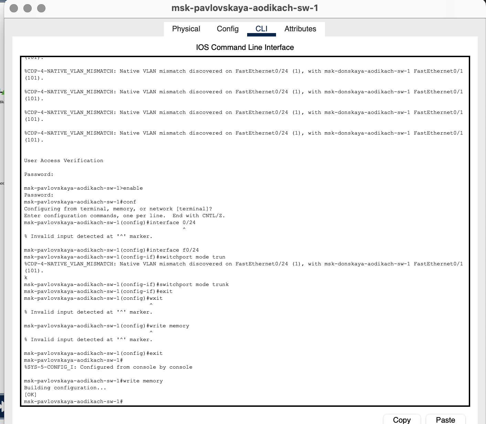
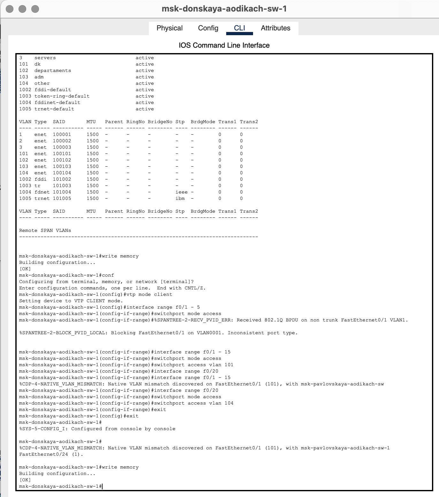
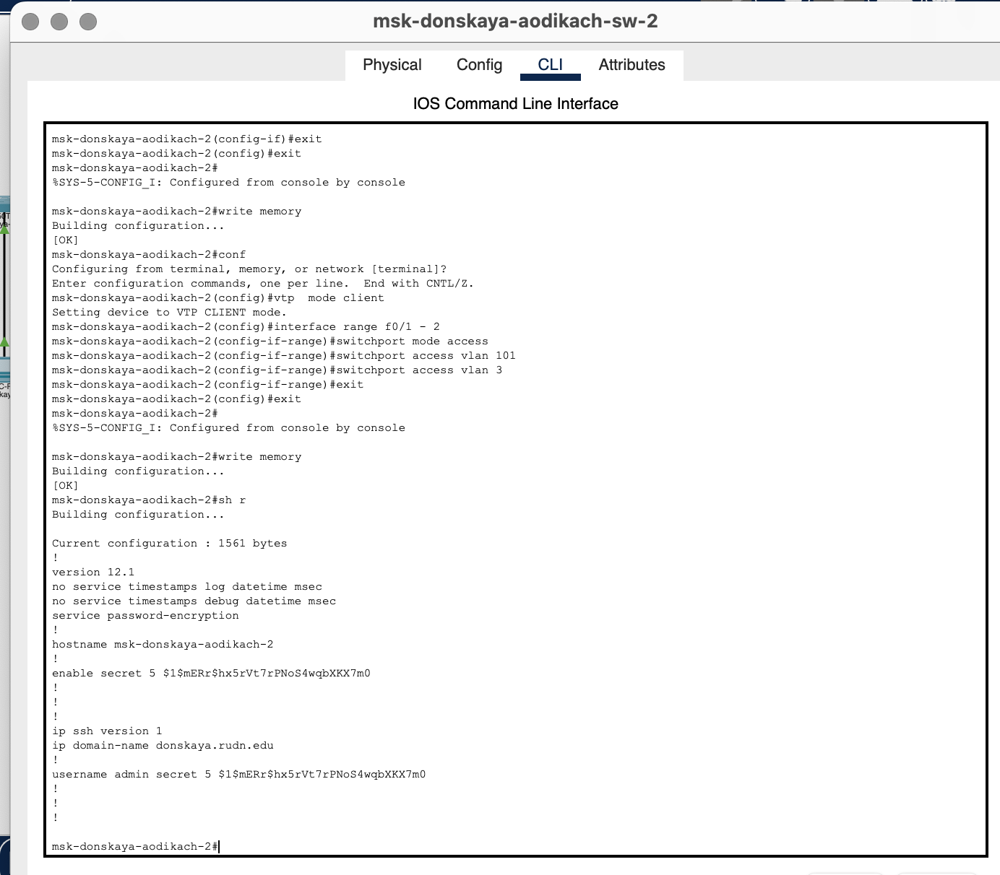
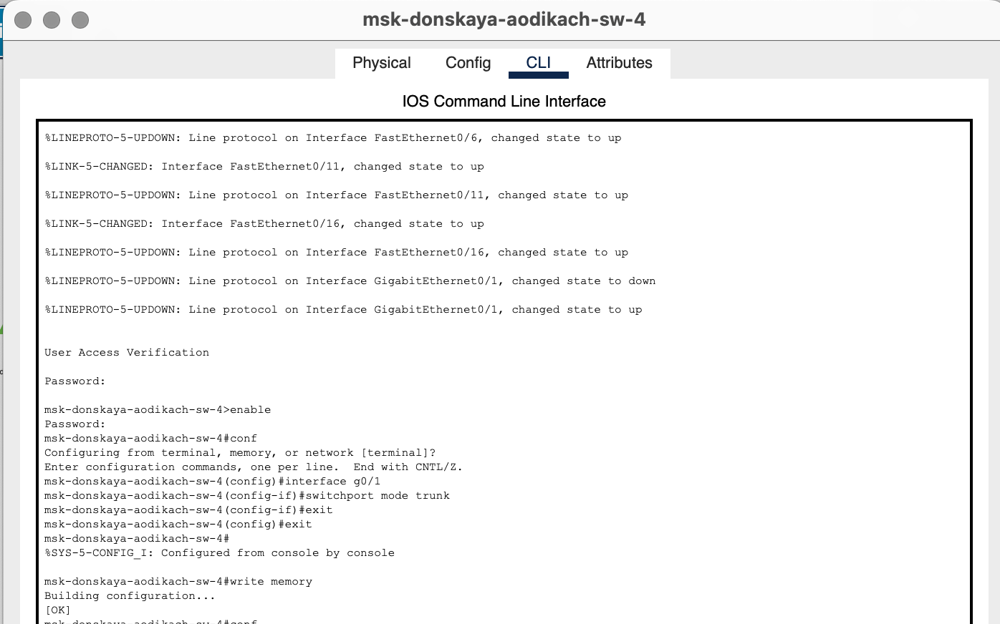
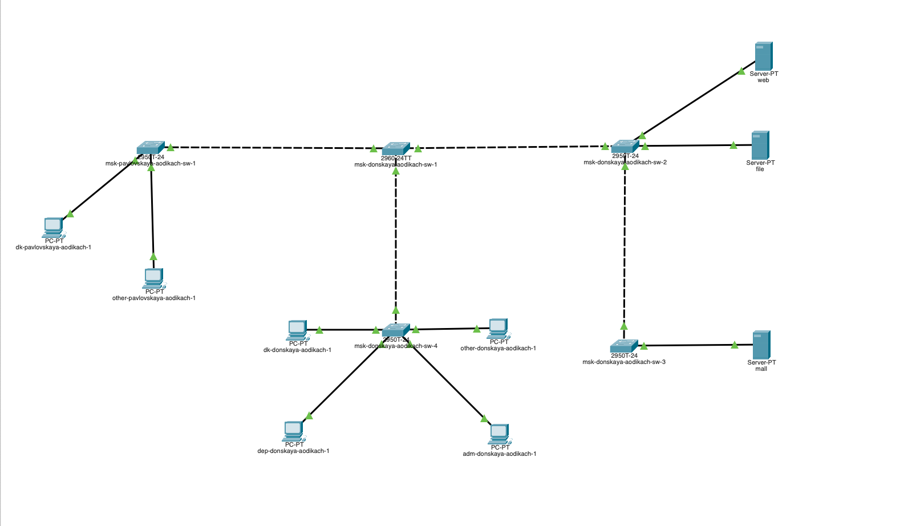
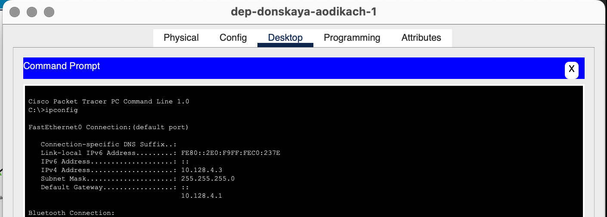
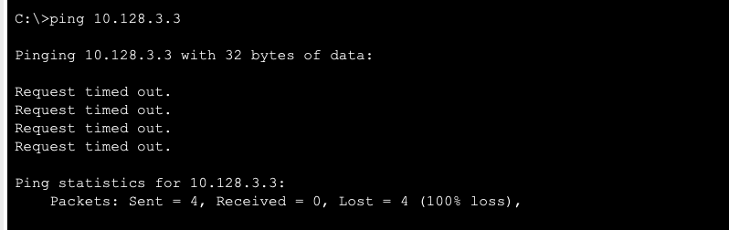
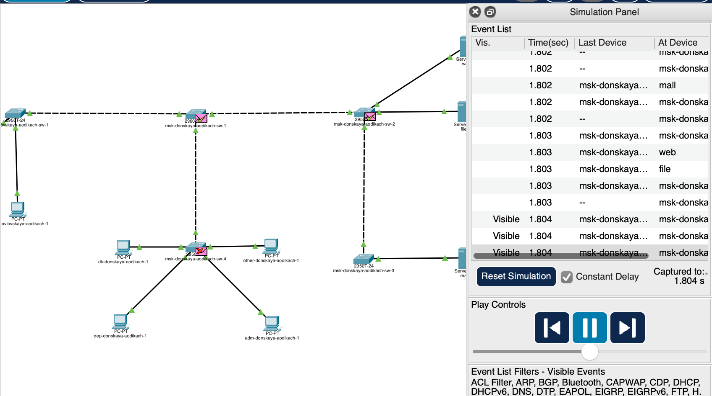
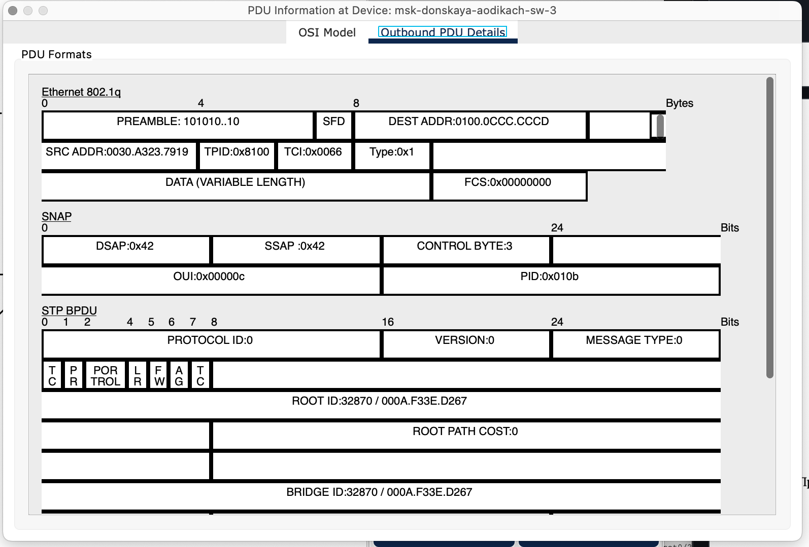

---
## Front matter
lang: ru-RU
title: Лабораторная работа №5
subtitle: Администрирование локальных сетей
author:
  - Дикач А.О.
institute:
  - Российский университет дружбы народов, Москва, Россия
date: 11 марта 2025

## i18n babel
babel-lang: russian
babel-otherlangs: english

## Formatting pdf
toc: false
toc-title: Содержание
slide_level: 2
aspectratio: 169
section-titles: true
theme: metropolis
header-includes:
 - \metroset{progressbar=frametitle,sectionpage=progressbar,numbering=fraction}
---

# Информация

## Докладчик

  * Дикач Анна Олеговна
  * НПИбд-01-22 (1132222009)
  * Российский университет дружбы народов
  * <https://github.com/chelibos?tab=repositories>

## Цель работы

Получить основные навыки по настройке VLAN на коммутаторах сети.

# Выполнение лабораторной работы

##  Используя последовательность из текста лабораторной работы провожу конфигурацию Trunk-порта на коммутатору msk-donskaya-aodikach-sw-01

{#fig:001 width=60%}

##  Используя последовательность из текста лабораторной работы провожу конфигурацию Trunk-порта на коммутатору msk-pavlovskaya-aodikach-sw-1

{#fig:002 width=60%}

##  Прописываю конфигурацию диапазонов портов и конфигурации VTP msk-donskaya-aodikach-sw-01

{#fig:003 width=60%}

##

{#fig:004 width=60%}

##  Провожу настройку конфигурации Trunk-портов, VTP и диапазона портов для msk-donskaya-aodikach-sw-02

{#fig:005 width=60%}

##

{#fig:006 width=60%}

##  Провожу настройку конфигурации Trunk-портов, VTP и диапазона портов для msk-donskaya-aodikach-sw-03

{#fig:007 width=70%}

##  Провожу настройку конфигурации Trunk-портов, VTP и диапазона портов для msk-donskaya-aodikach-sw-04

{#fig:008 width=70%}

##  

{#fig:009 width=70%}

##  Проверяю состояние сети

{#fig:012 width=70%}

##  Проверяю результат проделанной работы на dep-donskaya-aodikach-1 и пробую пропинговать устройство из другой сети. Неудачно

{#fig:010 width=30%}

{#fig:011 width=30%}

##  Запускаю симуляцию. В сети на одной улице пакеты коммуницируют друг с другом верно, однако при попытке передать пакеты на другую улицу вылезает ошибка

{#fig:013 width=30%}

{#fig:014 width=30%}

## Вывод

Получила основные навыки по настройке VLAN на коммутаторах сети.

