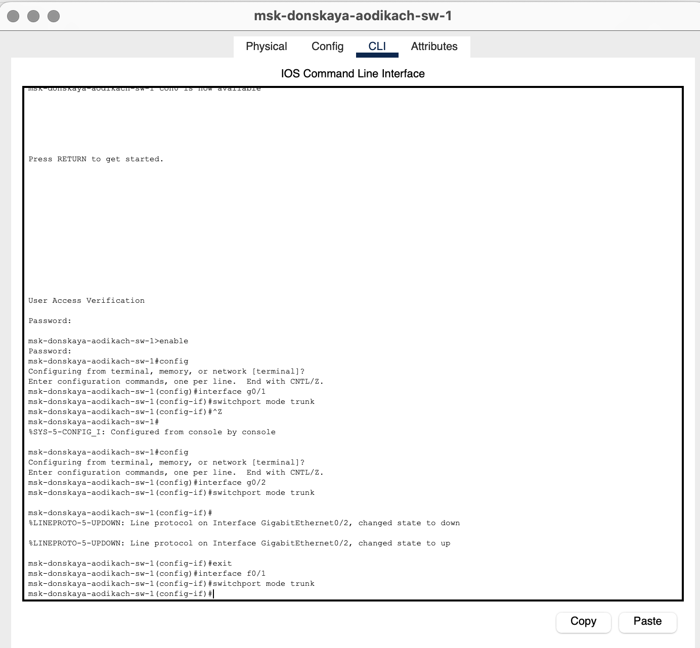
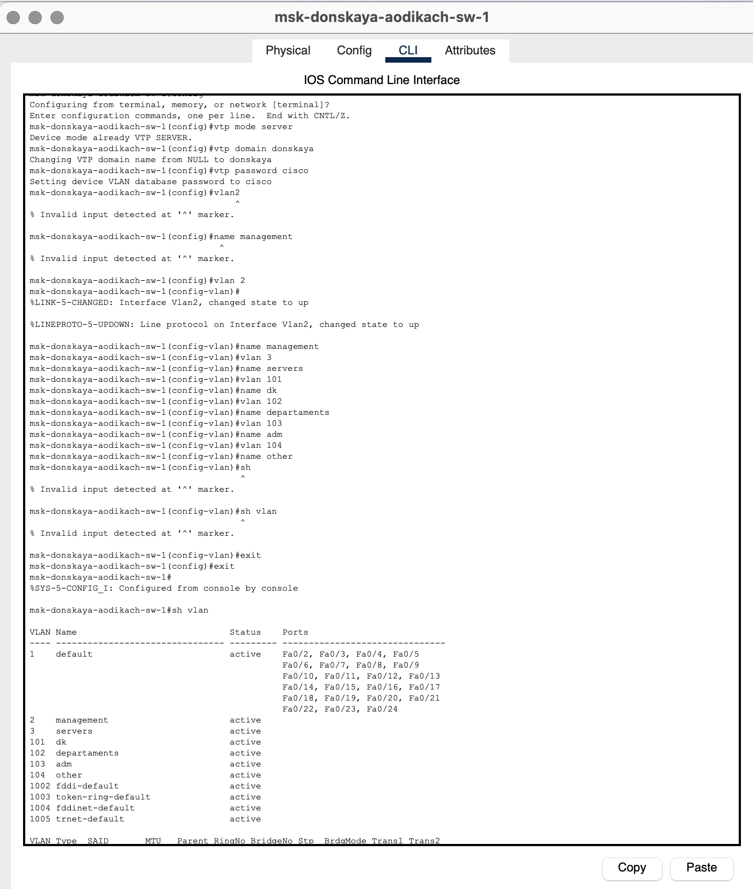
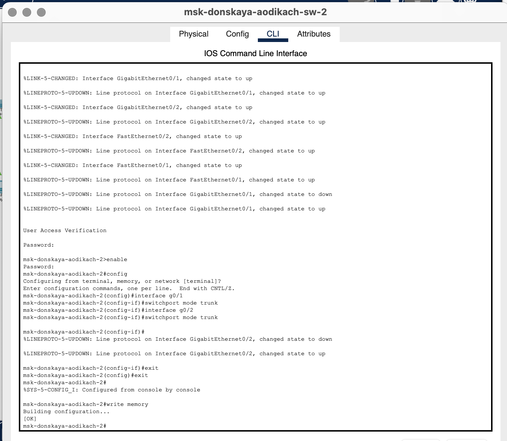
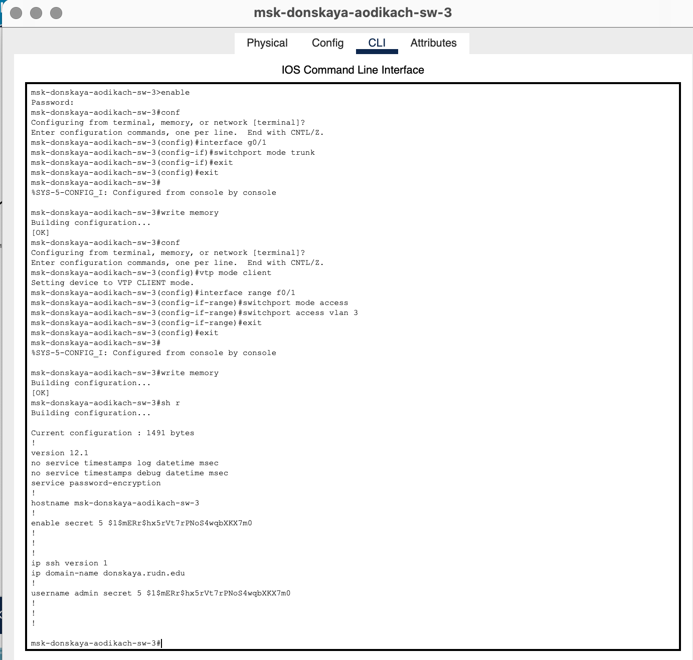
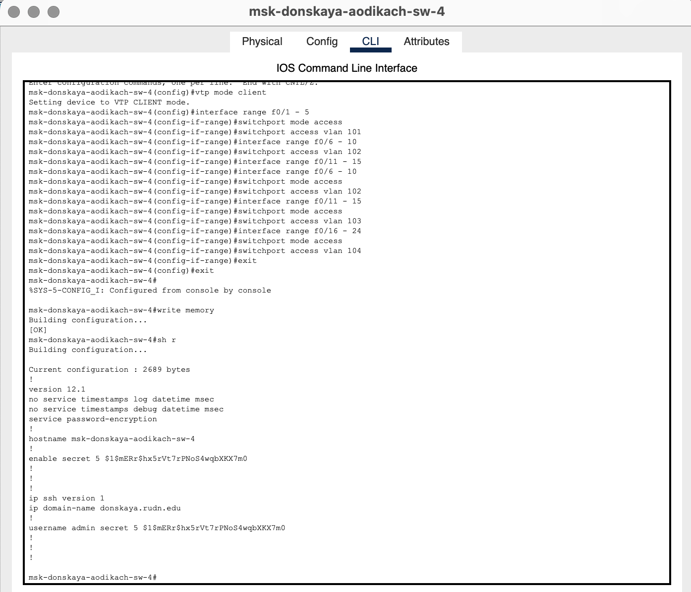

---
## Front matter
title: "Лабораторная работа №5"
subtitle: "Админимстрирование локальных сетей"
author: "Дикач Анна Олеговна НПИбд-01-22"

## Generic otions
lang: ru-RU
toc-title: "Содержание"

## Bibliography
bibliography: bib/cite.bib
csl: pandoc/csl/gost-r-7-0-5-2008-numeric.csl

## Pdf output format
toc: true # Table of contents
toc-depth: 2
lof: true # List of figures
lot: true # List of tables
fontsize: 12pt
linestretch: 1.5
papersize: a4
documentclass: scrreprt
## I18n polyglossia
polyglossia-lang:
  name: russian
  options:
  - spelling=modern
  - babelshorthands=true
polyglossia-otherlangs:
  name: english
## I18n babel
babel-lang: russian
babel-otherlangs: english
## Fonts
mainfont: IBM Plex Serif
romanfont: IBM Plex Serif
sansfont: IBM Plex Sans
monofont: IBM Plex Mono
mathfont: STIX Two Math
mainfontoptions: Ligatures=Common,Ligatures=TeX,Scale=0.94
romanfontoptions: Ligatures=Common,Ligatures=TeX,Scale=0.94
sansfontoptions: Ligatures=Common,Ligatures=TeX,Scale=MatchLowercase,Scale=0.94
monofontoptions: Scale=MatchLowercase,Scale=0.94,FakeStretch=0.9
mathfontoptions:
## Biblatex
biblatex: true
biblio-style: "gost-numeric"
biblatexoptions:
  - parentracker=true
  - backend=biber
  - hyperref=auto
  - language=auto
  - autolang=other*
  - citestyle=gost-numeric
## Pandoc-crossref LaTeX customization
figureTitle: "Рис."
tableTitle: "Таблица"
listingTitle: "Листинг"
lofTitle: "Список иллюстраций"
lotTitle: "Список таблиц"
lolTitle: "Листинги"
## Misc options
indent: true
header-includes:
  - \usepackage{indentfirst}
  - \usepackage{float} # keep figures where there are in the text
  - \floatplacement{figure}{H} # keep figures where there are in the text
---

# Цель работы

Получить основные навыки по настройке VLAN на коммутаторах сети.

# Выполнение лабораторной работы

1. Используя последовательность из текста лабораторной работы провожу конфигурацию Trunk-порта на коммутатору msk-donskaya-aodikach-sw-01 и msk-pavlovskaya-aodikach-sw-1 (рис. [-@fig:001]) (рис. [-@fig:002]).

{#fig:001 width=70%}

{#fig:002 width=70%}

2. Прописываю конфигурацию диапазонов портов и конфигурации VTP msk-donskaya-aodikach-sw-01 (рис. [-@fig:003]) (рис. [-@fig:004]).

{#fig:003 width=70%}

{#fig:004 width=70%}

3. Провожу настройку конфигурации Trunk-портов, VTP и диапазона портов для msk-donskaya-aodikach-sw-02 (рис. [-@fig:005]) (рис. [-@fig:006]).

{#fig:005 width=70%}

{#fig:006 width=70%}

4. Провожу настройку конфигурации Trunk-портов, VTP и диапазона портов для msk-donskaya-aodikach-sw-03 (рис. [-@fig:007]).

{#fig:007 width=70%}

5. Провожу настройку конфигурации Trunk-портов, VTP и диапазона портов для msk-donskaya-aodikach-sw-04 (рис. [-@fig:008]) (рис. [-@fig:009]).

{#fig:008 width=70%}

{#fig:009 width=70%}

6. В построенной сети все коммутаторы активны (рис. [-@fig:012]).

{#fig:012 width=70%}

7. Проверяю результат проделанной работы на dep-donskaya-aodikach-1 и пробую пропинговать устройство из другой сети. Неудачно (рис. [-@fig:010]) (рис. [-@fig:011]).

{#fig:010 width=70%}

{#fig:011 width=70%}

8. Запускаю симуляцию. В сети на одной улице пакеты коммуницируют друг с другом верно, однако при попытке передать пакеты на другую улицу вылезает ошибка (рис. [-@fig:013]) (рис. [-@fig:014]).

{#fig:013 width=70%}

{#fig:014 width=70%}

# Вывод

Получила основные навыки по настройке VLAN на коммутаторах сети.

# Ответ на вопросы

1. **Команда для просмотра списка VLAN:**
   ```bash
   show vlan brief
   ```

2. **VLAN Trunking Protocol (VTP):**
   - Протокол для синхронизации информации о VLAN между коммутаторами.
   - **Команды:**
     - Настройка режима VTP:
       ```bash
       vtp mode [server | client | transparent]
       ```
     - Настройка домена VTP:
       ```bash
       vtp domain <имя_домена>
       ```
     - Просмотр информации о VTP:
       ```bash
       show vtp status
       ```

3. **Internet Control Message Protocol (ICMP):**
   - Протокол для отправки сообщений об ошибках и диагностики сети.
   - **Формат пакета ICMP:**
     - Тип (8 бит) — тип сообщения (например, Echo Request/Reply).
     - Код (8 бит) — уточнение типа.
     - Контрольная сумма (16 бит) — проверка целостности.
     - Данные (переменная длина) — полезная нагрузка.

4. **Address Resolution Protocol (ARP):**
   - Протокол для определения MAC-адреса по IP-адресу.
   - **Формат пакета ARP:**
     - Тип сети (2 байта) — например, Ethernet (0x0001).
     - Тип протокола (2 байта) — например, IPv4 (0x0800).
     - Длина MAC-адреса (1 байт).
     - Длина IP-адреса (1 байт).
     - Операция (2 байта) — запрос (1) или ответ (2).
     - MAC-адрес отправителя (6 байт).
     - IP-адрес отправителя (4 байта).
     - MAC-адрес получателя (6 байт).
     - IP-адрес получателя (4 байта).

5. **MAC-адрес:**
   - Уникальный идентификатор сетевого устройства на канальном уровне.
   - **Структура:**
     - 6 байт (48 бит), записывается в формате `XX:XX:XX:XX:XX:XX`.
     - Первые 3 байта — идентификатор производителя (OUI).
     - Последние 3 байта — уникальный номер устройства.