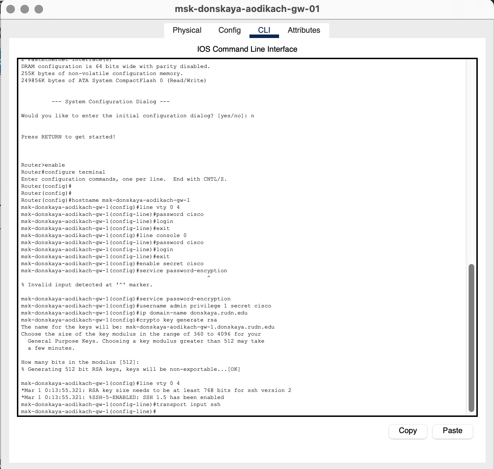
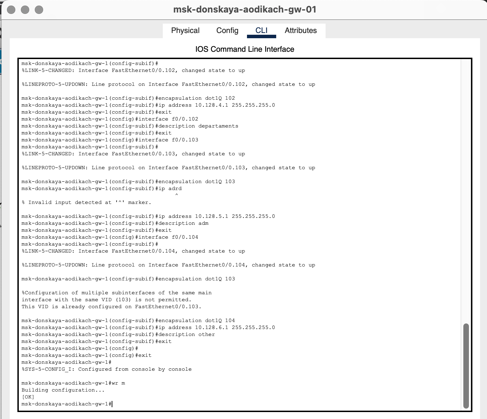
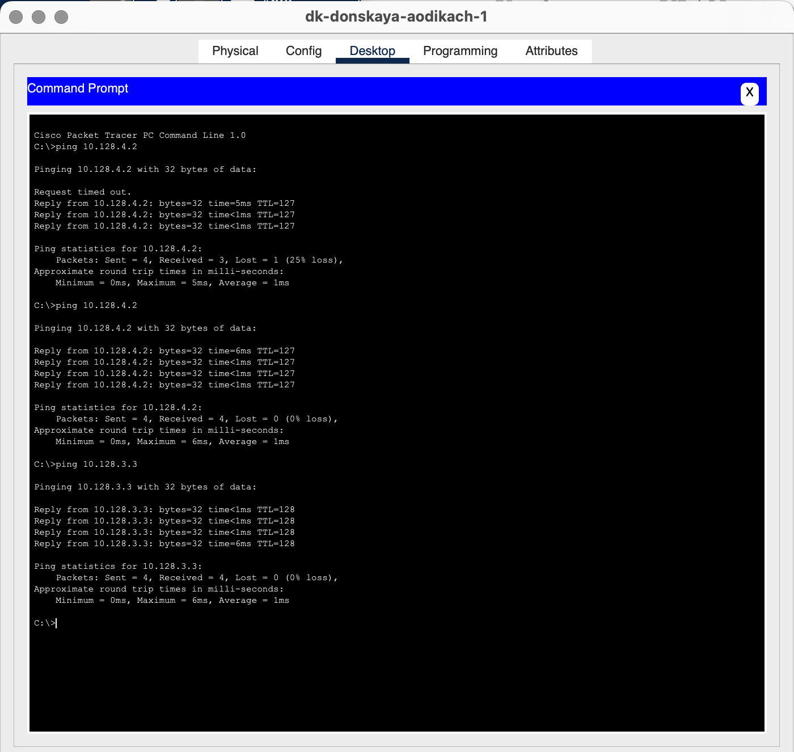
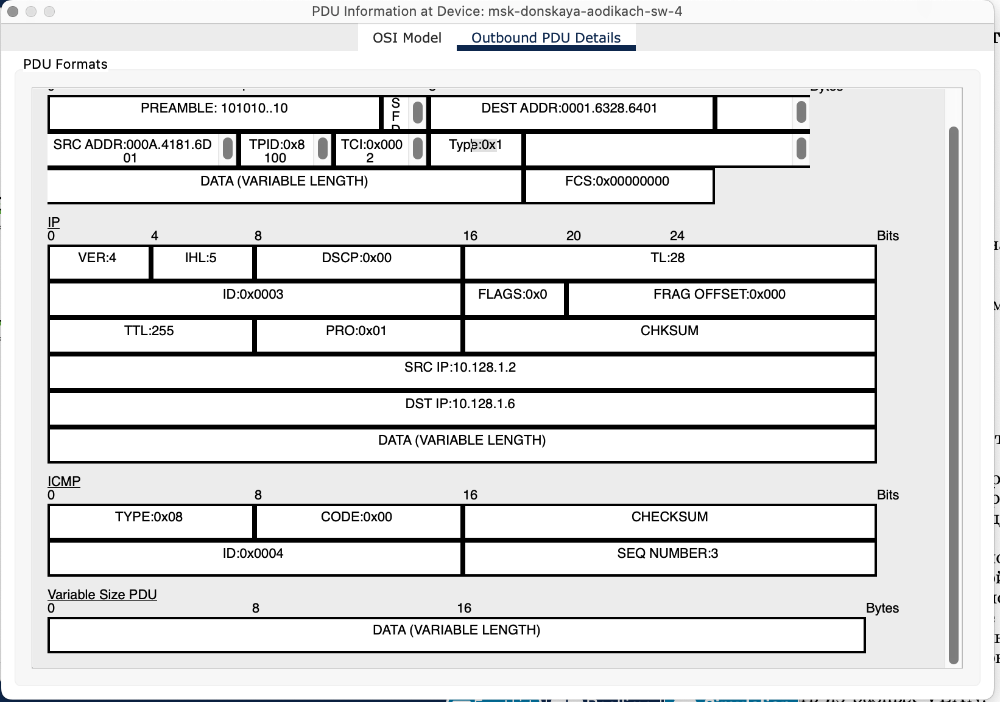
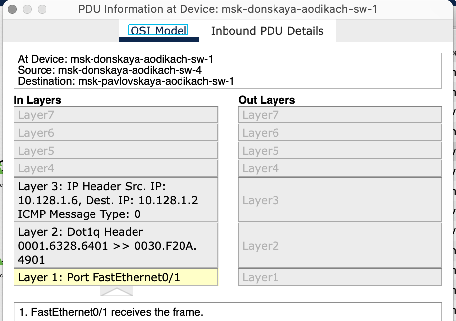

---
## Front matter
lang: ru-RU
title: Лабораторная работа №6
subtitle: Администрирование локальных сетей
author:
  - Дикач А.О.
institute:
  - Российский университет дружбы народов, Москва, Россия
date: 19.11.2025г

## i18n babel
babel-lang: russian
babel-otherlangs: english

## Formatting pdf
toc: false
toc-title: Содержание
slide_level: 2
aspectratio: 169
section-titles: true
theme: metropolis
header-includes:
 - \metroset{progressbar=frametitle,sectionpage=progressbar,numbering=fraction}
---

# Информация

## Докладчик

  * Дикач Анна Олеговна
  * НПИбд-01-22 (1132222009)
  * Российский университет дружбы народов
  * <https://github.com/chelibos?tab=repositories>

## Цель работы

Настроить статическую маршрутизацию VLAN в сети.

# Выполнение лабораторной работы

##  Добавляю маршрутизатор Cisco 2811 в сеть и подключаю его к 24 порту коммутатора msk-donskaya-aodikch-sw-01.

##   Провожу первичное конфигурирование маршрутизатора. Настраиваю имя, пароль, удалённое подключение по ssh

{#fig:001 width=70%}

## Настраиваю порт коммутатора на msk-donskaya-aodikach-sw-01 как trunk-порт

{#fig:002 width=70%}

## Настраиваю виртуальные интерфейсы в соответсвии с номерами VLAN опираясь на таблицу IP-адресов

{#fig:003 width=70%}

## Продолжение настройки портов 

{#fig:004 width=70%}

## Проверяю доступность устройств с помощью команды ping

{#fig:005 width=70%}

##  Запускаю симуляцию и просматриваю процесс передвижения пакета ICMP

{#fig:006 width=30%}

{#fig:007 width=30%}

## 

{#fig:008 width=30%}

{#fig:009 width=30%}

## Вывод

Настроила статистическую маршрутизацию VLAN в сети.

