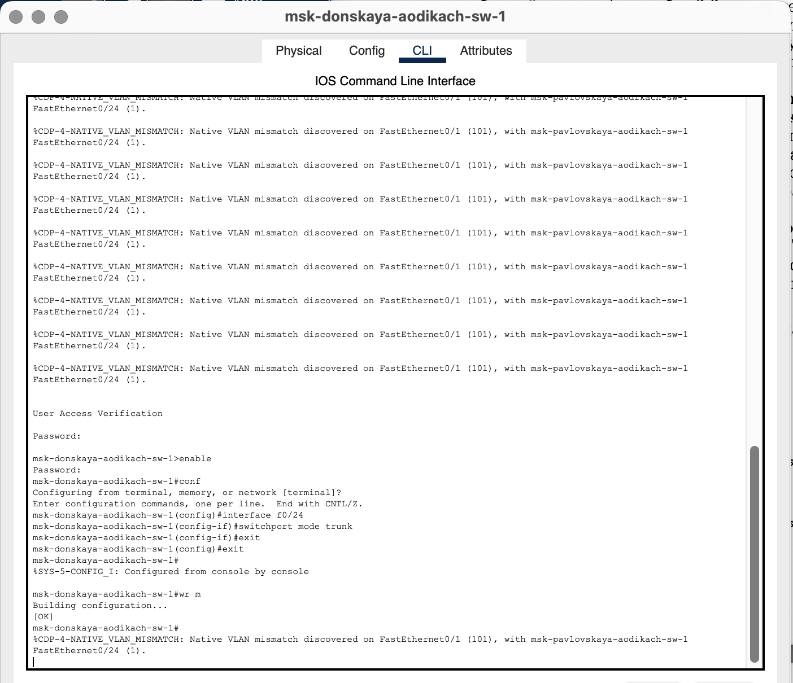
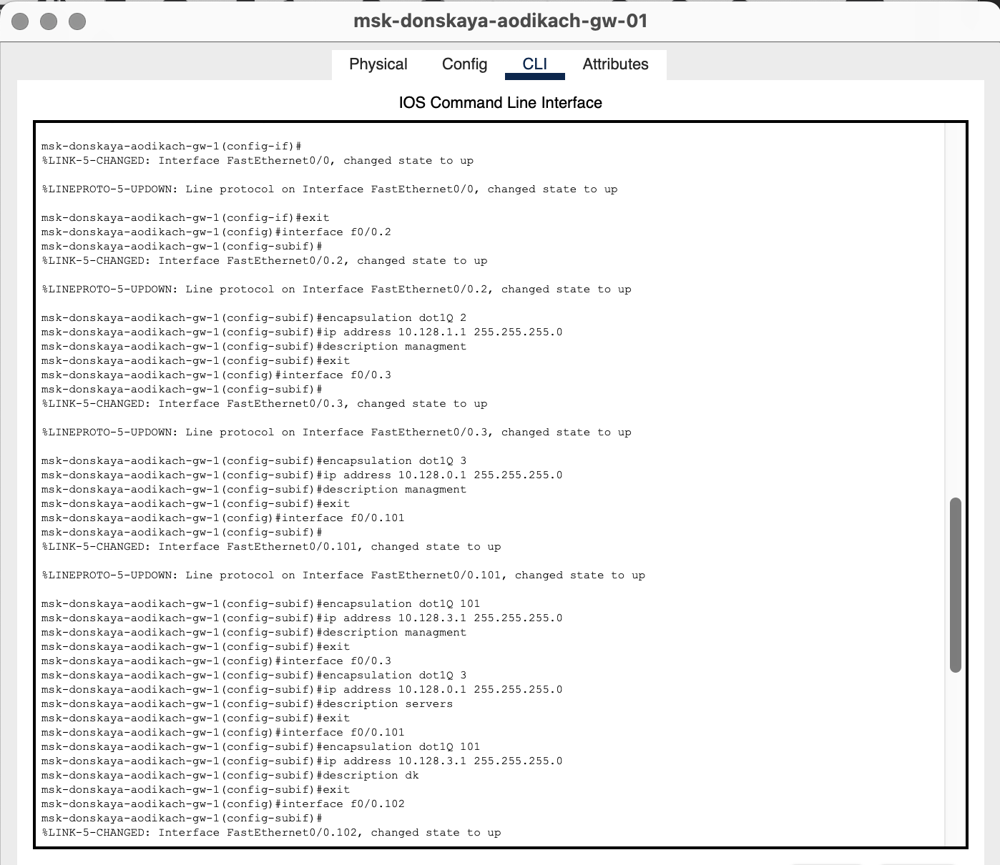
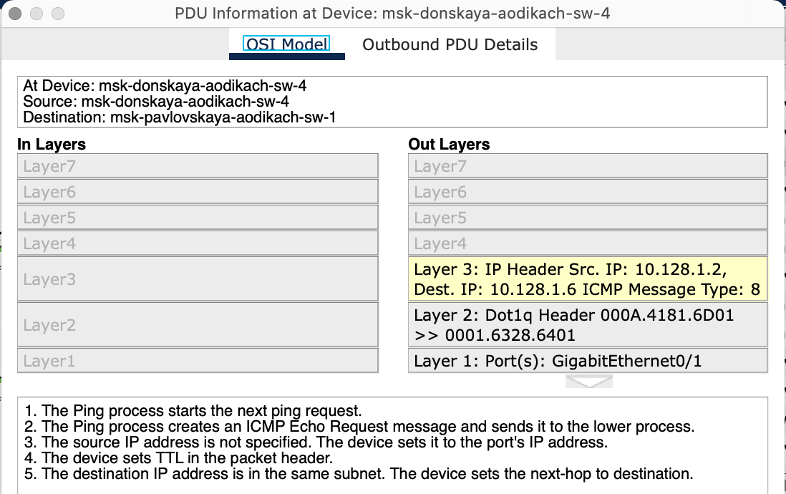
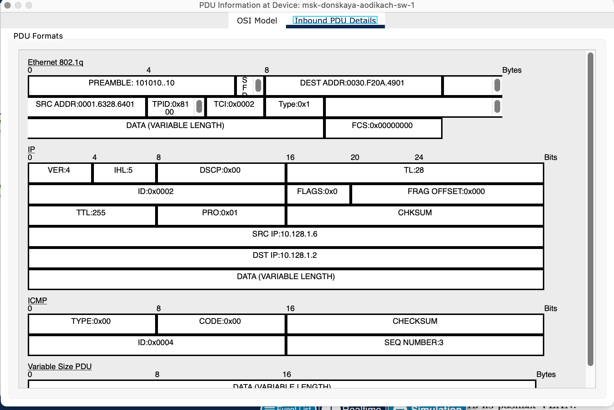

---
## Front matter
title: "Лабораторная работа №6"
subtitle: "Админимстрирование локальных сетей"
author: "Дикач Анна Олеговна НПИбд-01-22"

## Generic otions
lang: ru-RU
toc-title: "Содержание"

## Bibliography
bibliography: bib/cite.bib
csl: pandoc/csl/gost-r-7-0-5-2008-numeric.csl

## Pdf output format
toc: true # Table of contents
toc-depth: 2
lof: true # List of figures
lot: true # List of tables
fontsize: 12pt
linestretch: 1.5
papersize: a4
documentclass: scrreprt
## I18n polyglossia
polyglossia-lang:
  name: russian
  options:
  - spelling=modern
  - babelshorthands=true
polyglossia-otherlangs:
  name: english
## I18n babel
babel-lang: russian
babel-otherlangs: english
## Fonts
mainfont: IBM Plex Serif
romanfont: IBM Plex Serif
sansfont: IBM Plex Sans
monofont: IBM Plex Mono
mathfont: STIX Two Math
mainfontoptions: Ligatures=Common,Ligatures=TeX,Scale=0.94
romanfontoptions: Ligatures=Common,Ligatures=TeX,Scale=0.94
sansfontoptions: Ligatures=Common,Ligatures=TeX,Scale=MatchLowercase,Scale=0.94
monofontoptions: Scale=MatchLowercase,Scale=0.94,FakeStretch=0.9
mathfontoptions:
## Biblatex
biblatex: true
biblio-style: "gost-numeric"
biblatexoptions:
  - parentracker=true
  - backend=biber
  - hyperref=auto
  - language=auto
  - autolang=other*
  - citestyle=gost-numeric
## Pandoc-crossref LaTeX customization
figureTitle: "Рис."
tableTitle: "Таблица"
listingTitle: "Листинг"
lofTitle: "Список иллюстраций"
lotTitle: "Список таблиц"
lolTitle: "Листинги"
## Misc options
indent: true
header-includes:
  - \usepackage{indentfirst}
  - \usepackage{float} # keep figures where there are in the text
  - \floatplacement{figure}{H} # keep figures where there are in the text
---

# Цель работы

Настроить статическую маршрутизацию VLAN в сети.

# Выполнение лабораторной работы

1. Добавляю маршрутизатор Cisco 2811 в сеть и подключаю его к 24 порту коммутатора msk-donskaya-aodikch-sw-01.

2.  Провожу первичное конфигурирование маршрутизатора. Настраиваю имя, пароль, удалённое подключение по ssh
 (рис. [-@fig:001]).

{#fig:001 width=70%}

3. Настраиваю порт коммутатора на msk-donskaya-aodikach-sw-01 как trunk-порт (рис. [-@fig:002]).

{#fig:002 width=70%}

4. Настраиваю виртуальные интерфейсы в соответсвии с номерами VLAN опираясь на таблицу IP-адресов (рис. [-@fig:003]) (рис. [-@fig:004]).

{#fig:003 width=70%}

{#fig:004 width=70%}

5. Проверяю доступность устройств с помощью команды ping (рис. [-@fig:005]).

{#fig:005 width=70%}

6. Запускаю симуляцию и просматриваю процесс передвижения пакета ICMP (рис. [-@fig:006]) (рис. [-@fig:007]) (рис. [-@fig:008]) (рис. [-@fig:009]) .

{#fig:006 width=70%}

{#fig:007 width=70%}

{#fig:008 width=70%}

{#fig:009 width=70%}

# Вывод

Настроила статистическую маршрутизацию VLAN в сети.

# Ответ на вопросы

1. **IEEE 802.1Q** — стандарт, определяющий механизм VLAN (виртуальных локальных сетей) и тегирование кадров для их идентификации в сетях Ethernet. Позволяет разделять трафик на логические сегменты.

2. **Формат кадра IEEE 802.1Q**:  
   - Вставляется 4-байтовый тег (VLAN Tag) между полями MAC-адресов и EtherType.  
   - Тег включает:  
     - **TPID (Tag Protocol Identifier, 2 байта)**: Указывает на наличие тега (обычно 0x8100).  
     - **PCP (Priority Code Point, 3 бита)**: Приоритет кадра.  
     - **DEI (Drop Eligible Indicator, 1 бит)**: Флаг возможности отбрасывания кадра.  
     - **VID (VLAN Identifier, 12 бит)**: Идентификатор VLAN (диапазон 0–4095).

# Список литературы{.unnumbered}

::: {#refs}
:::