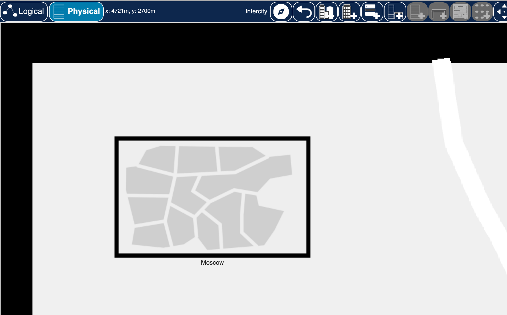
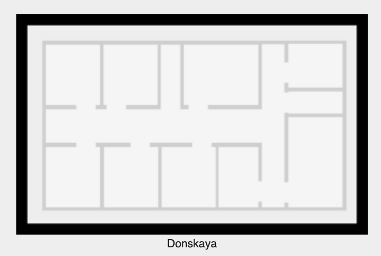
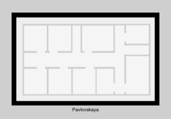
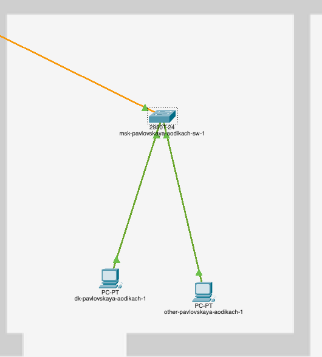
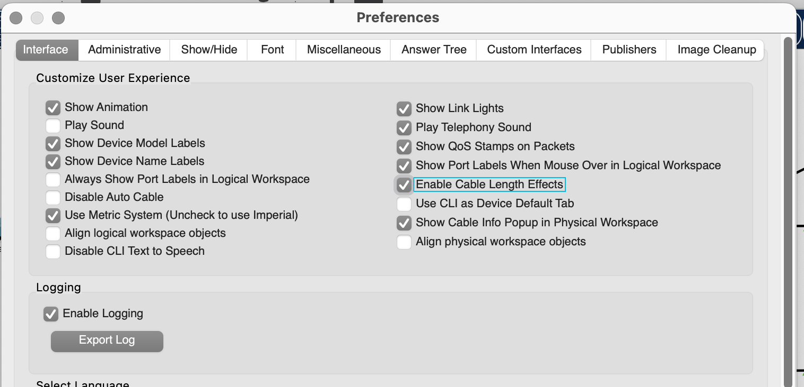
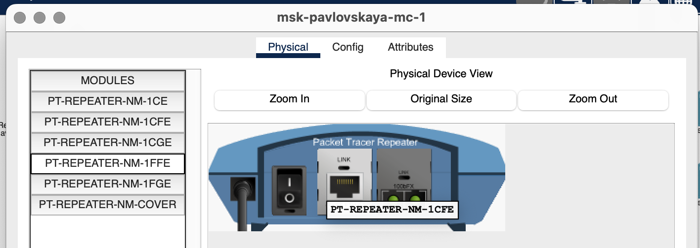
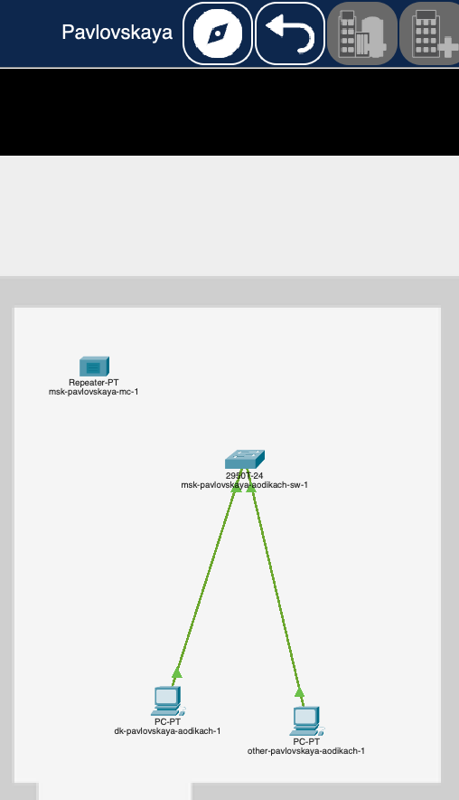
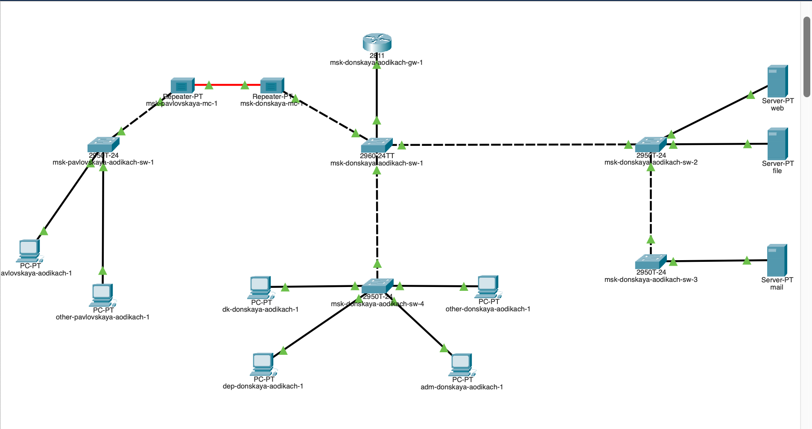

---
## Front matter
lang: ru-RU
title: Лабораторная работа №7
subtitle: Администрирование локальных сетей
author:
  - Дикач А.О.
institute:
  - Российский университет дружбы народов, Москва, Россия
date: 27.03.2025 г.

## i18n babel
babel-lang: russian
babel-otherlangs: english

## Formatting pdf
toc: false
toc-title: Содержание
slide_level: 2
aspectratio: 169
section-titles: true
theme: metropolis
header-includes:
 - \metroset{progressbar=frametitle,sectionpage=progressbar,numbering=fraction}
---

# Информация

## Докладчик

  * Дикач Анна Олеговна
  * НПИбд-01-22 (1132222009)
  * Российский университет дружбы народов
  * <https://github.com/chelibos?tab=repositories>

## Цель работы

Получить навыки работы с физической рабочей областью Packet Tracer, а также учесть физические параметры сети.

# Выполнение лабораторной работы

##  Открываю файл лабораторной работы №6 и перехожу в физическую рабочую часть. Присваиваю городу название Moscow. Создаю новую улицу и меняю названия по умолчанию на Donskaya и Pavlovskaya

{#fig:001 width=50%}

##  

{#fig:002 width=30%}

{#fig:003 width=30%}

## Перехожу в редактирование серверной части и переношу все устройства с припиской Pavlovskaya на одноимённую улицу

{#fig:004 width=20%}

{#fig:005 width=20%}

## Пингую устройства на другой улице и убеждаюсь в том что соединение сохранено

{#fig:006 width=60%}

## Активирую разрешение на учёт физических характеристик среды передачи 

{#fig:007 width=70%}

##  Переношу улицы подальше друг от друга в физической части приложения и заново пингую устройства. Теперь пинг не доходит

{#fig:008 width=40%}

{#fig:009 width=40%}

## Удалаляю соединение между улицами и добавляю два повторителя. Заменяю имеющиеся модули на PT-REPEATER- NM-1FFE и PT-REPEATER-NM-1CFE для подключения оптоволокна и витой пары по технологии Fast Ethernet

{#fig:010 width=40%}

{#fig:011 width=40%}

## Переножу один из повторителей на территорию Pavlovskaya

{#fig:012 width=50%}

##  Подключаю коммутатор msk-donskaya-sw-1 к msk-donskaya-mc-1 по ви- той паре, msk-donskaya-mc-1 и msk-pavlovskaya-mc-1 — по оптоволокну, msk-pavlovskaya-sw-1 к msk-pavlovskaya-mc-1 — по витой паре

{#fig:013 width=30%}

{#fig:014 width=30%}

## Проверяю работоспособность соединения

{#fig:015 width=70%}

## Вывод

Получила навыки работы с физической рабочей областью Packet Tracer, а также учла физические параметры сети

