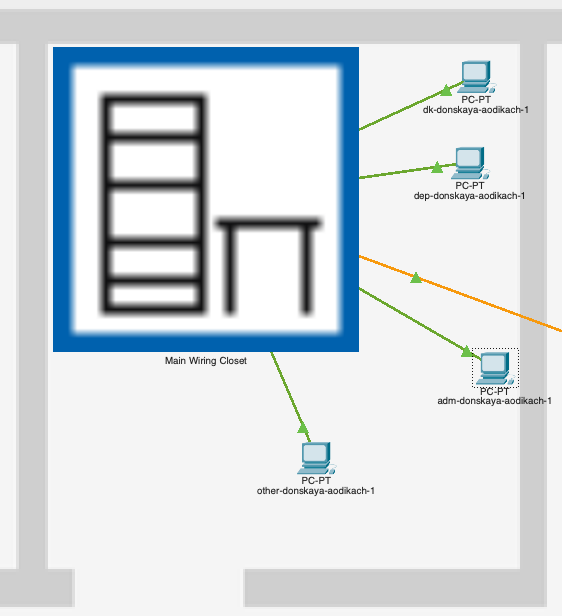
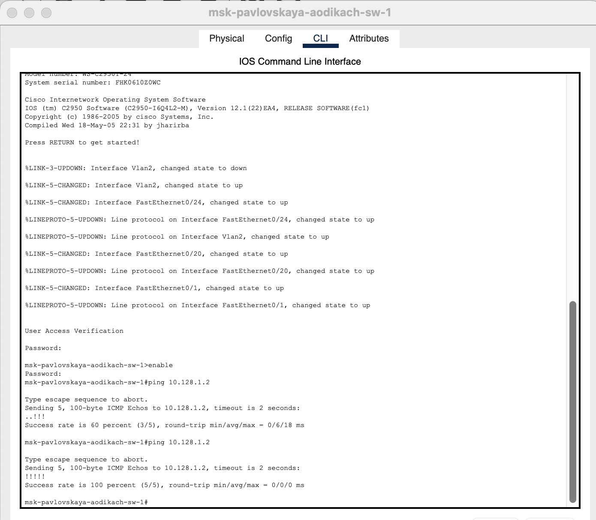
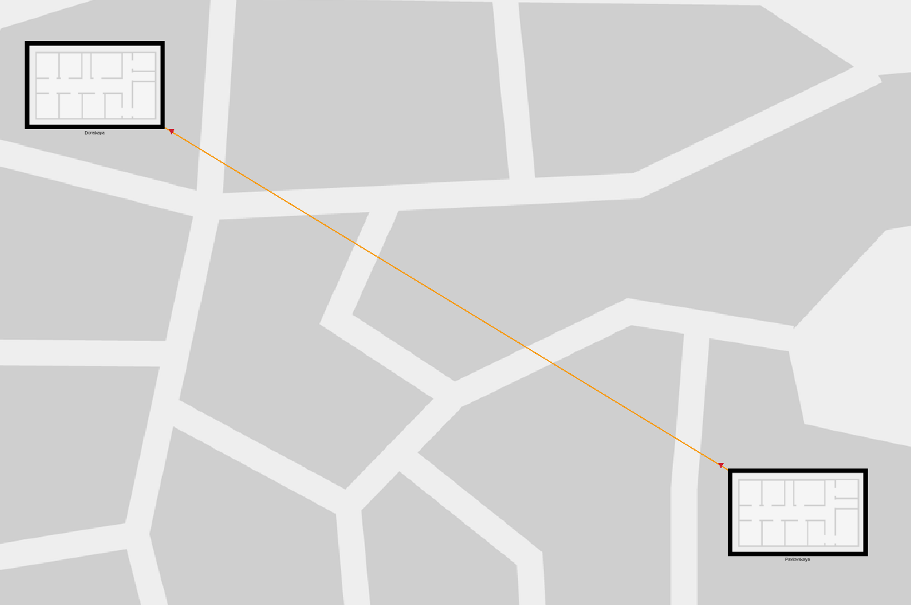
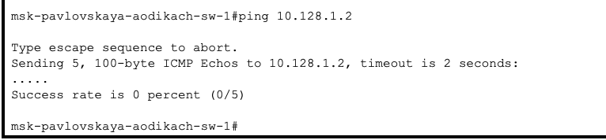
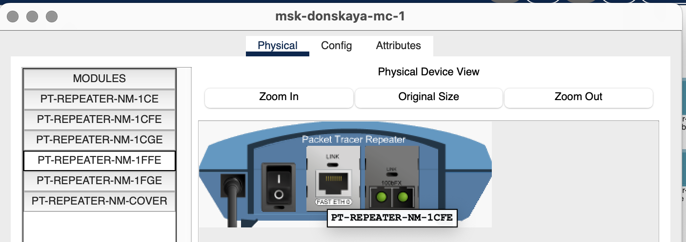
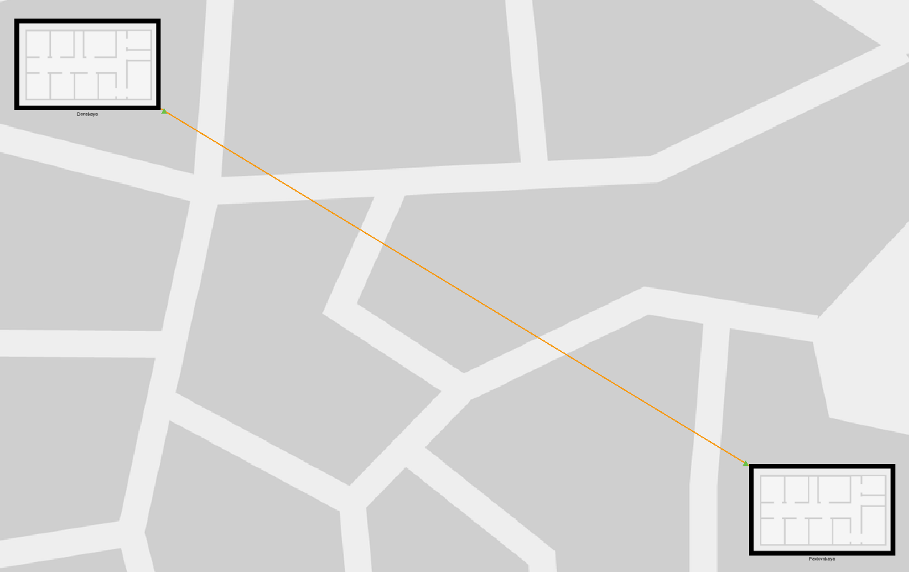
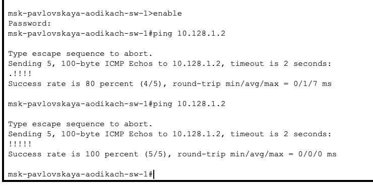

---
## Front matter
title: "Лабораторная работа №7"
subtitle: "Админимстрирование локальных сетей"
author: "Дикач Анна Олеговна НПИбд-01-22"

## Generic otions
lang: ru-RU
toc-title: "Содержание"

## Bibliography
bibliography: bib/cite.bib
csl: pandoc/csl/gost-r-7-0-5-2008-numeric.csl

## Pdf output format
toc: true # Table of contents
toc-depth: 2
lof: true # List of figures
lot: true # List of tables
fontsize: 12pt
linestretch: 1.5
papersize: a4
documentclass: scrreprt
## I18n polyglossia
polyglossia-lang:
  name: russian
  options:
  - spelling=modern
  - babelshorthands=true
polyglossia-otherlangs:
  name: english
## I18n babel
babel-lang: russian
babel-otherlangs: english
## Fonts
mainfont: IBM Plex Serif
romanfont: IBM Plex Serif
sansfont: IBM Plex Sans
monofont: IBM Plex Mono
mathfont: STIX Two Math
mainfontoptions: Ligatures=Common,Ligatures=TeX,Scale=0.94
romanfontoptions: Ligatures=Common,Ligatures=TeX,Scale=0.94
sansfontoptions: Ligatures=Common,Ligatures=TeX,Scale=MatchLowercase,Scale=0.94
monofontoptions: Scale=MatchLowercase,Scale=0.94,FakeStretch=0.9
mathfontoptions:
## Biblatex
biblatex: true
biblio-style: "gost-numeric"
biblatexoptions:
  - parentracker=true
  - backend=biber
  - hyperref=auto
  - language=auto
  - autolang=other*
  - citestyle=gost-numeric
## Pandoc-crossref LaTeX customization
figureTitle: "Рис."
tableTitle: "Таблица"
listingTitle: "Листинг"
lofTitle: "Список иллюстраций"
lotTitle: "Список таблиц"
lolTitle: "Листинги"
## Misc options
indent: true
header-includes:
  - \usepackage{indentfirst}
  - \usepackage{float} # keep figures where there are in the text
  - \floatplacement{figure}{H} # keep figures where there are in the text
---

# Цель работы

Получить навыки работы с физической рабочей областью Packet Tracer, а также учесть физические параметры сети.

# Выполнение лабораторной работы

1. Открываю файл лабораторной работы №6 и перехожу в физическую рабочую часть. Присваиваю городу название Moscow. Создаю новую улицу и меняю названия по умолчанию на Donskaya и Pavlovskaya (рис. [-@fig:001]) (рис. [-@fig:002]) (рис. [-@fig:003]).

{#fig:001 width=70%}

{#fig:002 width=70%}

{#fig:003 width=70%}

2. Перехожу в редактирование серверной части и переношу все устройства с припиской Pavlovskaya на одноимённую улицу  (рис. [-@fig:004]) (рис. [-@fig:005]).

{#fig:004 width=70%}

{#fig:005 width=70%}

3. Пингую устройства на другой улице и убеждаюсь в том что соединение сохранено (рис. [-@fig:006]).

{#fig:006 width=70%}

4. Активирую разрешение на учёт физических характеристик среды передачи (рис. [-@fig:007]).

{#fig:007 width=70%}

5. Переношу улицы подальше друг от друга в физической части приложения и заново пингую устройства. Теперь пинг не доходит (рис. [-@fig:008]) (рис. [-@fig:009]).

{#fig:008 width=70%}

{#fig:009 width=70%}

6. Удалаляю соединение между улицами и добавляю два повторителя. Заменяю имеющиеся модули на PT-REPEATER- NM-1FFE и PT-REPEATER-NM-1CFE для подключения оптоволокна и витой пары по технологии Fast Ethernet (рис. [-@fig:010]) (рис. [-@fig:011]).

{#fig:010 width=70%}

{#fig:011 width=70%}

7. Переножу один из повторителей на территорию Pavlovskaya (рис. [-@fig:012]).

{#fig:012 width=70%}

8. Подключаю коммутатор msk-donskaya-sw-1 к msk-donskaya-mc-1 по ви- той паре, msk-donskaya-mc-1 и msk-pavlovskaya-mc-1 — по оптоволокну, msk-pavlovskaya-sw-1 к msk-pavlovskaya-mc-1 — по витой паре (рис. [-@fig:013]) (рис. [-@fig:014]).

{#fig:013 width=70%}

{#fig:014 width=70%}

9. Проверяю работоспособность соединения (рис. [-@fig:015]).

{#fig:015 width=70%}

# Вывод

Получила навыки работы с физической рабочей областью Packet Tracer, а также учла физические параметры сети

# Ответ на вопросы

1. Среды передачи данных: витая пара, коаксиальный кабель, оптоволокно, радиоволны. Характеристики: ширина канала, дальность передачи, устойчивость к помехам, стоимость, легкость установки.

2. Категории витой пары: 

   • Cat 5e — до 1 Гбит/с на 100 м.

   • Cat 6 — до 10 Гбит/с на 55 м.

   • Cat 6a — до 10 Гбит/с на 100 м.

   • Cat 7 — до 10 Гбит/с на 100 м, экранированная.

   • Cat 8 — до 25/40 Гбит/с на 30 м.
   Отличия: максимальная скорость и дальность передачи. Используются в зависимости от требований к скорости и расстоянию.

3. Одномодовое оптоволокно — передает свет по одному пути, используется для больших расстояний (до 100 км). Многомодовое оптоволокно — передает свет по нескольким путям, подходит для коротких расстояний (до 2 км). Выбор зависит от расстояния и необходимой пропускной способности.

4. Разъемы на патчах оптоволокна: LC, SC, ST, MTP/MPO. Отличия: размер, способ подключения и количество волокон. LC — компактный, SC — простой в использовании, ST — круглый с защелкой, MTP/MPO — многоволоконный разъем для высокой плотности.

# Список литературы {.unnumbered}

::: {#refs}
:::