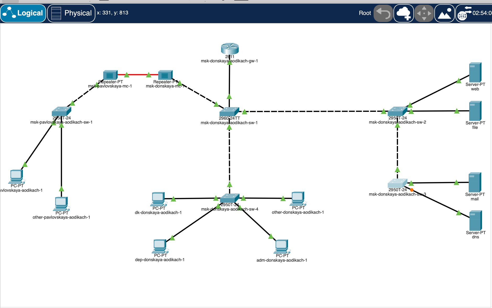
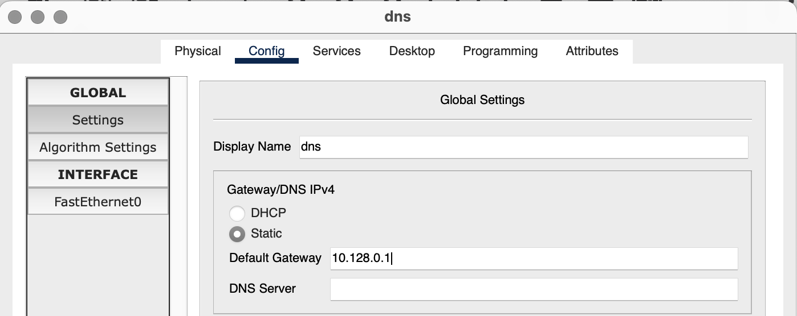
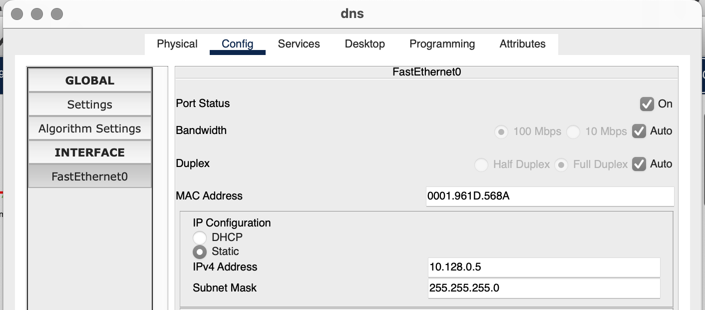
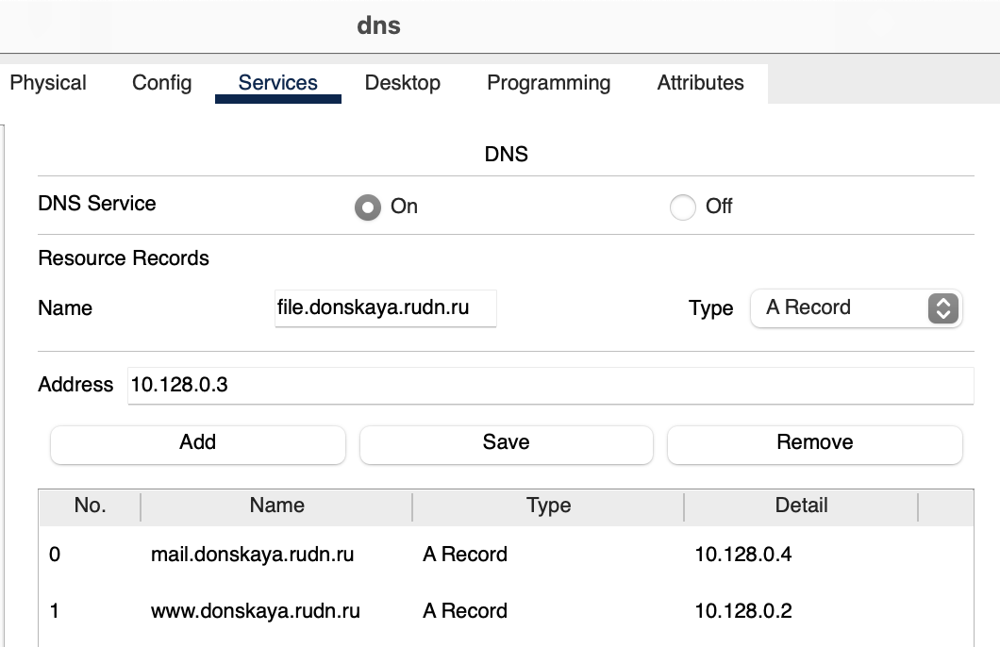
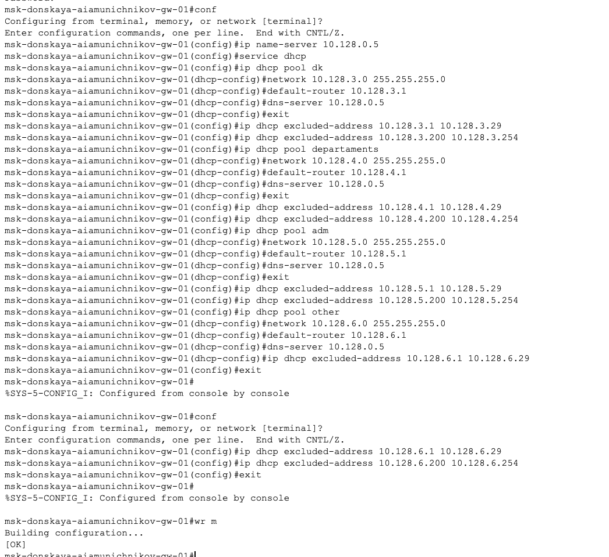
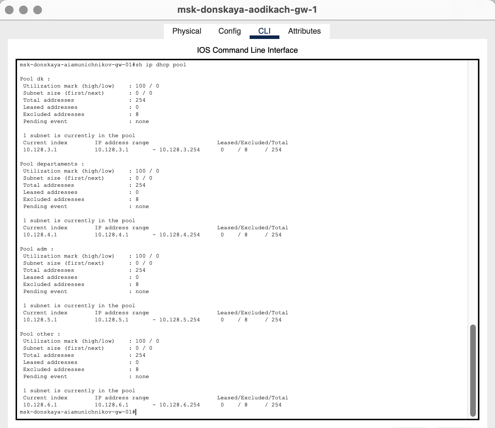
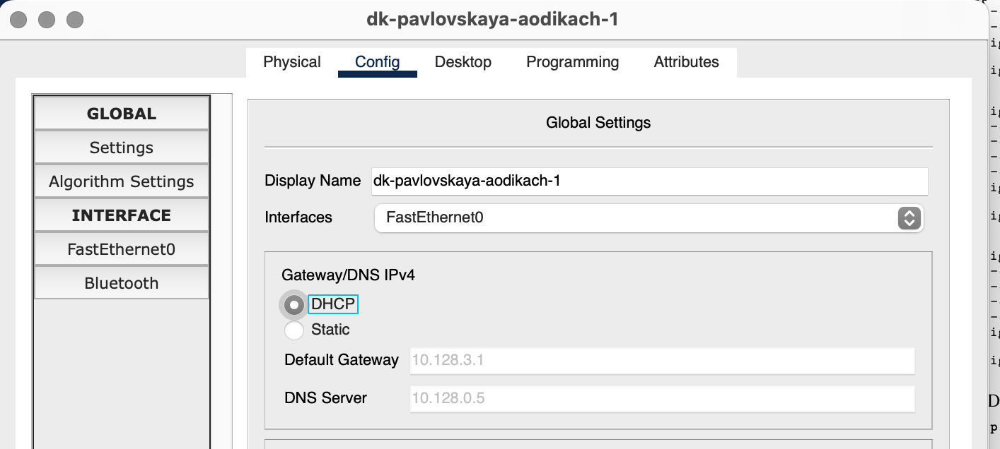
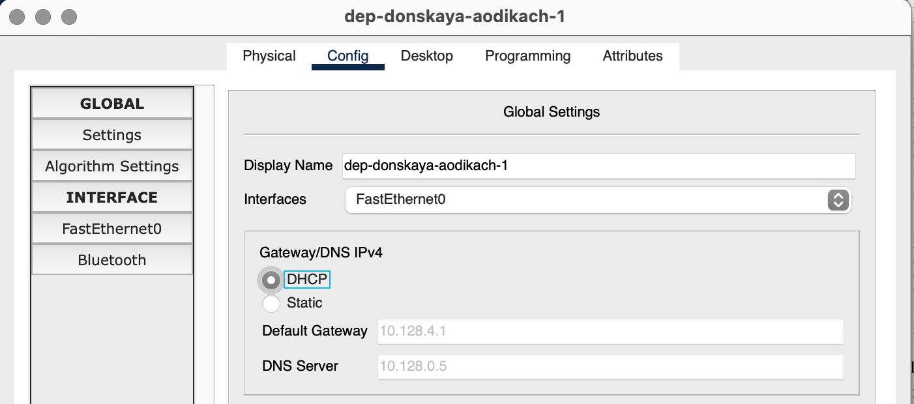
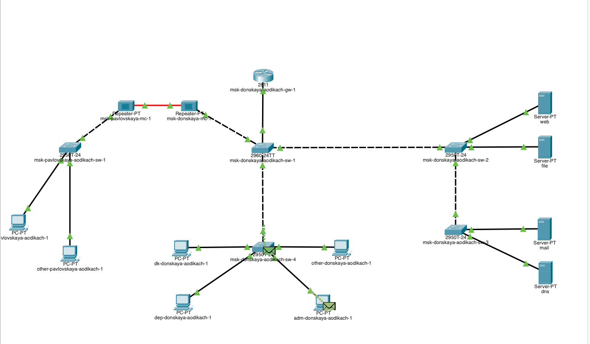
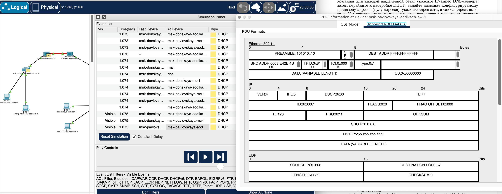

---
## Front matter
lang: ru-RU
title: Лабораторная работа №8
subtitle: Администрирование локальных сетей
author:
  - Дикач А.О.
institute:
  - Российский университет дружбы народов, Москва, Россия
date: 27.03.2025 г.

## i18n babel
babel-lang: russian
babel-otherlangs: english

## Formatting pdf
toc: false
toc-title: Содержание
slide_level: 2
aspectratio: 169
section-titles: true
theme: metropolis
header-includes:
 - \metroset{progressbar=frametitle,sectionpage=progressbar,numbering=fraction}
---

# Информация

## Докладчик

  * Дикач Анна Олеговна
  * НПИбд-01-22 (1132222009)
  * Российский университет дружбы народов
  * <https://github.com/chelibos?tab=repositories>

## Цель работы

Приобретение практических навыков по настройке динамического распреде- ления IP-адресов посредством протокола DHCP в локальной сети.

# Выполнение лабораторной работы

##  В логическую обласьь добавляю сервер dns и подключаю его к коммутатору.Активирую привязанные порты и настраиваю конфигурацию сервера

{#fig:001 width=40%}

{#fig:002 width=40%}

##  

{#fig:003 width=40%}

{#fig:004 width=40%}

## В конфигурации сервера выбираю службу DNS и активирую её. Добавляю записи о всех серверах 

{#fig:005 width=30%}

{#fig:006 width=30%}

##

{#fig:007 width=30%}

{#fig:008 width=30%}

## Настраиваю DHCP-сервис на маршрутизаторе с помощью скрипта из текста лабораторной работы

{#fig:009 width=70%}

##  Просматриваю информацию о пулах DHCP 

{#fig:010 width=70%}

## Просматриваю информацию о привязках выданных адресов

{#fig:011 width=70%}

## На оконечных устройствах меняю статистическое распредление адресов на динамическое 

{#fig:012 width=30%}

{#fig:013 width=30%}

##  Проверяю какие адреса выделяются оконечным устройствам, а также доступность устройств из разных подсетей

{#fig:014 width=70%}

## В режиме симуляции изучаю каким образом происходит запрос адреса по протоколу DHCP

{#fig:015 width=30%}

{#fig:016 width=30%}

## Вывод

Приобрела практические навыки по настройке динамического распределения IP-адресов посредством протокола DHCP в локальной сети.

