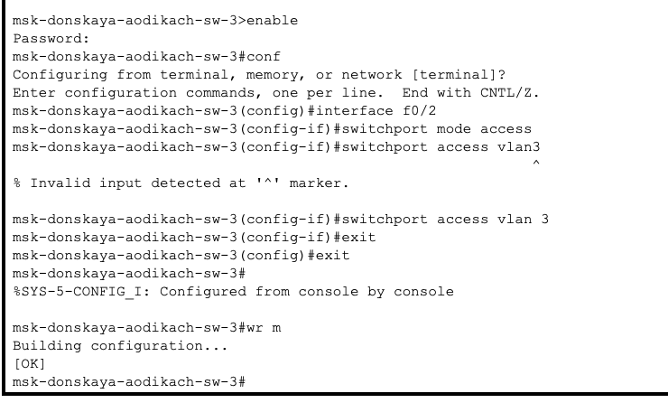
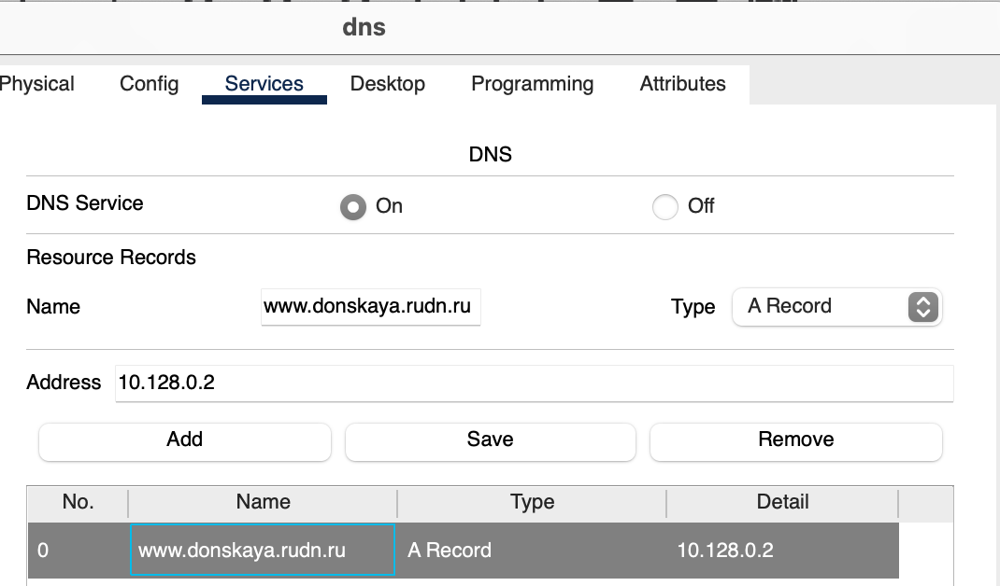
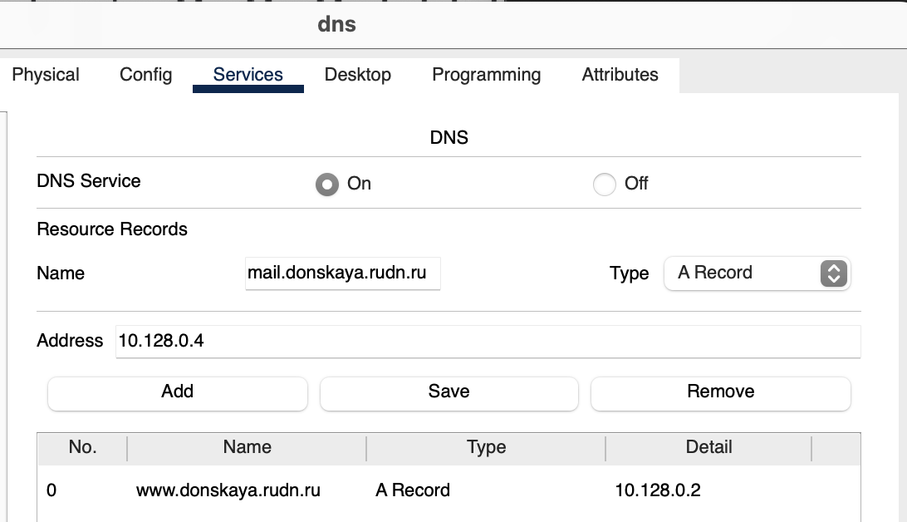
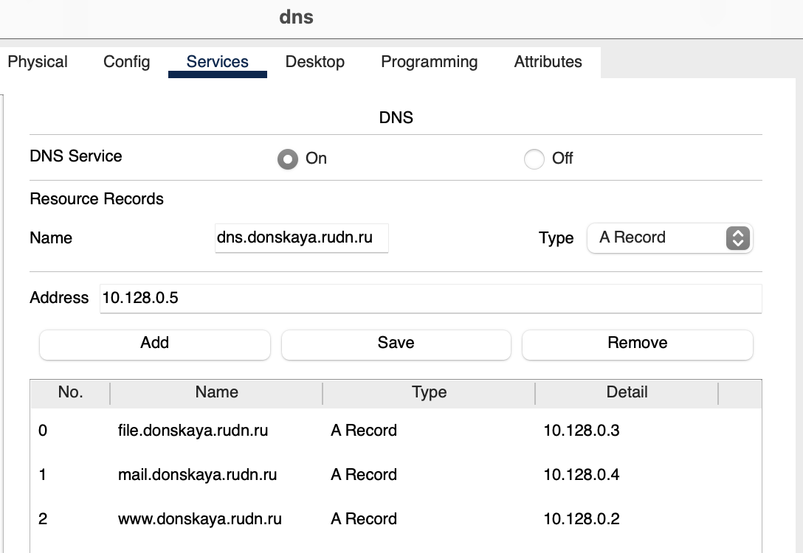
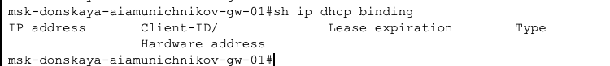
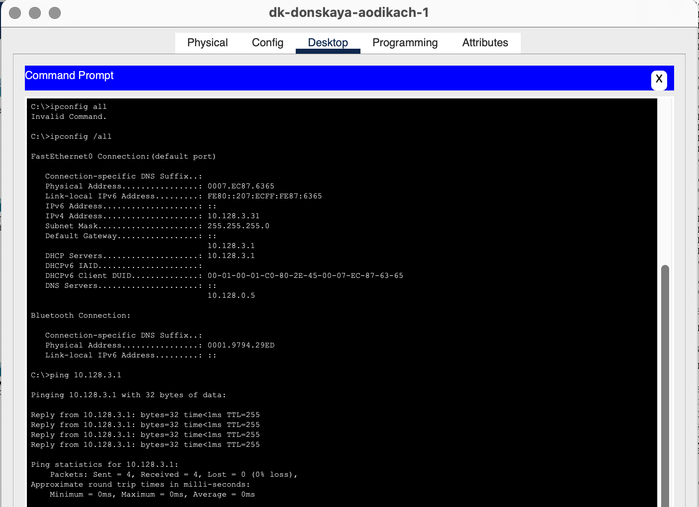

---
## Front matter
title: "Лабораторная работа №8"
subtitle: "Админимстрирование локальных сетей"
author: "Дикач Анна Олеговна НПИбд-01-22"

## Generic otions
lang: ru-RU
toc-title: "Содержание"

## Bibliography
bibliography: bib/cite.bib
csl: pandoc/csl/gost-r-7-0-5-2008-numeric.csl

## Pdf output format
toc: true # Table of contents
toc-depth: 2
lof: true # List of figures
lot: true # List of tables
fontsize: 12pt
linestretch: 1.5
papersize: a4
documentclass: scrreprt
## I18n polyglossia
polyglossia-lang:
  name: russian
  options:
  - spelling=modern
  - babelshorthands=true
polyglossia-otherlangs:
  name: english
## I18n babel
babel-lang: russian
babel-otherlangs: english
## Fonts
mainfont: IBM Plex Serif
romanfont: IBM Plex Serif
sansfont: IBM Plex Sans
monofont: IBM Plex Mono
mathfont: STIX Two Math
mainfontoptions: Ligatures=Common,Ligatures=TeX,Scale=0.94
romanfontoptions: Ligatures=Common,Ligatures=TeX,Scale=0.94
sansfontoptions: Ligatures=Common,Ligatures=TeX,Scale=MatchLowercase,Scale=0.94
monofontoptions: Scale=MatchLowercase,Scale=0.94,FakeStretch=0.9
mathfontoptions:
## Biblatex
biblatex: true
biblio-style: "gost-numeric"
biblatexoptions:
  - parentracker=true
  - backend=biber
  - hyperref=auto
  - language=auto
  - autolang=other*
  - citestyle=gost-numeric
## Pandoc-crossref LaTeX customization
figureTitle: "Рис."
tableTitle: "Таблица"
listingTitle: "Листинг"
lofTitle: "Список иллюстраций"
lotTitle: "Список таблиц"
lolTitle: "Листинги"
## Misc options
indent: true
header-includes:
  - \usepackage{indentfirst}
  - \usepackage{float} # keep figures where there are in the text
  - \floatplacement{figure}{H} # keep figures where there are in the text
---

# Цель работы

Приобретение практических навыков по настройке динамического распреде- ления IP-адресов посредством протокола DHCP в локальной сети.

# Выполнение лабораторной работы

1. В логическую обласьь добавляю сервер dns и подключаю его к коммутатору.Активирую привязанные порты и настраиваю конфигурацию сервера (рис. [-@fig:001])  (рис. [-@fig:002])  (рис. [-@fig:003])  (рис. [-@fig:004]).

{#fig:001 width=70%}

{#fig:002 width=70%}

{#fig:003 width=70%}

{#fig:004 width=70%}

2. В конфигурации сервера выбираю службу DNS и активирую её. Добавляю записи о всех серверах (рис. [-@fig:005]) (рис. [-@fig:006]) (рис. [-@fig:007]) (рис. [-@fig:008]).

{#fig:005 width=70%}

{#fig:006 width=70%}

{#fig:007 width=70%}

{#fig:008 width=70%}

3. Настраиваю DHCP-сервис на маршрутизаторе с помощью скрипта из текста лабораторной работы (рис. [-@fig:009]).

{#fig:009 width=70%}

4. Просматриваю информацию о пулах DHCP (рис. [-@fig:010]).

{#fig:010 width=70%}

5. Просматриваю информацию о привязках выданных адресов (рис. [-@fig:011]).

{#fig:011 width=70%}

7. На оконечных устройствах меняю статистическое распредление адресов на динамическое (рис. [-@fig:012]) (рис. [-@fig:013]).

{#fig:012 width=70%}

{#fig:013 width=70%}

8. Проверяю какие адреса выделяются оконечным устройствам, а также доступность устройств из разных подсетей (рис. [-@fig:014]).

{#fig:014 width=70%}

9. В режиме симуляции изучаю каким образом происходит запрос адреса по протоколу DHCP (рис. [-@fig:015]) (рис. [-@fig:016]).

{#fig:015 width=70%}

{#fig:016 width=70%}

# Вывод

Приобрела практические навыки по настройке динамического распределения IP-адресов посредством протокола DHCP в локальной сети.

# Ответ на вопросы

1. Протокол DHCP отвечает за автоматическую настройку IP-адресов и других сетевых параметров для устройств в сети.

2. Типы DHCP-сообщений: DHCPDISCOVER, DHCPOFFER, DHCPREQUEST, DHCPACK, DHCPNAK, DHCPRELEASE, DHCPINFORM.

3. Параметры в сообщениях DHCP: IP-адрес, маска подсети, шлюз по умолчанию, DNS-серверы, время аренды IP-адреса и другие настройки.

4. DNS (Domain Name System) — это система, которая переводит доменные имена в IP-адреса и обратно.

5. Типы записей DNS:

   • A (Address) — соответствует доменному имени и его IPv4-адресу.

   • AAAA — соответствует доменному имени и его IPv6-адресу.

   • CNAME (Canonical Name) — указывает на другое доменное имя.

   • MX (Mail Exchange) — определяет почтовые серверы для домена.

   • NS (Name Server) — указывает на серверы имен для домена.

   • TXT — содержит текстовую информацию, часто используется для верификации.

# Список литературы {.unnumbered}

::: {#refs}
:::