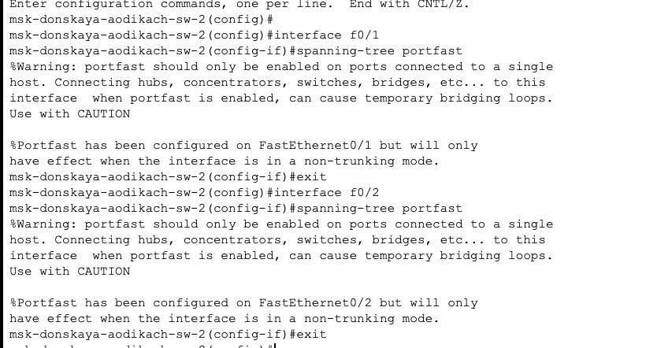
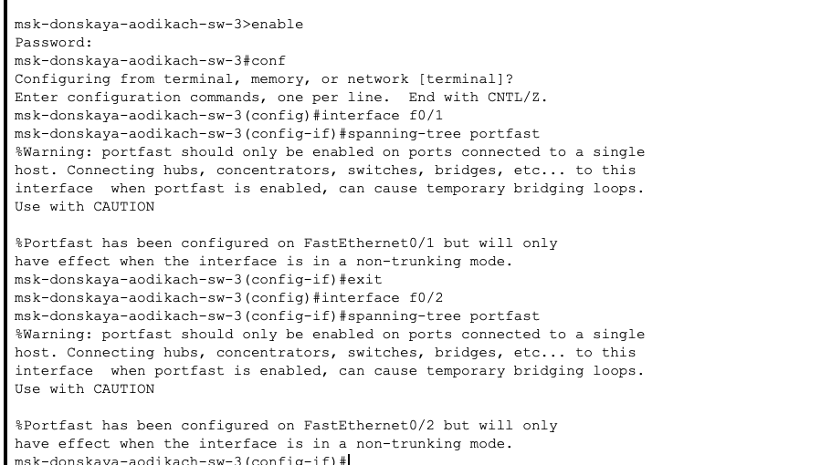
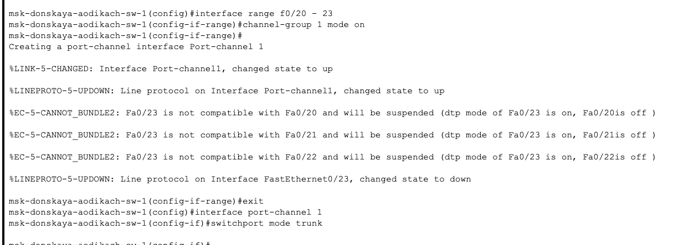

---
## Front matter
lang: ru-RU
title: Лабораторная работа №9
subtitle: Администрирование локальных сетей
author:
  - Дикач А.О.
institute:
  - Российский университет дружбы народов, Москва, Россия
date: 31.03.2025 г.

## i18n babel
babel-lang: russian
babel-otherlangs: english

## Formatting pdf
toc: false
toc-title: Содержание
slide_level: 2
aspectratio: 169
section-titles: true
theme: metropolis
header-includes:
 - \metroset{progressbar=frametitle,sectionpage=progressbar,numbering=fraction}
---

# Информация

## Докладчик

  * Дикач Анна Олеговна
  * НПИбд-01-22 (1132222009)
  * Российский университет дружбы народов
  * <https://github.com/chelibos?tab=repositories>

## Цель работы

Изучение возможностей протокола STP и его модификаций по обеспечению отказоустойчивости сети, агрегированию интерфейсов и перераспределению нагрузки между ними.

# Выполнение лабораторной работы

##  Сформировала резервное соединение между коммутаторами 1 и 3. сделала порт g0/2 транковым, соединила коммутаторы и сделала порты транковыми

{#fig:001 width=70%}

##  

{#fig:002 width=40%}

{#fig:003 width=40%}

## Пропинговала серверы mail и web. Движение пакетов происходит через коммутатор msk-donskaya-aodikach-sw-2

{#fig:004 width=70%}

## На коммутаторе msk-donskaya-sw-2 посмотриваю состояние протокола STP для vlan 3

{#fig:005 width=70%}

## В качестве корневого коммутатора STP настраиваю коммутатор msk- donskaya-sw-1. Убеждаюсь в том что пакеты ICMP проходят от хоста dk-donskaya-1 до mail через коммутаторы msk-donskaya-sw-1 и msk- donskaya-sw-3, а от хоста dk-donskaya-1 до web через коммутаторы msk-donskaya-sw-1 и msk-donskaya-sw-2.

{#fig:006 width=70%}

## Настраиваю режим Portfast на интерфейсах коммутаторов

{#fig:007 width=30%}

{#fig:008 width=30%}

## С помощью команды ping -n 1000 mail изучаю отказоустойчивость протокола STP и время восстановления соединения при переключении на резервное соединение

{#fig:009 width=70%}

##

{#fig:010 width=70%}

{#fig:011 width=70%}

##  Переключаю коммутаторы на режи работы по протоколу Rapid PVST+ и изучаю отказоустойчивость

{#fig:012 width=30%}

{#fig:013 width=30%}

## Формирую агрегированное соединение интерфейсов Fa0/20 – Fa0/23 между коммутаторами msk-donskaya-sw-1 и msk-donskaya-sw-4 и настраиваю агрегирование каналов

{#fig:014 width=40%}

{#fig:015 width=40%}

## Вывод

Изучила возможности протокола STP и его модификаций по обеспечению отказоустойчивости сети, агрегированию интерфейсов и перераспределению нагрузки между ними.

