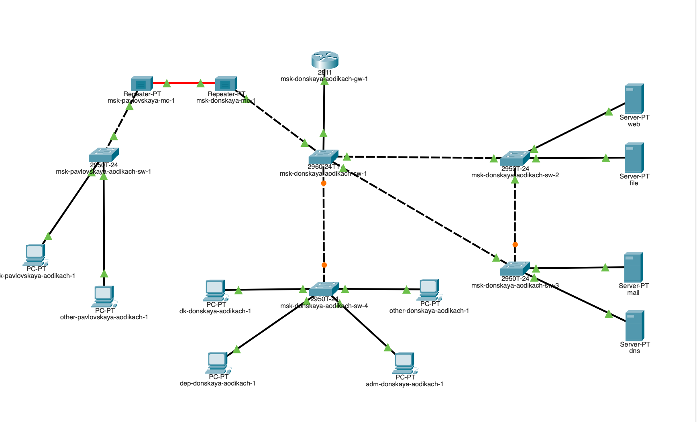
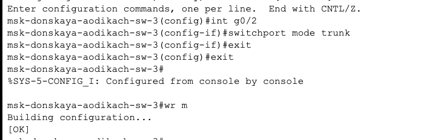
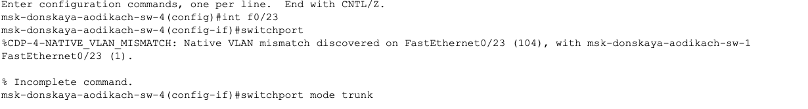
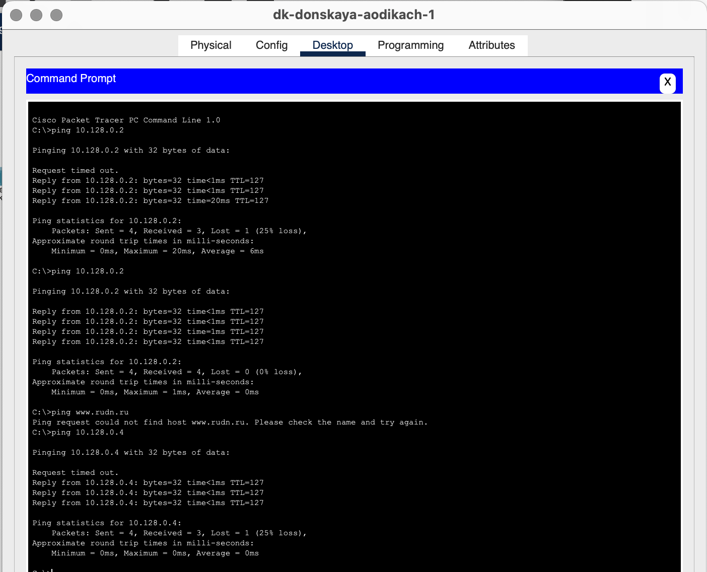
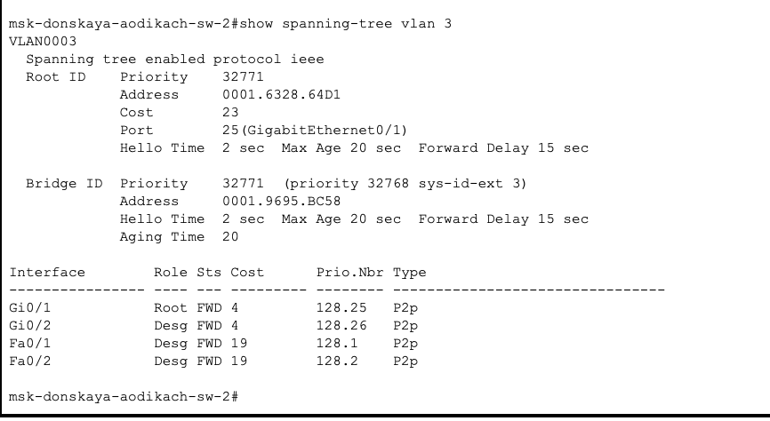
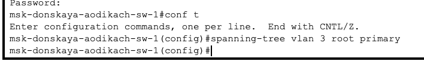
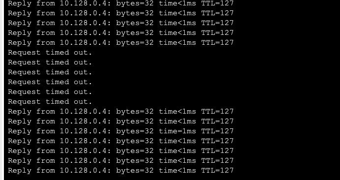
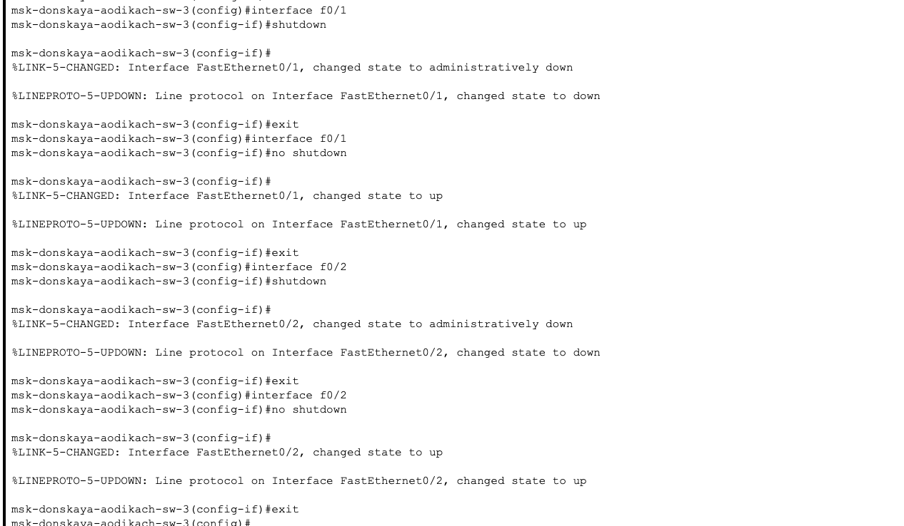
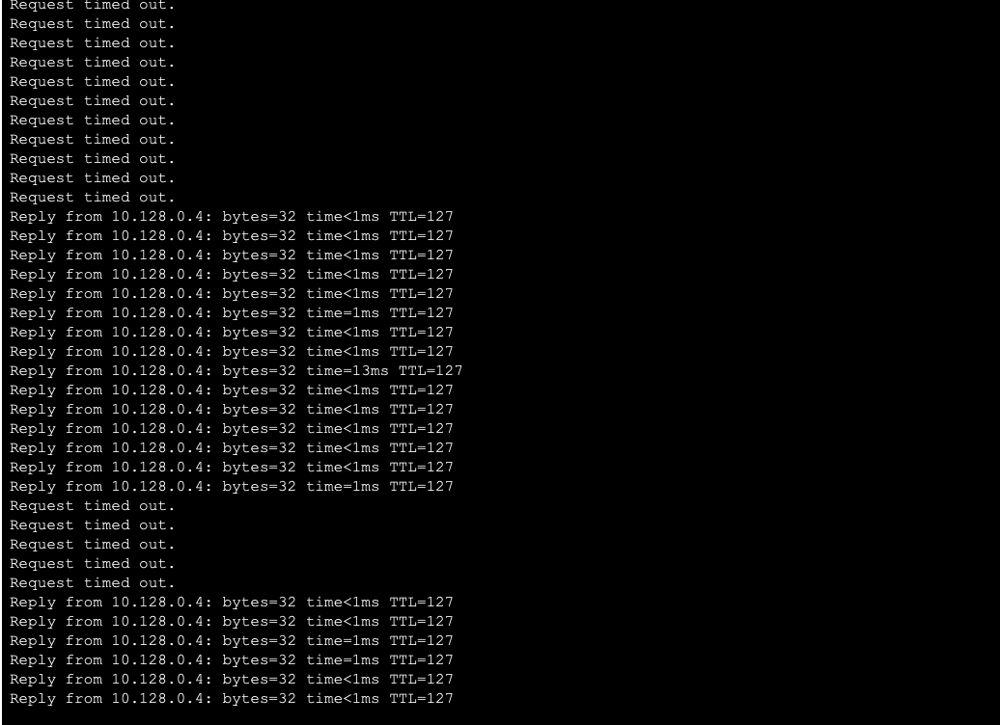
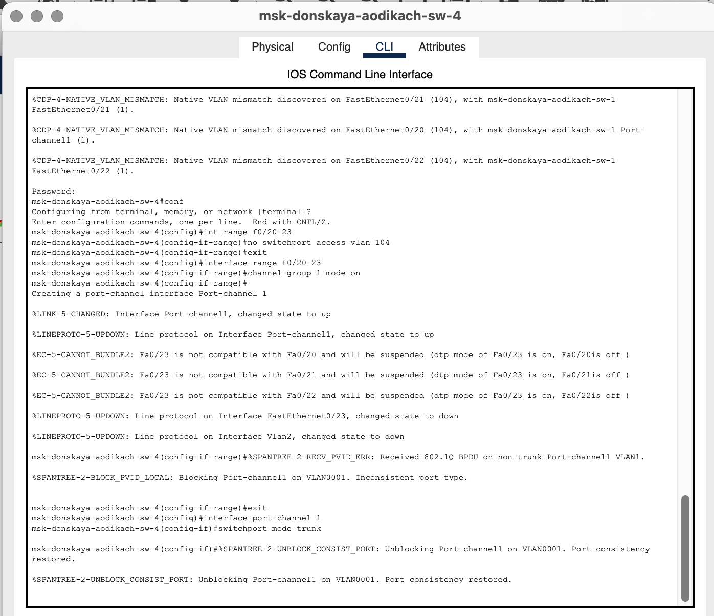

---
## Front matter
title: "Лабораторная работа №9"
subtitle: "Админимстрирование локальных сетей"
author: "Дикач Анна Олеговна НПИбд-01-22"

## Generic otions
lang: ru-RU
toc-title: "Содержание"

## Bibliography
bibliography: bib/cite.bib
csl: pandoc/csl/gost-r-7-0-5-2008-numeric.csl

## Pdf output format
toc: true # Table of contents
toc-depth: 2
lof: true # List of figures
lot: true # List of tables
fontsize: 12pt
linestretch: 1.5
papersize: a4
documentclass: scrreprt
## I18n polyglossia
polyglossia-lang:
  name: russian
  options:
  - spelling=modern
  - babelshorthands=true
polyglossia-otherlangs:
  name: english
## I18n babel
babel-lang: russian
babel-otherlangs: english
## Fonts
mainfont: IBM Plex Serif
romanfont: IBM Plex Serif
sansfont: IBM Plex Sans
monofont: IBM Plex Mono
mathfont: STIX Two Math
mainfontoptions: Ligatures=Common,Ligatures=TeX,Scale=0.94
romanfontoptions: Ligatures=Common,Ligatures=TeX,Scale=0.94
sansfontoptions: Ligatures=Common,Ligatures=TeX,Scale=MatchLowercase,Scale=0.94
monofontoptions: Scale=MatchLowercase,Scale=0.94,FakeStretch=0.9
mathfontoptions:
## Biblatex
biblatex: true
biblio-style: "gost-numeric"
biblatexoptions:
  - parentracker=true
  - backend=biber
  - hyperref=auto
  - language=auto
  - autolang=other*
  - citestyle=gost-numeric
## Pandoc-crossref LaTeX customization
figureTitle: "Рис."
tableTitle: "Таблица"
listingTitle: "Листинг"
lofTitle: "Список иллюстраций"
lotTitle: "Список таблиц"
lolTitle: "Листинги"
## Misc options
indent: true
header-includes:
  - \usepackage{indentfirst}
  - \usepackage{float} # keep figures where there are in the text
  - \floatplacement{figure}{H} # keep figures where there are in the text
---

# Цель работы

Изучение возможностей протокола STP и его модификаций по обеспечению отказоустойчивости сети, агрегированию интерфейсов и перераспределению нагрузки между ними.

# Выполнение лабораторной работы

1. Сформировала резервное соединение между коммутаторами 1 и 3. сделала порт g0/2 транковым, соединила коммутаторы и сделала порты транковыми (рис. [-@fig:001])(рис. [-@fig:002])(рис. [-@fig:003]).

{#fig:001 width=70%}

{#fig:002 width=70%}

{#fig:003 width=70%}

2. Пропинговала серверы mail и web. Движение пакетов происходит через коммутатор msk-donskaya-aodikach-sw-2 (рис. [-@fig:004]).

{#fig:004 width=70%}

3. На коммутаторе msk-donskaya-sw-2 посмотриваю состояние протокола STP для vlan 3 (рис. [-@fig:005]).

{#fig:005 width=70%}

4. В качестве корневого коммутатора STP настраиваю коммутатор msk- donskaya-sw-1. Убеждаюсь в том что пакеты ICMP проходят от хоста dk-donskaya-1 до mail через коммутаторы msk-donskaya-sw-1 и msk- donskaya-sw-3, а от хоста dk-donskaya-1 до web через коммутаторы msk-donskaya-sw-1 и msk-donskaya-sw-2. (рис. [-@fig:006]).

{#fig:006 width=70%}

5. Настраиваю режим Portfast на интерфейсах коммутаторов (рис. [-@fig:007])(рис. [-@fig:008]).

{#fig:007 width=70%}

{#fig:008 width=70%}

6. С помощью команды ping -n 1000 mail изучаю отказоустойчивость протокола STP и время восстановления соединения при переключении на резервное соединение (рис. [-@fig:009])(рис. [-@fig:010])(рис. [-@fig:011]).

{#fig:009 width=70%}

{#fig:010 width=70%}

{#fig:011 width=70%}

7. Переключаю коммутаторы на режи работы по протоколу Rapid PVST+ и изучаю отказоустойчивость (рис. [-@fig:012])(рис. [-@fig:013]).

{#fig:012 width=70%}

{#fig:013 width=70%}

8. Формирую агрегированное соединение интерфейсов Fa0/20 – Fa0/23 между коммутаторами msk-donskaya-sw-1 и msk-donskaya-sw-4 и настраиваю агрегирование каналов (рис. [-@fig:014])(рис. [-@fig:015]).

{#fig:014 width=70%}

{#fig:015 width=70%}

# Вывод

Изучила возможности протокола STP и его модификаций по обеспечению отказоустойчивости сети, агрегированию интерфейсов и перераспределению нагрузки между ними.

# Ответ на вопросы

1. Команда для определения состояния протокола STP для VLAN — show spanning-tree VLAN_ID. Она показывает корневой мост, стоимость пути, состояние портов и их роли (корневой, назначенный и т.д.). Пример вывода: 
   
copy

   VLAN0001
   Spanning tree enabled protocol ieee
   Root ID    Priority    32768
              Address     00:1A:2B:3C:4D:5E
              Cost        4
              Port        25
              Hello Time  2 sec  Max Age 20 sec  Forward Delay 15 sec
   

2. Чтобы узнать, в каком режиме работает устройство (STP или Rapid PVST+), используйте команду show spanning-tree. Пример вывода:
   
copy

   Spanning tree enabled protocol rapid-pvst
   

3. Режим PortFast настраивается для портов, к которым подключаются конечные устройства (например, компьютеры), чтобы избежать задержки при переходе порта в состояние "пересылка". Это позволяет быстро активировать порты и улучшить время подключения.

4. Принцип работы агрегированного интерфейса заключается в объединении нескольких физических интерфейсов в один логический для повышения пропускной способности и отказоустойчивости. Используется для увеличения пропускной способности между коммутаторами или между коммутатором и сервером.

5. Основные отличия:

   • LACP (Link Aggregation Control Protocol) — динамический протокол, который автоматически управляет агрегированием и обеспечивает отказоустойчивость.

   • PAgP (Port Aggregation Protocol) — также динамический, но работает только на устройствах Cisco.

   • Статическое агрегирование — требует ручной настройки и не поддерживает автоматическое управление.

6. Команды для проверки состояния агрегированного канала EtherChannel:

   • show etherchannel summary — показывает общее состояние EtherChannel.

   • show etherchannel detail — предоставляет детальную информацию о каждом канале.

# Список литературы {.unnumbered}

::: {#refs}
:::