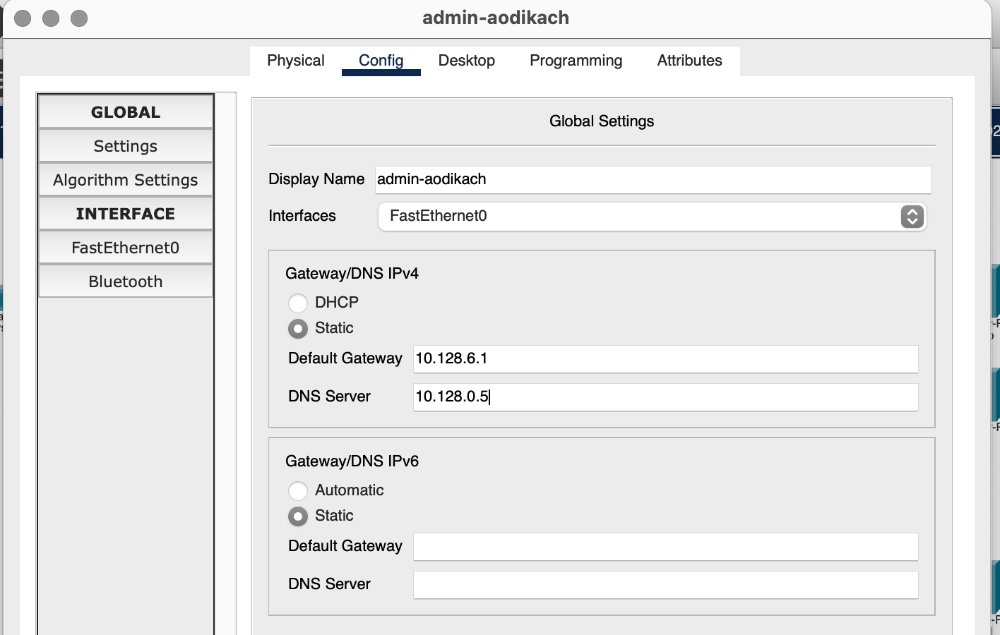
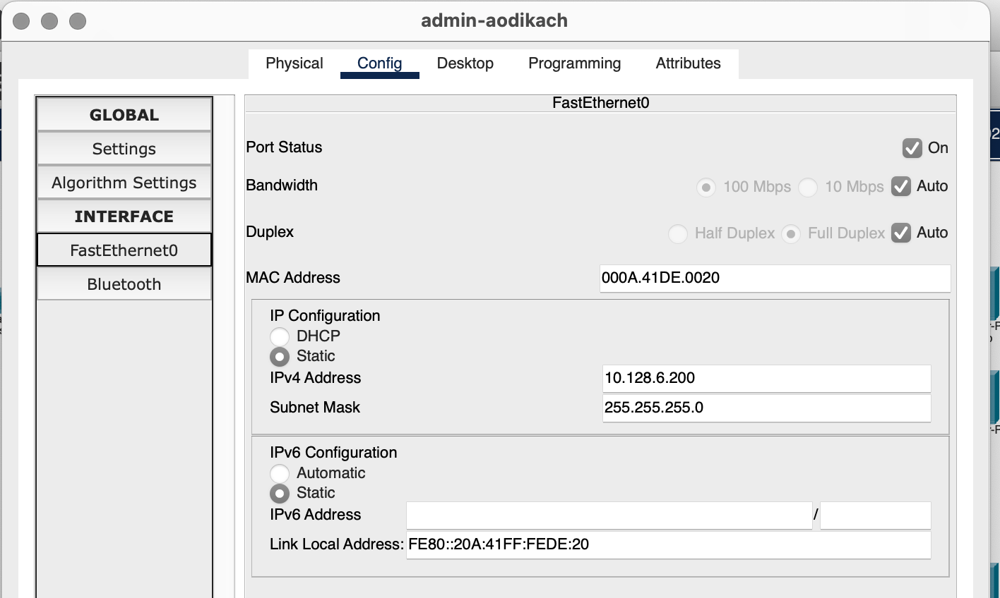
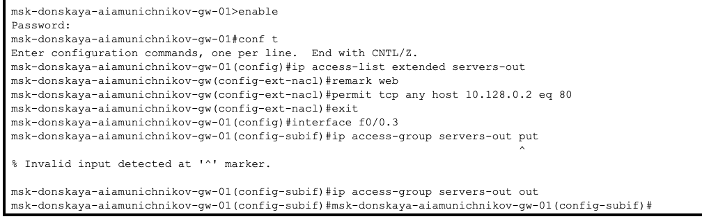
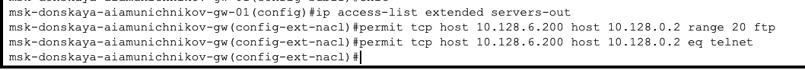
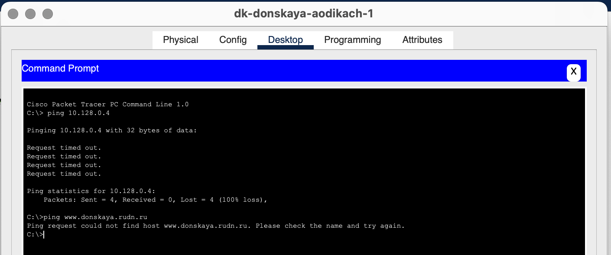
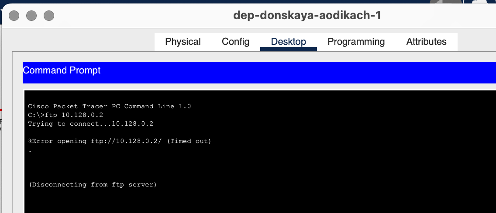
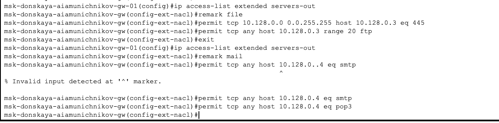
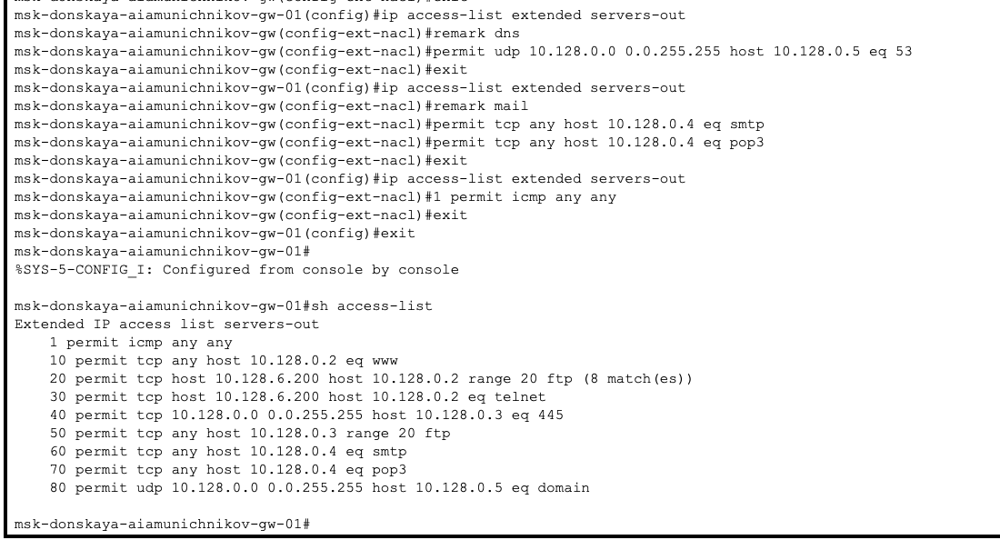
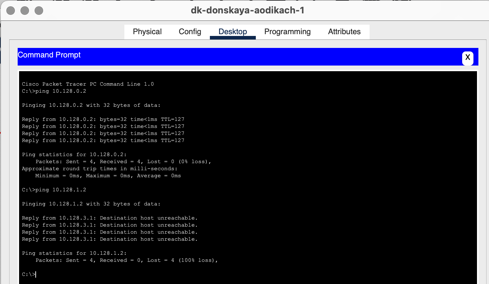
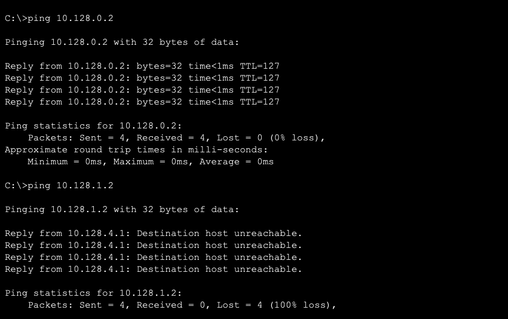

---
## Front matter
lang: ru-RU
title: Лабораторная работа №10
subtitle: Администрирование локальных сетей
author:
  - Дикач А.О.
institute:
  - Российский университет дружбы народов, Москва, Россия
date: 

## i18n babel
babel-lang: russian
babel-otherlangs: english

## Formatting pdf
toc: false
toc-title: Содержание
slide_level: 2
aspectratio: 169
section-titles: true
theme: metropolis
header-includes:
 - \metroset{progressbar=frametitle,sectionpage=progressbar,numbering=fraction}
---

# Информация

## Докладчик

  * Дикач Анна Олеговна
  * НПИбд-01-22 (1132222009)
  * Российский университет дружбы народов
  * <https://github.com/chelibos?tab=repositories>

## Цель работы

Освоить настройку прав доступа пользователей к ресурсам сети.

# Выполнение лабораторной работы

##  В рабочей области проекта подключаю ноутбук с именем admin к сети к other-donskaya-1 с тем, чтобы разрешить ему потом любые действия, связанные с управлением сетью. Для этого подсоединяю ноутбук к порту 24 коммутатора msk-donskaya-sw-4 и присваиваю ему статический адрес 10.128.6.200, указав в качестве gateway-адреса 10.128.6.1 и адреса DNS-сервера 10.128.0.5

{#fig:001 width=70%}

##  

{#fig:002 width=40%}

{#fig:003 width=40%}

## Настраиваю доступ к web-серверу по порту tcp 80. Добавляю список управления доступом к интерфейсу

{#fig:004 width=70%}

## Настраиваю дополнительный доступ для админимстратора по протоколам Telnet и FTP

{#fig:005 width=70%}

## Убеждаюсь в том что с узла с ip-адресом 10.128.6.200 есть доступ по протоколу FTP. При попыткке сделать то же самое с другого устройства ничего не получается

{#fig:006 width=40%}

{#fig:007 width=40%}

##  Настраиваю доступ к файловому и почтовому серверу

{#fig:008 width=70%}

## Провожу настройку доступа к DNS-серверу, активирую icmp-запросы и просматриваю номера строк правил в списке контроля доступа

{#fig:009 width=70%}

## Настраиваю доступ админимстратора к сети сетевого оборудывания

{#fig:010 width=70%}

##  Проверяю корректность установленных правил доступа

{#fig:011 width=40%}

{#fig:012 width=40%}

## Вывод

Освоила настройку прав доступа пользователей к ресурсам.

