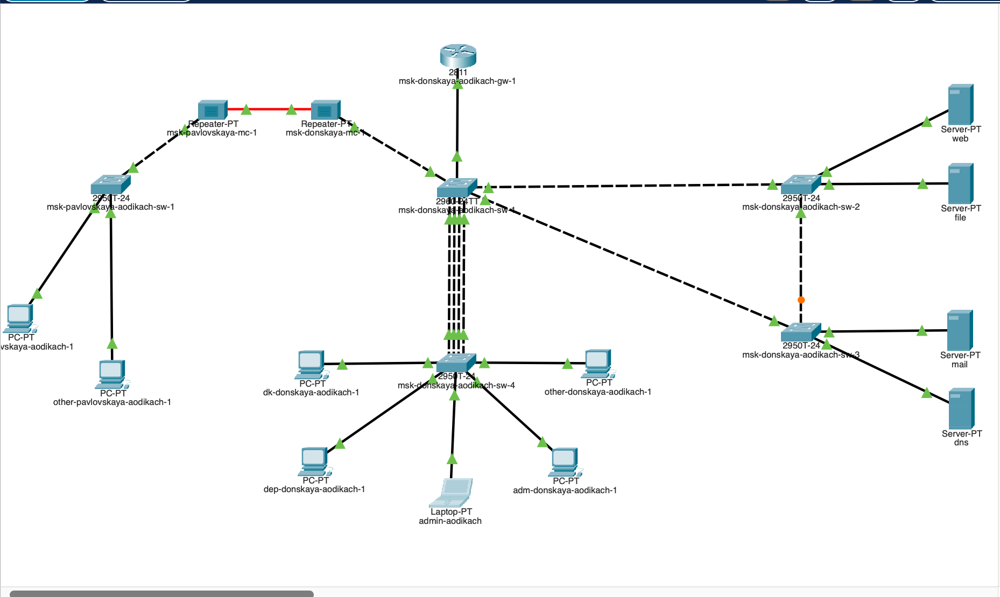
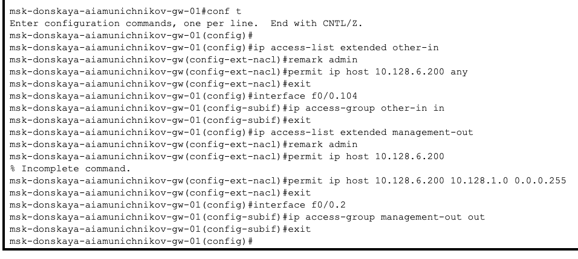

---
## Front matter
title: "Лабораторная работа №10"
subtitle: "Админимстрирование локальных сетей"
author: "Дикач Анна Олеговна НПИбд-01-22"

## Generic otions
lang: ru-RU
toc-title: "Содержание"

## Bibliography
bibliography: bib/cite.bib
csl: pandoc/csl/gost-r-7-0-5-2008-numeric.csl

## Pdf output format
toc: true # Table of contents
toc-depth: 2
lof: true # List of figures
lot: true # List of tables
fontsize: 12pt
linestretch: 1.5
papersize: a4
documentclass: scrreprt
## I18n polyglossia
polyglossia-lang:
  name: russian
  options:
  - spelling=modern
  - babelshorthands=true
polyglossia-otherlangs:
  name: english
## I18n babel
babel-lang: russian
babel-otherlangs: english
## Fonts
mainfont: IBM Plex Serif
romanfont: IBM Plex Serif
sansfont: IBM Plex Sans
monofont: IBM Plex Mono
mathfont: STIX Two Math
mainfontoptions: Ligatures=Common,Ligatures=TeX,Scale=0.94
romanfontoptions: Ligatures=Common,Ligatures=TeX,Scale=0.94
sansfontoptions: Ligatures=Common,Ligatures=TeX,Scale=MatchLowercase,Scale=0.94
monofontoptions: Scale=MatchLowercase,Scale=0.94,FakeStretch=0.9
mathfontoptions:
## Biblatex
biblatex: true
biblio-style: "gost-numeric"
biblatexoptions:
  - parentracker=true
  - backend=biber
  - hyperref=auto
  - language=auto
  - autolang=other*
  - citestyle=gost-numeric
## Pandoc-crossref LaTeX customization
figureTitle: "Рис."
tableTitle: "Таблица"
listingTitle: "Листинг"
lofTitle: "Список иллюстраций"
lotTitle: "Список таблиц"
lolTitle: "Листинги"
## Misc options
indent: true
header-includes:
  - \usepackage{indentfirst}
  - \usepackage{float} # keep figures where there are in the text
  - \floatplacement{figure}{H} # keep figures where there are in the text
---

# Цель работы

Освоить настройку прав доступа пользователей к ресурсам сети.

# Выполнение лабораторной работы

1. В рабочей области проекта подключаю ноутбук с именем admin к сети к other-donskaya-1 с тем, чтобы разрешить ему потом любые действия, связанные с управлением сетью. Для этого подсоединяю ноутбук к порту 24 коммутатора msk-donskaya-sw-4 и присваиваю ему статический адрес 10.128.6.200, указав в качестве gateway-адреса 10.128.6.1 и адреса DNS-сервера 10.128.0.5 (рис. [-@fig:001])(рис. [-@fig:002])(рис. [-@fig:003]).

{#fig:001 width=70%}

{#fig:002 width=70%}

{#fig:003 width=70%}

2. Настраиваю доступ к web-серверу по порту tcp 80. Добавляю список управления доступом к интерфейсу (рис. [-@fig:004]).

{#fig:004 width=70%}

3. Настраиваю дополнительный доступ для админимстратора по протоколам Telnet и FTP (рис. [-@fig:005]).

{#fig:005 width=70%}

4. Убеждаюсь в том что с узла с ip-адресом 10.128.6.200 есть доступ по протоколу FTP. При попыткке сделать то же самое с другого устройства ничего не получается (рис. [-@fig:006])(рис. [-@fig:007]).

{#fig:006 width=70%}

{#fig:007 width=70%}

5. Настраиваю доступ к файловому и почтовому серверу (рис. [-@fig:008]).

{#fig:008 width=70%}

6. Провожу настройку доступа к DNS-серверу, активирую icmp-запросы и просматриваю номера строк правил в списке контроля доступа(рис. [-@fig:009]).

{#fig:009 width=70%}

7. Настраиваю доступ админимстратора к сети сетевого оборудывания (рис. [-@fig:010]).

{#fig:010 width=70%}

8. Проверяю корректность установленных правил доступа (рис. [-@fig:011])(рис. [-@fig:012]).

{#fig:011 width=70%}

{#fig:012 width=70%}

# Вывод

Освоила настройку прав доступа пользователей к ресурсам.

# Ответ на вопросы

1. С помощью команды access-list [номер] [действие] [протокол] [источник] [назначение].

2. С помощью команды interface range [тип] [номер] - [номер] и затем задайте правило.

3. С помощью команды show access-lists.

4. Команду ip access-list [номер] можно использовать для редактирования или permit/deny с указанием позиции.

# Список литературы {.unnumbered}

::: {#refs}
:::

