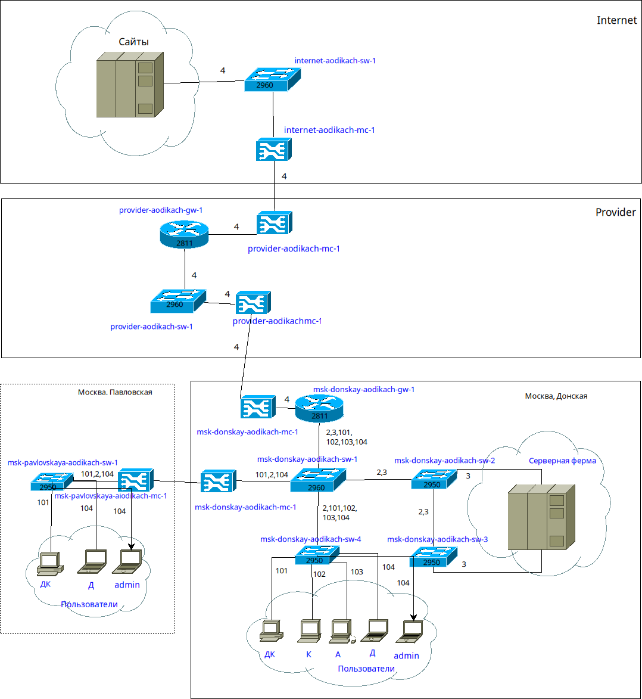
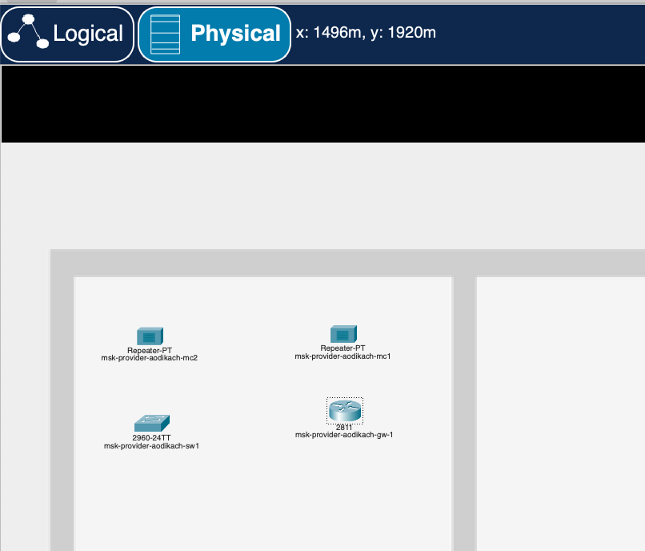
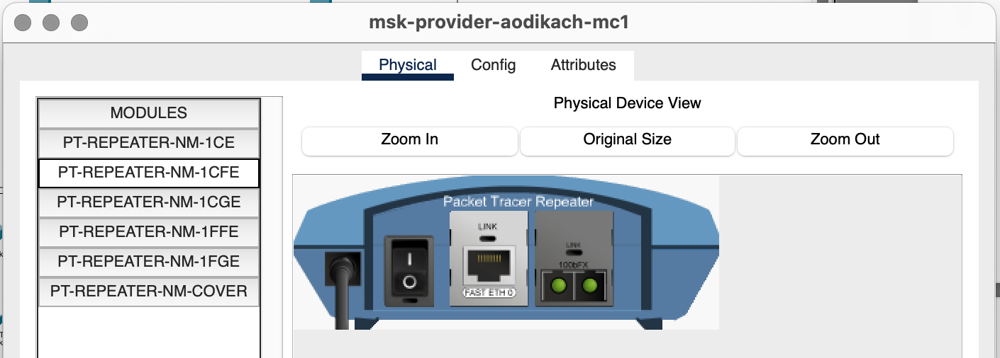
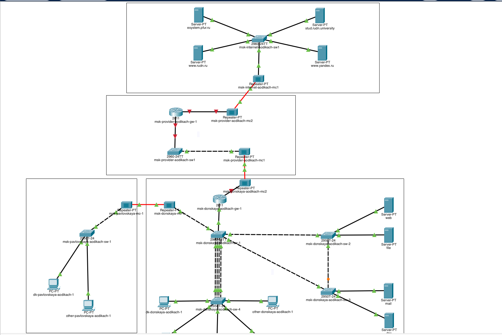
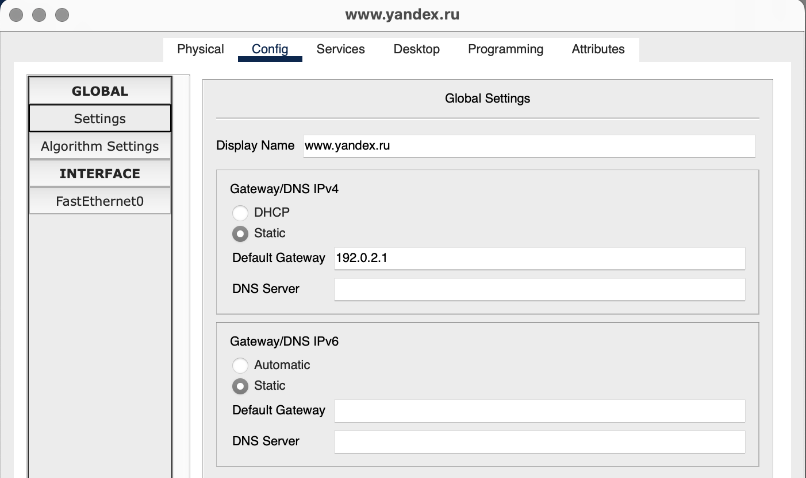
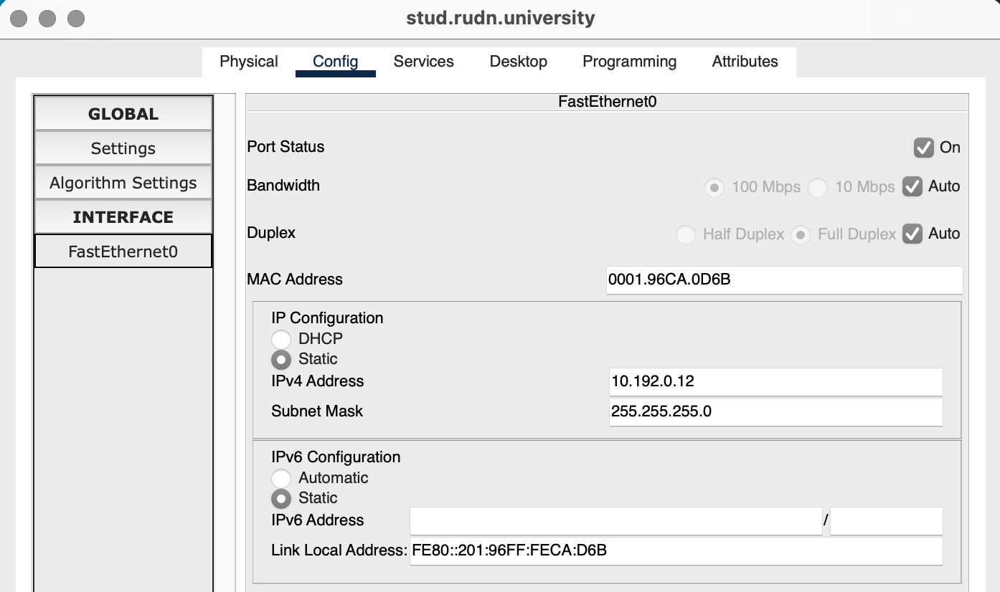
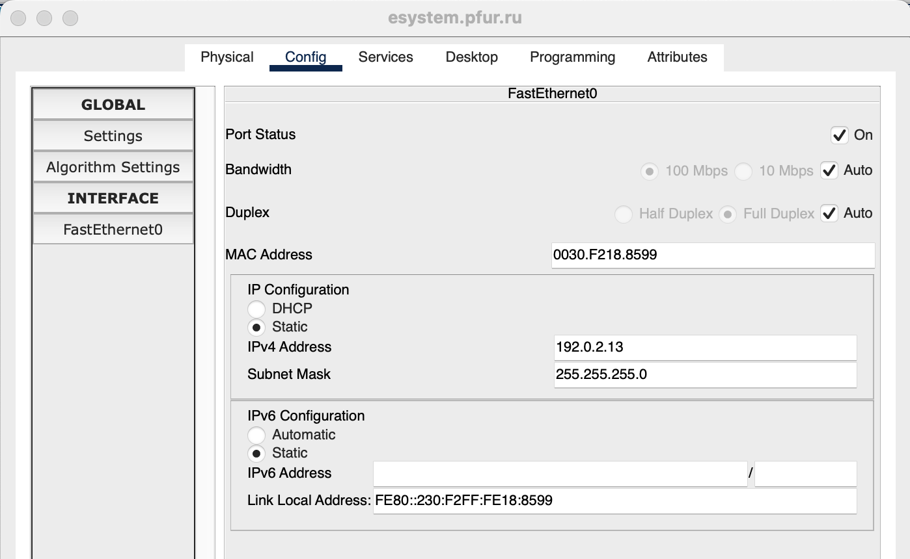
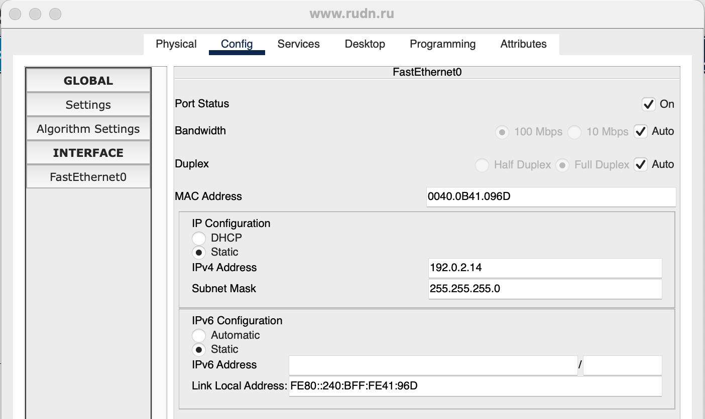
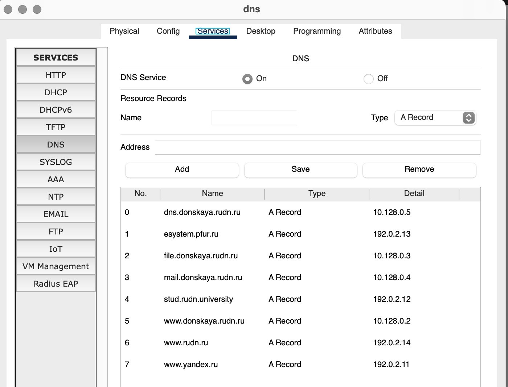

---
## Front matter
lang: ru-RU
title: Лабораторная работа №11
subtitle: Администрирование локальных сетей
author:
  - Дикач А.О.
institute:
  - Российский университет дружбы народов, Москва, Россия
date: 

## i18n babel
babel-lang: russian
babel-otherlangs: english

## Formatting pdf
toc: false
toc-title: Содержание
slide_level: 2
aspectratio: 169
section-titles: true
theme: metropolis
header-includes:
 - \metroset{progressbar=frametitle,sectionpage=progressbar,numbering=fraction}
---

# Информация

## Докладчик

  * Дикач Анна Олеговна
  * НПИбд-01-22 (1132222009)
  * Российский университет дружбы народов
  * <https://github.com/chelibos?tab=repositories>

## Цель работы

Провести подготовительные мероприятия по подключению локальной сети организации к Интернету.

# Выполнение лабораторной работы

##  Строю схему подсоединения локальной сети к Интернету, модельные сети провайдера в сети Интернет (схемы L1, L2, L3), а также распределение IP-адресов 

{#fig:001 width=40%}

##

{#fig:002 width=70%}

##

{#fig:003 width=40%}

{#fig:004 width=50%}

##  Размещаю на схеме проекта 4 медиаконвертера, 2 коммутатора, маршрутизатор и 4 сервера, присваиваю им названия 

{#fig:005 width=70%}

## В физической рабочей области добавляю 2 здания - Internet и Provider. Переношу всё необходимое оборудывание в соответсвующие здания

{#fig:006 width=20%}

{#fig:007 width=20%}

## На медиаконвертерах заменяю модули на PT-REPEATER- NM-1FFE и PT-REPEATER-NM-1CFE для подключения витой пары по технологии Fast Ethernet и оптоволокна соответственно

{#fig:008 width=70%}

## Провожу соединение объектов согласно скорректированной схеме

{#fig:009 width=70%}

##  Прописываю IP-адреса серверам согласно таблице распределения

{#fig:011 width=30%}

{#fig:012 width=30%}

## 

{#fig:013 width=30%}

{#fig:014 width=30%}

## 

{#fig:015 width=70%}

## Прописываю свдеения о серверах на DNS-сервер сети "Донская" 

{#fig:016 width=70%}

## Вывод

Провела подготовительные мероприятия по подключению локальной сети организации к интернету.

