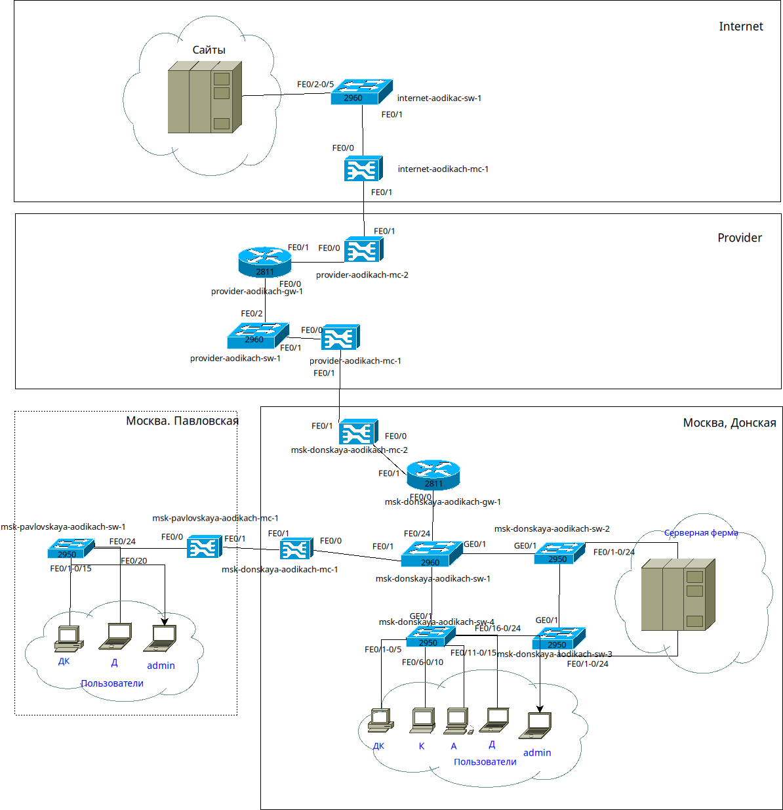
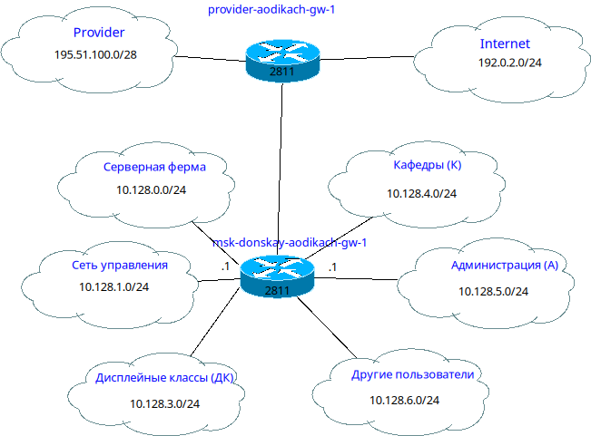
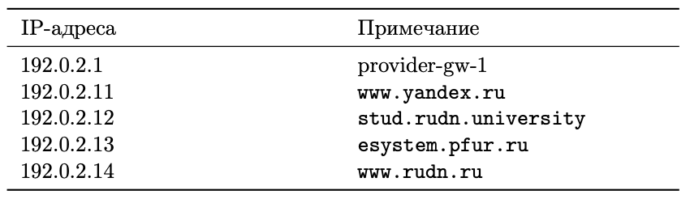
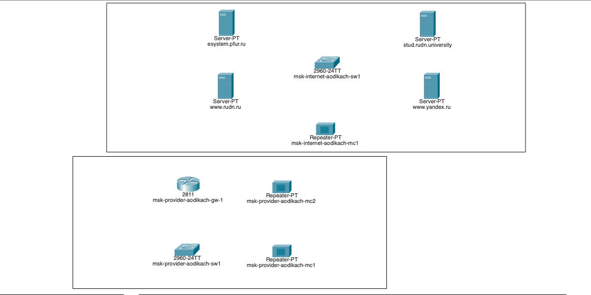
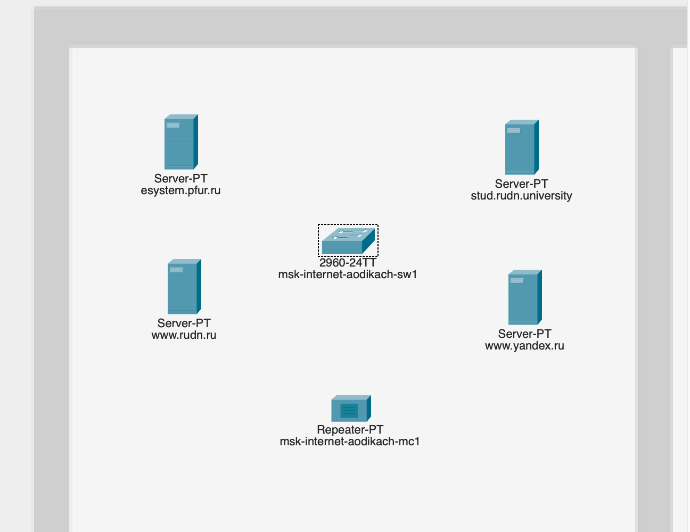
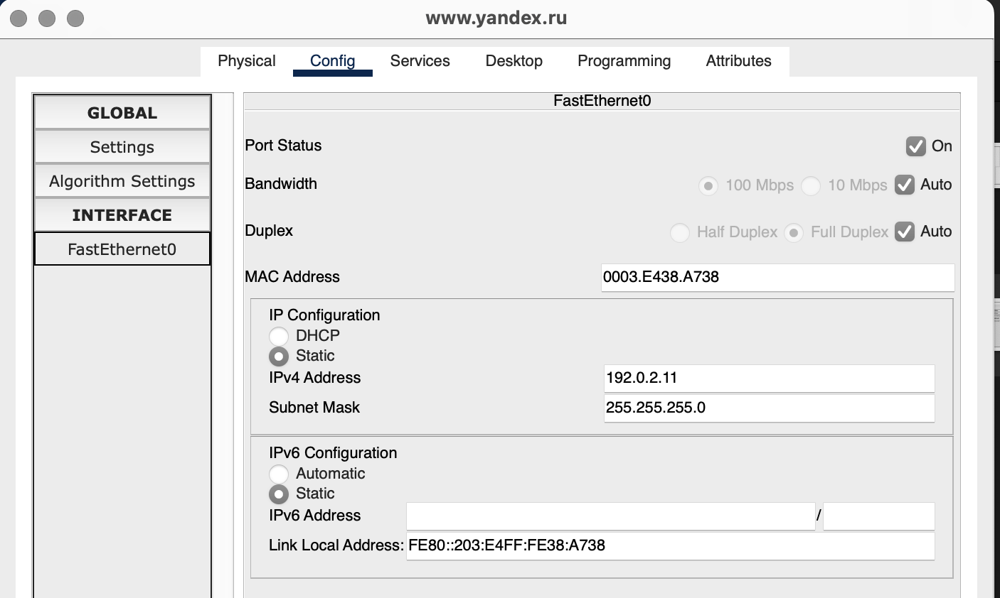

---
## Front matter
title: "Лабораторная работа №11"
subtitle: "Админимстрирование локальных сетей"
author: "Дикач Анна Олеговна НПИбд-01-22"

## Generic otions
lang: ru-RU
toc-title: "Содержание"

## Bibliography
bibliography: bib/cite.bib
csl: pandoc/csl/gost-r-7-0-5-2008-numeric.csl

## Pdf output format
toc: true # Table of contents
toc-depth: 2
lof: true # List of figures
lot: true # List of tables
fontsize: 12pt
linestretch: 1.5
papersize: a4
documentclass: scrreprt
## I18n polyglossia
polyglossia-lang:
  name: russian
  options:
  - spelling=modern
  - babelshorthands=true
polyglossia-otherlangs:
  name: english
## I18n babel
babel-lang: russian
babel-otherlangs: english
## Fonts
mainfont: IBM Plex Serif
romanfont: IBM Plex Serif
sansfont: IBM Plex Sans
monofont: IBM Plex Mono
mathfont: STIX Two Math
mainfontoptions: Ligatures=Common,Ligatures=TeX,Scale=0.94
romanfontoptions: Ligatures=Common,Ligatures=TeX,Scale=0.94
sansfontoptions: Ligatures=Common,Ligatures=TeX,Scale=MatchLowercase,Scale=0.94
monofontoptions: Scale=MatchLowercase,Scale=0.94,FakeStretch=0.9
mathfontoptions:
## Biblatex
biblatex: true
biblio-style: "gost-numeric"
biblatexoptions:
  - parentracker=true
  - backend=biber
  - hyperref=auto
  - language=auto
  - autolang=other*
  - citestyle=gost-numeric
## Pandoc-crossref LaTeX customization
figureTitle: "Рис."
tableTitle: "Таблица"
listingTitle: "Листинг"
lofTitle: "Список иллюстраций"
lotTitle: "Список таблиц"
lolTitle: "Листинги"
## Misc options
indent: true
header-includes:
  - \usepackage{indentfirst}
  - \usepackage{float} # keep figures where there are in the text
  - \floatplacement{figure}{H} # keep figures where there are in the text
---

# Цель работы

Провести подготовительные мероприятия по подключению локальной сети организации к Интернету.

# Выполнение лабораторной работы

1. Строю схему подсоединения локальной сети к Интернету, модельные сети провайдера в сети Интернет (схемы L1, L2, L3), а также распределение IP-адресов (рис. [-@fig:001])(рис. [-@fig:002])(рис. [-@fig:003])(рис. [-@fig:004]).

{#fig:001 width=70%}

{#fig:002 width=70%}

{#fig:003 width=70%}

{#fig:004 width=70%}

2. Размещаю на схеме проекта 4 медиаконвертера, 2 коммутатора, маршрутизатор и 4 сервера, присваиваю им названия (рис. [-@fig:005]).

{#fig:005 width=70%}

3. В физической рабочей области добавляю 2 здания - Internet и Provider. Переношу всё необходимое оборудывание в соответсвующие здания (рис. [-@fig:006]) (рис. [-@fig:007]).

{#fig:006 width=70%}

{#fig:007 width=70%}

4. На медиаконвертерах заменяю модули на PT-REPEATER- NM-1FFE и PT-REPEATER-NM-1CFE для подключения витой пары по технологии Fast Ethernet и оптоволокна соответственно (рис. [-@fig:008]).

{#fig:008 width=70%}

5. Провожу соединение объектов согласно скорректированной схеме (рис. [-@fig:009]).

{#fig:009 width=70%}

6. Прописываю IP-адреса серверам согласно таблице распределения (рис. [-@fig:011]) (рис. [-@fig:012]) (рис. [-@fig:013]) (рис. [-@fig:014]) (рис. [-@fig:015]).

{#fig:011 width=70%}

{#fig:012 width=70%}

{#fig:013 width=70%}

{#fig:014 width=70%}

{#fig:015 width=70%}

7. Прописываю свдеения о серверах на DNS-сервер сети "Донская" (рис. [-@fig:016]).

{#fig:016 width=70%}

# Вывод

Провела подготовительные мероприятия по подключению локальной сети организации к интернету.

# Ответ на вопросы

1. Network Address Translation (NAT) — это метод преобразования IP-адресов, который позволяет нескольким устройствам в локальной сети использовать один внешний IP-адрес.

2. Определение узла за NAT: Узел находится за NAT, если его локальный IP-адрес не соответствует публичному адресу и не доступен напрямую из Интернета.

3. Оборудование для NAT: За преобразование адресов методом NAT отвечает маршрутизатор или брандмауэр.

4. Отличия NAT:

   • Статический NAT: Один внешний адрес соответствует одному внутреннему.

   • Динамический NAT: Внутренние адреса временно сопоставляются с пулом внешних адресов.

   • Перегруженный NAT (PAT): Несколько внутренних адресов используют один внешний адрес с различными портами.

5. Типы NAT:

   • Статический NAT: Постоянное сопоставление адресов.

   • Динамический NAT: Временное сопоставление из пула адресов.

   • Перегруженный NAT (PAT): Использует один внешний адрес для множества внутренних.

   • NAT с поддержкой протоколов (например, ALG): Обрабатывает специфические протоколы для корректной работы.

# Список литературы {.unnumbered}

::: {#refs}
:::

