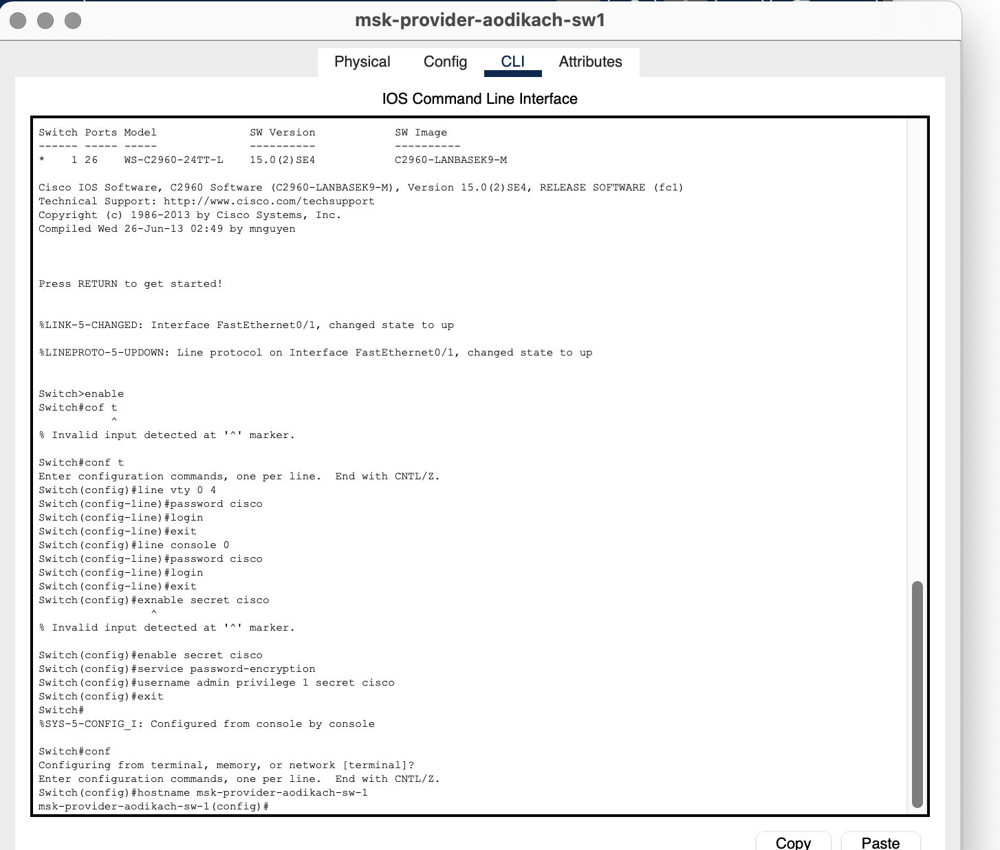
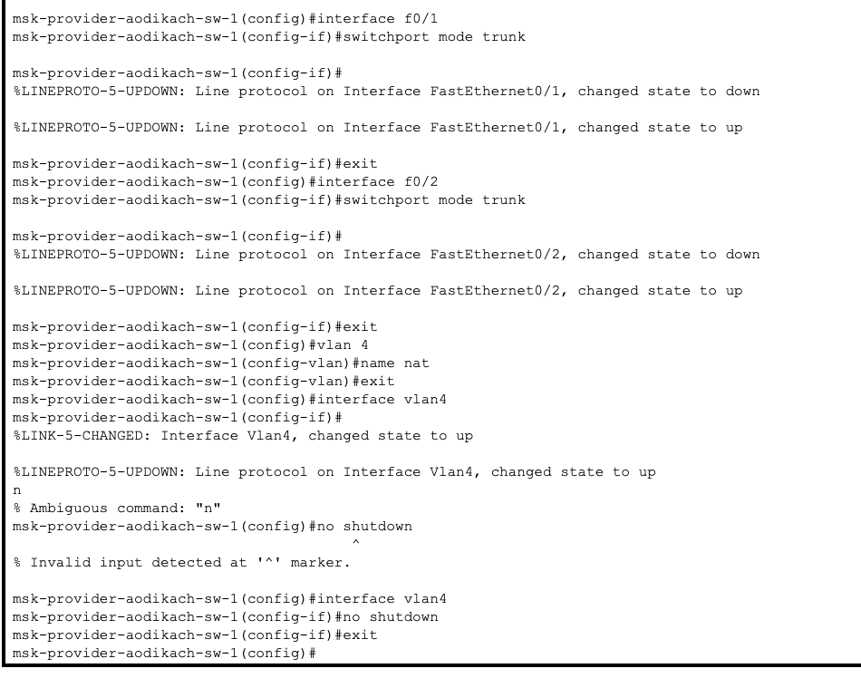
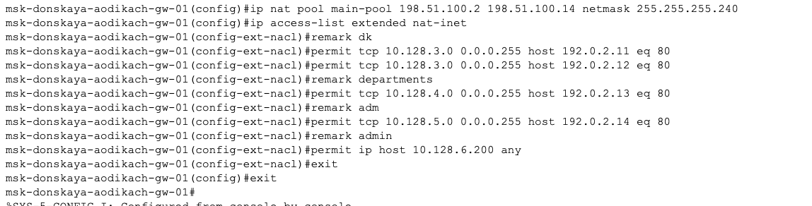
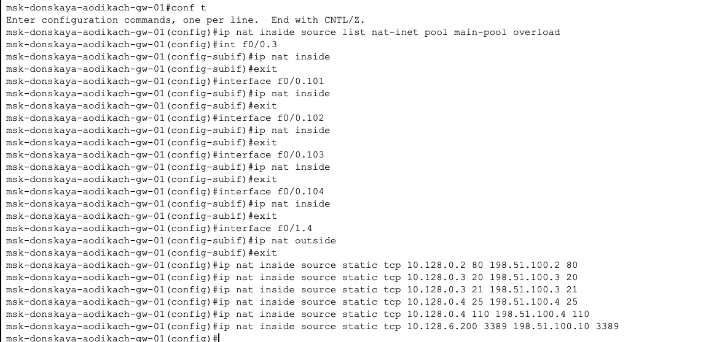

---
## Front matter
lang: ru-RU
title: Лабораторная работа №12
subtitle: Администрирование локальных сетей
author:
  - Дикач А.О.
institute:
  - Российский университет дружбы народов, Москва, Россия
date: 

## i18n babel
babel-lang: russian
babel-otherlangs: english

## Formatting pdf
toc: false
toc-title: Содержание
slide_level: 2
aspectratio: 169
section-titles: true
theme: metropolis
header-includes:
 - \metroset{progressbar=frametitle,sectionpage=progressbar,numbering=fraction}
---

# Информация

## Докладчик

  * Дикач Анна Олеговна
  * НПИбд-01-22 (1132222009)
  * Российский университет дружбы народов
  * <https://github.com/chelibos?tab=repositories>

## Цель работы

Приобретение практических навыков по настройке доступа локальной сети к внешней сети посредством NAT.

# Выполнение лабораторной работы

##  Провожу первоначальную натсроцку маршрутизатора msk-provider-aodikach-gw-1 и коммутатора msk-provider-aodikach-sw-1

{#fig:001 width=40%}

##

{#fig:002 width=40%}

##  Провожу настроцку интерфейсов маршрутизатора и коммутатора

{#fig:003 width=70%}

## 

{#fig:004 width=70%}

## Провожу настройку пула адресов и доступа для NAT на маршрутизаторе msk-donskaya-aodikach-gw-1. Также выполняю настройку сетей для дисплейных классов, кафедр, администрации и для компьютера администратора 

{#fig:005 width=70%}

## 

{#fig:006 width=70%}

## Далее натсраиваю Port Address Translation и интерфейсы для NAT. После настраиваю доступ из Интернета для www-севрера, файлового сервера, почтового сервара и доступ по RDP

{#fig:007 width=70%}

##  Проверяю корректность  

{#fig:008 width=70%}

## Вывод

Приобрела практические навыки по настройке доступа локальной сетик  внешней сети посредством NAT.

