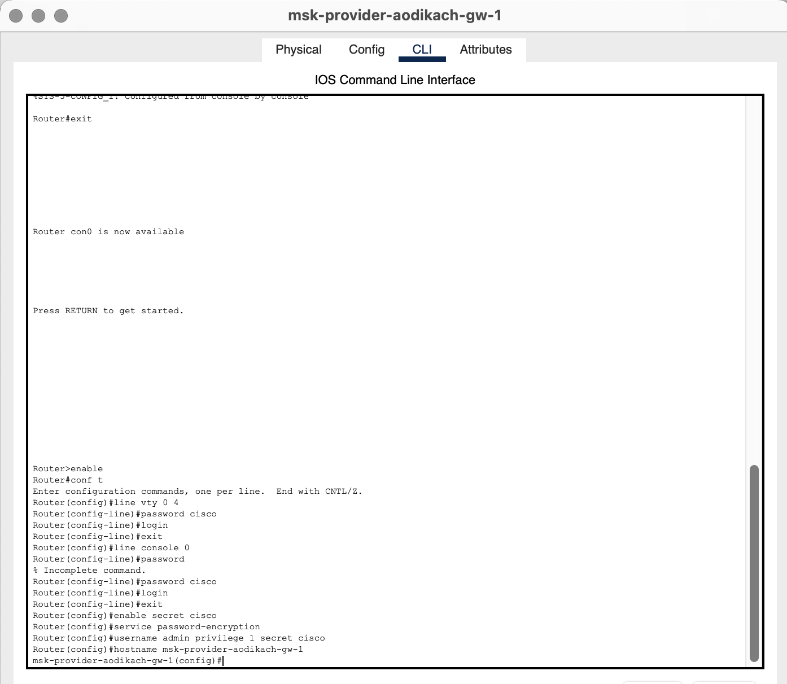
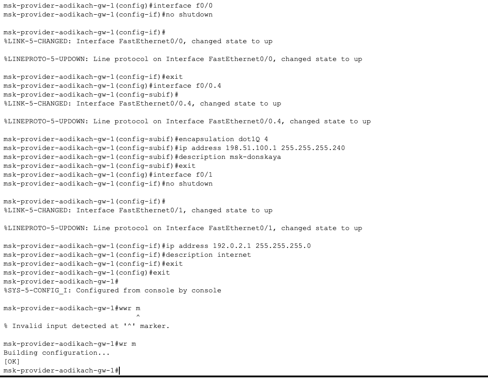
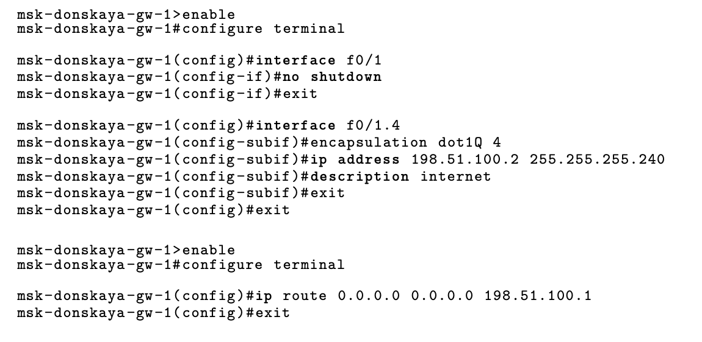
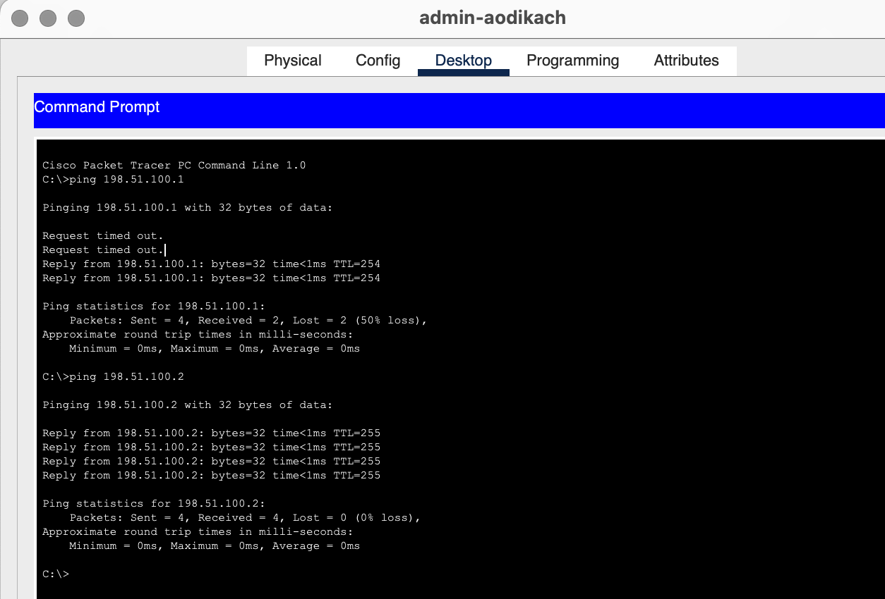

---
## Front matter
title: "Лабораторная работа №12"
subtitle: "Админимстрирование локальных сетей"
author: "Дикач Анна Олеговна НПИбд-01-22"

## Generic otions
lang: ru-RU
toc-title: "Содержание"

## Bibliography
bibliography: bib/cite.bib
csl: pandoc/csl/gost-r-7-0-5-2008-numeric.csl

## Pdf output format
toc: true # Table of contents
toc-depth: 2
lof: true # List of figures
lot: true # List of tables
fontsize: 12pt
linestretch: 1.5
papersize: a4
documentclass: scrreprt
## I18n polyglossia
polyglossia-lang:
  name: russian
  options:
  - spelling=modern
  - babelshorthands=true
polyglossia-otherlangs:
  name: english
## I18n babel
babel-lang: russian
babel-otherlangs: english
## Fonts
mainfont: IBM Plex Serif
romanfont: IBM Plex Serif
sansfont: IBM Plex Sans
monofont: IBM Plex Mono
mathfont: STIX Two Math
mainfontoptions: Ligatures=Common,Ligatures=TeX,Scale=0.94
romanfontoptions: Ligatures=Common,Ligatures=TeX,Scale=0.94
sansfontoptions: Ligatures=Common,Ligatures=TeX,Scale=MatchLowercase,Scale=0.94
monofontoptions: Scale=MatchLowercase,Scale=0.94,FakeStretch=0.9
mathfontoptions:
## Biblatex
biblatex: true
biblio-style: "gost-numeric"
biblatexoptions:
  - parentracker=true
  - backend=biber
  - hyperref=auto
  - language=auto
  - autolang=other*
  - citestyle=gost-numeric
## Pandoc-crossref LaTeX customization
figureTitle: "Рис."
tableTitle: "Таблица"
listingTitle: "Листинг"
lofTitle: "Список иллюстраций"
lotTitle: "Список таблиц"
lolTitle: "Листинги"
## Misc options
indent: true
header-includes:
  - \usepackage{indentfirst}
  - \usepackage{float} # keep figures where there are in the text
  - \floatplacement{figure}{H} # keep figures where there are in the text
---

# Цель работы

Приобретение практических навыков по настройке доступа локальной сети к внешней сети посредством NAT.

# Выполнение лабораторной работы

1. Провожу первоначальную натсроцку маршрутизатора msk-provider-aodikach-gw-1 и коммутатора msk-provider-aodikach-sw-1 (рис. [-@fig:001]) (рис. [-@fig:002]).

{#fig:001 width=70%}

{#fig:002 width=70%}

2. Провожу настроцку интерфейсов маршрутизатора и коммутатора по примеру из лабораторной работы (рис. [-@fig:003]) (рис. [-@fig:004]).

{#fig:003 width=70%}

{#fig:004 width=70%}

3. Провожу настройку пула адресов и доступа для NAT на маршрутизаторе msk-donskaya-aodikach-gw-1. Также выполняю настройку сетей для дисплейных классов, кафедр, администрации и для компьютера администратора  (рис. [-@fig:005])(рис. [-@fig:006]).

{#fig:005 width=70%}

{#fig:006 width=70%}

4. Далее натсраиваю Port Address Translation и интерфейсы для NAT. После настраиваю доступ из Интернета для www-севрера, файлового сервера, почтового сервара и доступ по RDP(рис. [-@fig:007]).

{#fig:007 width=70%}

5. Проверяю корректность с помощью пингования (рис. [-@fig:008]).

{#fig:008 width=70%}

# Вывод

Приобрела практические навыки по настройке доступа локальной сетик  внешней сети посредством NAT.

# Ответ на вопросы

1. Принцип работы NAT: Преобразует частные IP-адреса в публичные для доступа в Интернет, позволяя нескольким устройствам использовать один внешний адрес.

2. Настройка NAT: Настраивается на маршрутизаторе, определяются внутренний и внешний интерфейсы, правила преобразования адресов и включается NAT.

3. Cisco IOS NAT и субинтерфейсы: Да, поддерживается настройка NAT на субинтерфейсах для разных VLAN или сетей.

4. Пулы IP NAT: Набор публичных IP-адресов для динамического назначения внутренним устройствам при использовании динамического NAT.

5. Статические преобразования NAT: Фиксированное сопоставление одного внутреннего IP с публичным, используется для постоянного доступа к внутренним ресурсам из внешней сети.

# Список литературы {.unnumbered}

::: {#refs}
:::

