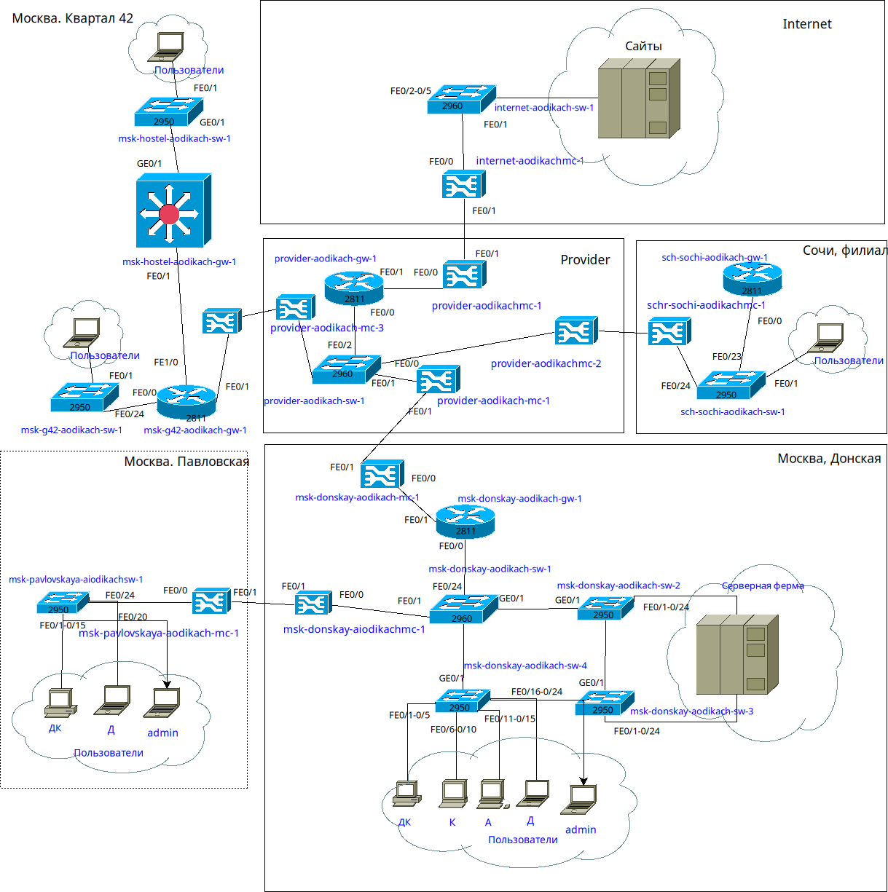
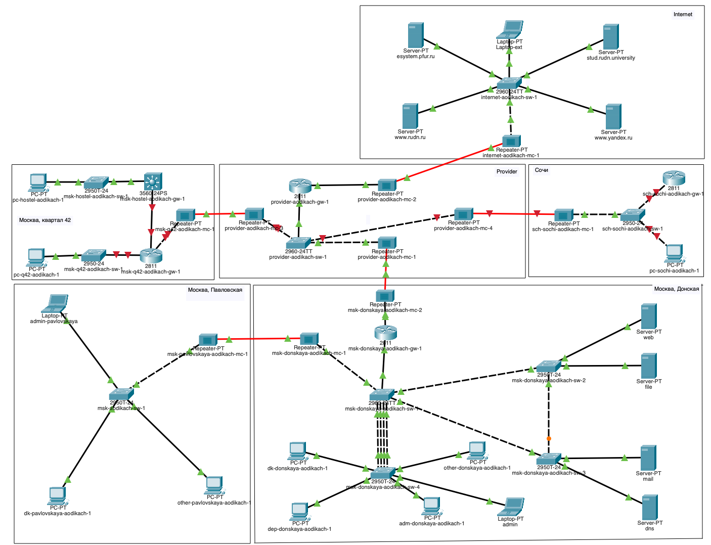
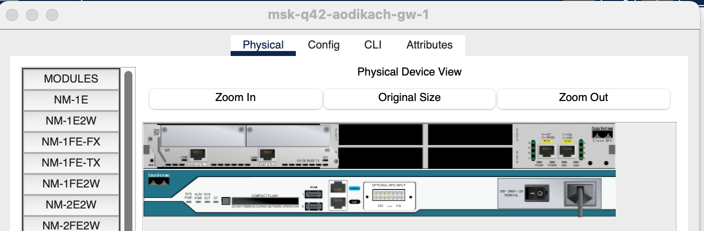
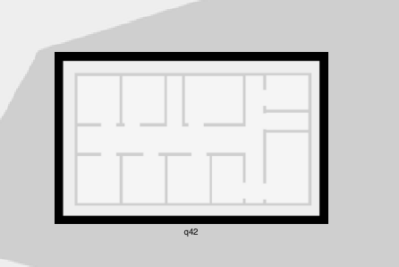
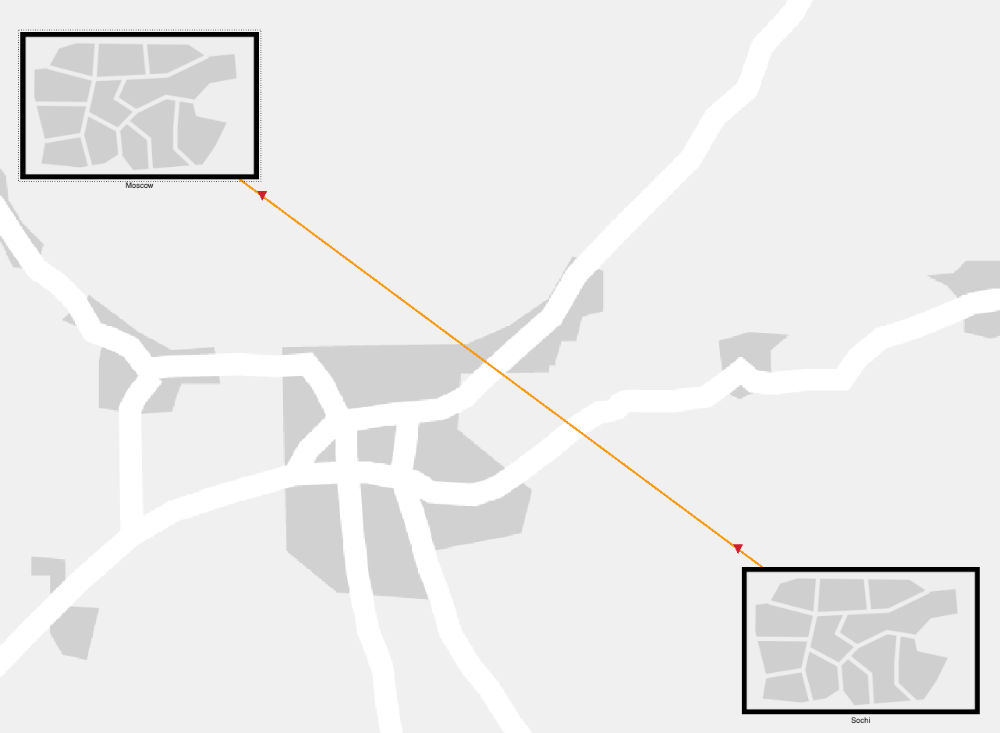
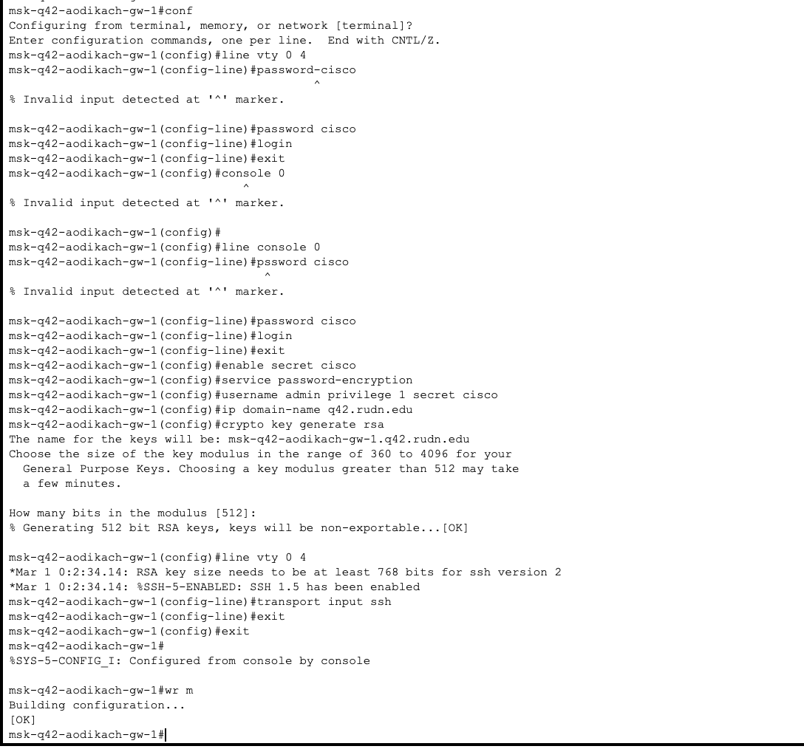
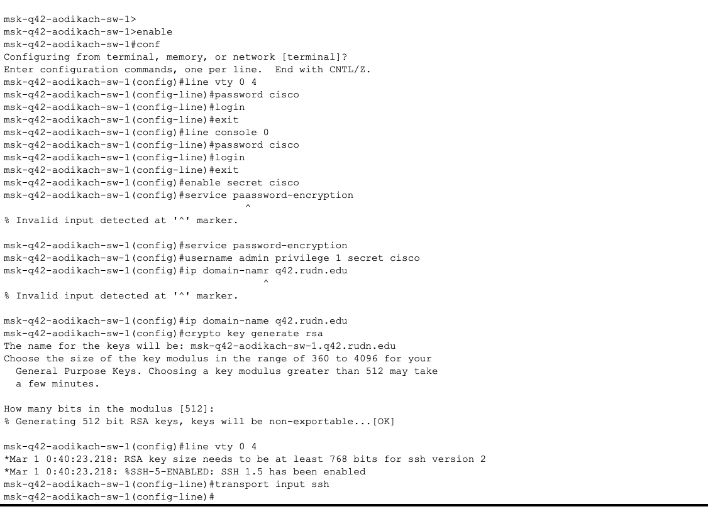

---
## Front matter
lang: ru-RU
title: Лабораторная работа №13
subtitle: Администрирование локальных сетей
author:
  - Дикач А.О.
institute:
  - Российский университет дружбы народов, Москва, Россия
date: 

## i18n babel
babel-lang: russian
babel-otherlangs: english

## Formatting pdf
toc: false
toc-title: Содержание
slide_level: 2
aspectratio: 169
section-titles: true
theme: metropolis
header-includes:
 - \metroset{progressbar=frametitle,sectionpage=progressbar,numbering=fraction}
---

# Информация

## Докладчик

  * Дикач Анна Олеговна
  * НПИбд-01-22 (1132222009)
  * Российский университет дружбы народов
  * <https://github.com/chelibos?tab=repositories>

## Цель работы

Провести подготовительные мероприятия по организации взаимодействия через сеть провайдера посредством статической маршрутизации локальной сети с сетью основного здания, расположенного в 42-м квартале в Москве, и сетью филиала, расположенного в г. Сочи.

# Выполнение лабораторной работы

##  Вношу изменения в схемы L1, L2, L3 сети, добавив в них информацию о сети основной территории

{#fig:001 width=50%}

##

{#fig:002 width=70%}

##

{#fig:003 width=70%}

##  Дополняю схему проекта, даю коррекные названия устройствам

{#fig:004 width=70%}

## На медиаконвертерах заменяю имеющиеся модули на PT-REPEATER- NM-1FFE и PT-REPEATER-NM-1CFE для подключения витой пары по технологии Fast Ethernet и оптоволокна соответственно

{#fig:005 width=70%}

## На маршрутизаторе добавляю дополнительный интерфейс

{#fig:006 width=70%}

## В физической рабочей части добавляю 42-й квартал, город сочи и на нём улицу Uni Sochi

{#fig:007 width=10%}

{#fig:008 width=10%}

{#fig:009 width=10%}

##  Переношу оборудывание в соответсвии с распределением

{#fig:010 width=20%}

{#fig:011 width=30%}

## Провожу первонаальную настройку маршрутизатора msk-q42-aodikach-gw-01

{#fig:012 width=70%}

## Провожу первоначальную настройку коммутатора msk-q42-aodiakch-sw-01

{#fig:013 width=70%}

## Провожу первоначальную настройку маршрутизирующего коммутатора msk-hostel-aodikach-qw-1

{#fig:014 width=70%}

##  Провожу первоначальную настройку коммутатора msk-hostel-aodikach-sw-1

{#fig:015 width=70%}

##  Перехожу к подключению подсети города Сочи. Провожу первоначальную настройку коммутатора shi-sochi-aodikach-sw-1

{#fig:016 width=70%}

##  Провожу первоначальную настройку маршрутизатора sci-sochi-aodikach-gw-1

{#fig:017 width=70%}

## Вывод

Провела подготовительные работы по организации взаимодействия через сеть провайдера посредством статической маршрутизации локальной сети с сетью основного здания.
