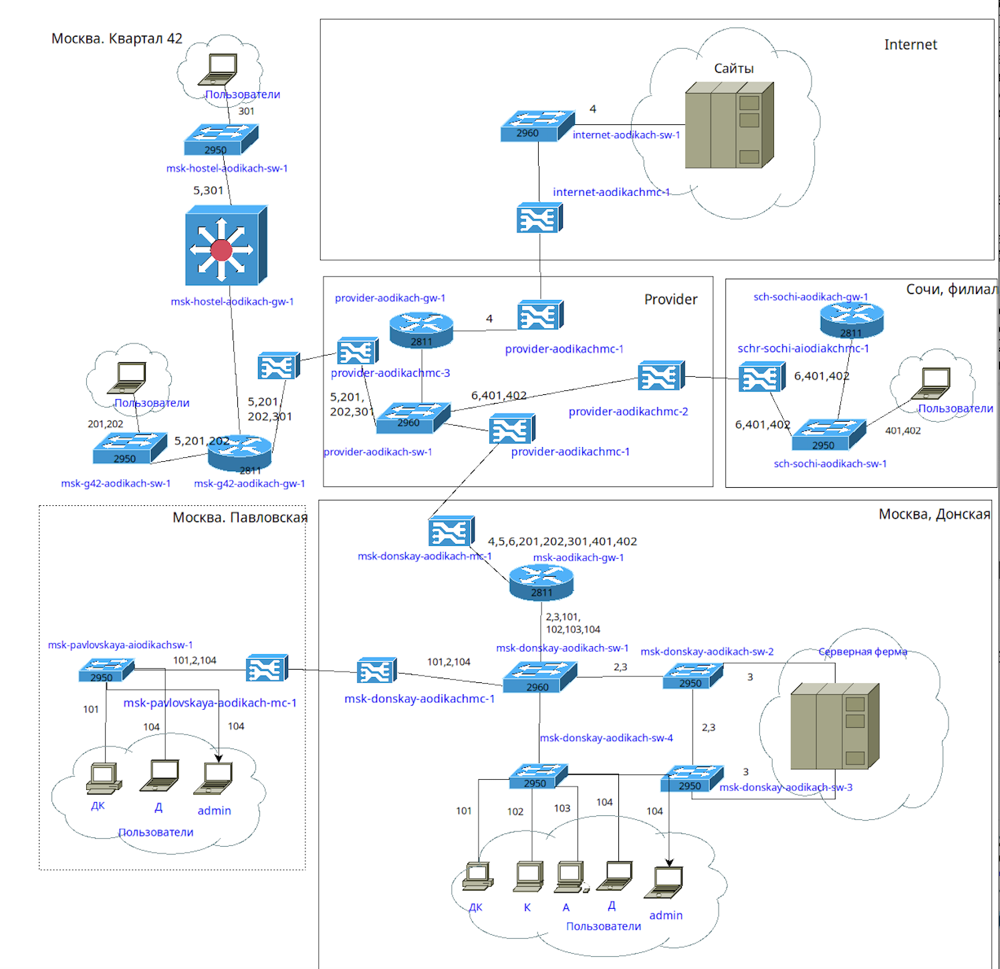
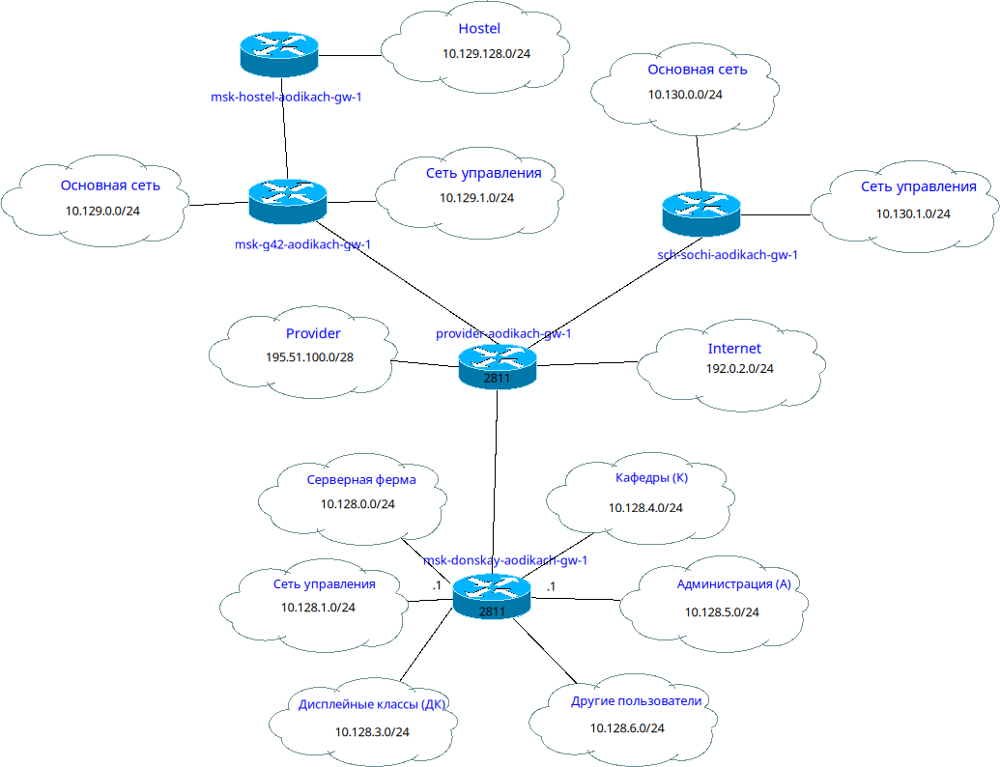
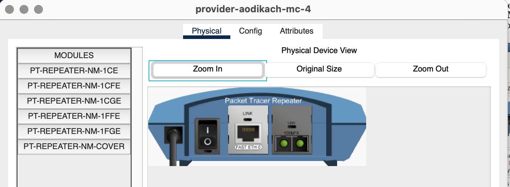
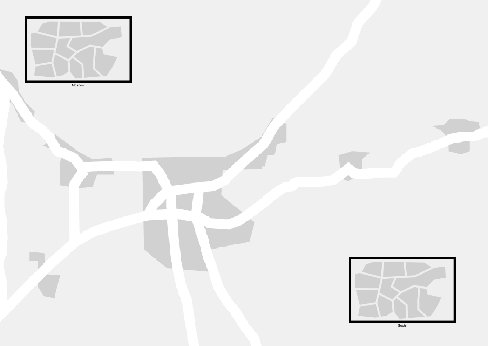
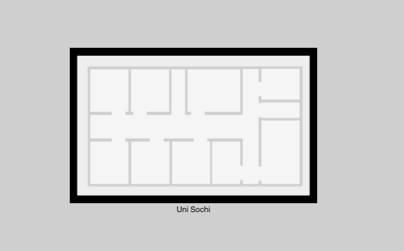
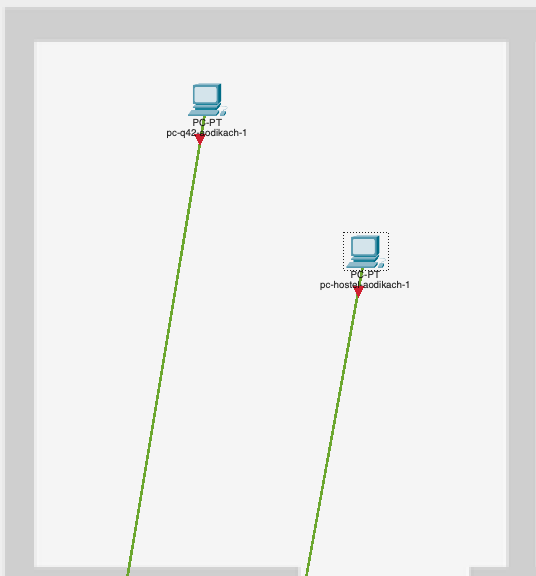
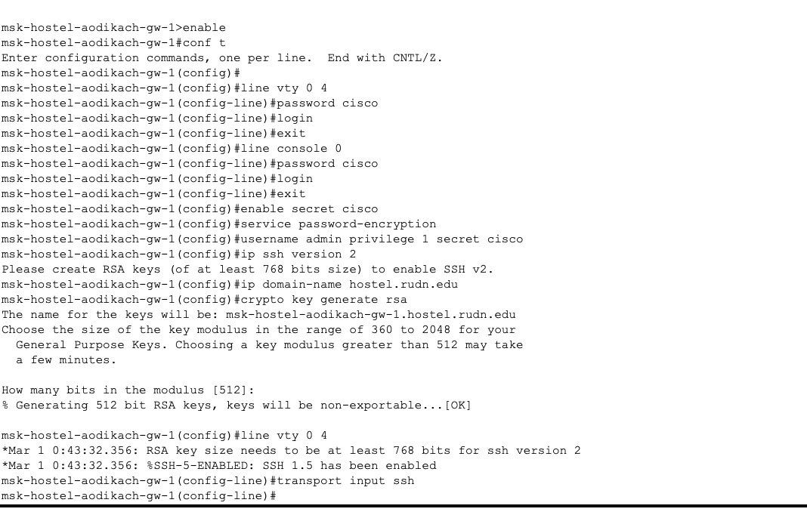
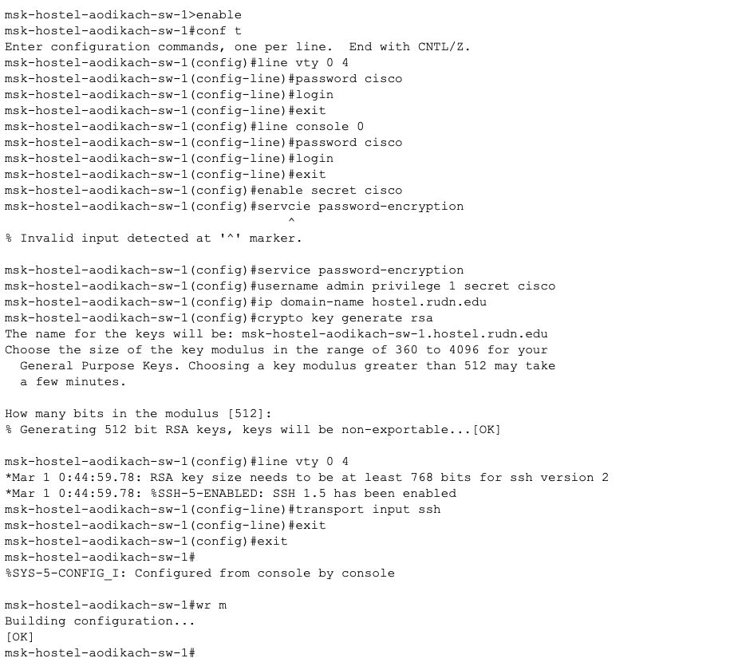
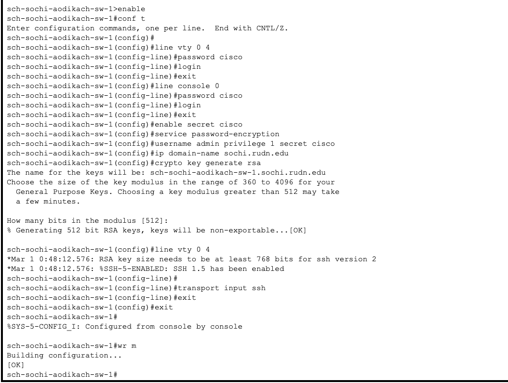
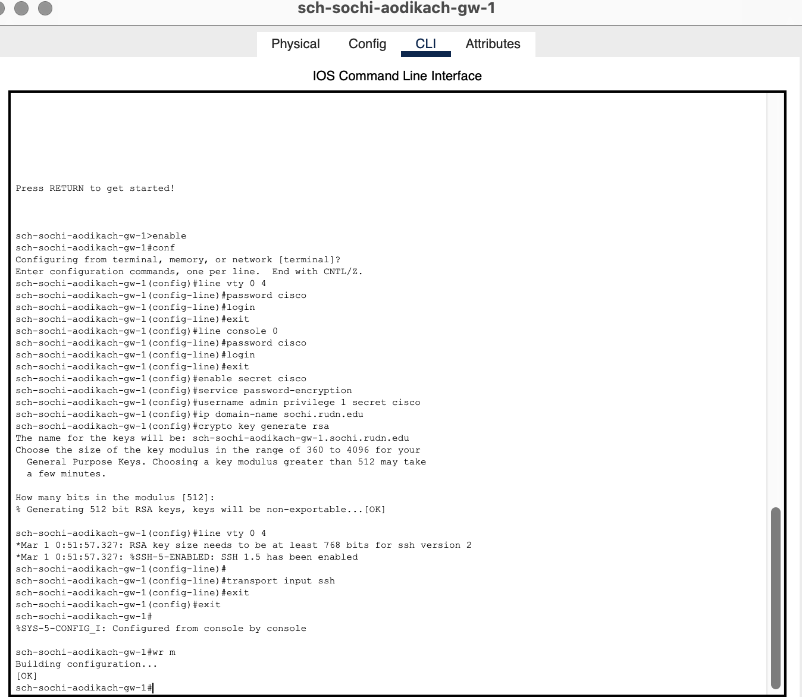

---
## Front matter
title: "Лабораторная работа №13"
subtitle: "Админимстрирование локальных сетей"
author: "Дикач Анна Олеговна НПИбд-01-22"

## Generic otions
lang: ru-RU
toc-title: "Содержание"

## Bibliography
bibliography: bib/cite.bib
csl: pandoc/csl/gost-r-7-0-5-2008-numeric.csl

## Pdf output format
toc: true # Table of contents
toc-depth: 2
lof: true # List of figures
lot: true # List of tables
fontsize: 12pt
linestretch: 1.5
papersize: a4
documentclass: scrreprt
## I18n polyglossia
polyglossia-lang:
  name: russian
  options:
  - spelling=modern
  - babelshorthands=true
polyglossia-otherlangs:
  name: english
## I18n babel
babel-lang: russian
babel-otherlangs: english
## Fonts
mainfont: IBM Plex Serif
romanfont: IBM Plex Serif
sansfont: IBM Plex Sans
monofont: IBM Plex Mono
mathfont: STIX Two Math
mainfontoptions: Ligatures=Common,Ligatures=TeX,Scale=0.94
romanfontoptions: Ligatures=Common,Ligatures=TeX,Scale=0.94
sansfontoptions: Ligatures=Common,Ligatures=TeX,Scale=MatchLowercase,Scale=0.94
monofontoptions: Scale=MatchLowercase,Scale=0.94,FakeStretch=0.9
mathfontoptions:
## Biblatex
biblatex: true
biblio-style: "gost-numeric"
biblatexoptions:
  - parentracker=true
  - backend=biber
  - hyperref=auto
  - language=auto
  - autolang=other*
  - citestyle=gost-numeric
## Pandoc-crossref LaTeX customization
figureTitle: "Рис."
tableTitle: "Таблица"
listingTitle: "Листинг"
lofTitle: "Список иллюстраций"
lotTitle: "Список таблиц"
lolTitle: "Листинги"
## Misc options
indent: true
header-includes:
  - \usepackage{indentfirst}
  - \usepackage{float} # keep figures where there are in the text
  - \floatplacement{figure}{H} # keep figures where there are in the text
---

# Цель работы

Провести подготовительные мероприятия по организации взаимодействия через сеть провайдера посредством статической маршрутизации локальной сети с сетью основного здания, расположенного в 42-м квартале в Москве, и сетью филиала, расположенного в г. Сочи.

# Выполнение лабораторной работы

1. Вношу изменения в схемы L1, L2, L3 сети, добавив в них информацию о сети основной территории (рис. [-@fig:001]) (рис. [-@fig:002]) (рис. [-@fig:003]).

{#fig:001 width=70%}

{#fig:002 width=70%}

{#fig:003 width=70%}

2. Дополняю схему проекта, даю коррекные названия устройствам (рис. [-@fig:004]).

{#fig:004 width=70%}

3. На медиаконвертерах заменяю имеющиеся модули на PT-REPEATER- NM-1FFE и PT-REPEATER-NM-1CFE для подключения витой пары по технологии Fast Ethernet и оптоволокна соответственно (рис. [-@fig:005]).

{#fig:005 width=70%}

4. На маршрутизаторе добавляю дополнительный интерфейс (рис. [-@fig:006]).

{#fig:006 width=70%}

5. В физической рабочей части добавляю 42-й квартал, город сочи и на нём улицу Uni Sochi (рис. [-@fig:007]) (рис. [-@fig:008]) (рис. [-@fig:009]).

{#fig:007 width=70%}

{#fig:008 width=70%}

{#fig:009 width=70%}

6. Переношу оборудывание в соответсвии с распределением (рис. [-@fig:010])(рис. [-@fig:011]).

{#fig:010 width=70%}

{#fig:011 width=70%}

7. Провожу первонаальную настройку маршрутизатора msk-q42-aodikach-gw-01 (рис. [-@fig:012]).

{#fig:012 width=70%}

8. Провожу первоначальную настройку коммутатора msk-q42-aodiakch-sw-01 (рис. [-@fig:013]).

{#fig:013 width=70%}

9. Провожу первоначальную настройку маршрутизирующего коммутатора msk-hostel-aodikach-qw-1 (рис. [-@fig:014]).

{#fig:014 width=70%}

10. Провожу первоначальную настройку коммутатора msk-hostel-aodikach-sw-1 (рис. [-@fig:015]).

{#fig:015 width=70%}

11. Перехожу к подключению подсети города Сочи. Провожу первоначальную настройку коммутатора shi-sochi-aodikach-sw-1 (рис. [-@fig:016]).

{#fig:016 width=70%}

12. Провожу первоначальную настройку маршрутизатора sci-sochi-aodikach-gw-1 (рис. [-@fig:017]).

{#fig:017 width=70%}

# Вывод

Провела подготовительные работы по организации взаимодействия через сеть провайдера посредством статической маршрутизации локальной сети с сетью основного здания.

# Ответ на вопросы

1. В каких случаях следует использовать статическую маршрутизацию? Примеры.

- Малые сети с простой топологией (например, офис с 2–3 маршрутизаторами).
- Фиксированные маршруты, где пути не меняются (например, связь между филиалами по выделенным каналам).
- Резервные каналы (floating static route).
- Контроль трафика (например, принудительное направление трафика через фаервол).
Примеры:

Маршрут между головным офисом и складом.
Настройка шлюза по умолчанию (ip route 0.0.0.0 0.0.0.0 192.168.1.1).

2. Основные принципы статической маршрутизации между VLANs

- Используется маршрутизатор (или L3-коммутатор) с настроенными SVI (Switch Virtual Interface) для каждого VLAN.
- Статические маршруты прописываются вручную на каждом узле маршрутизации.
- Требуется явное указание подсетей VLAN и шлюзов.
Пример:
bash
ip route 192.168.10.0 255.255.255.0 192.168.1.1  # VLAN 10 → шлюз 192.168.1.1
ip route 192.168.20.0 255.255.255.0 192.168.1.1  # VLAN 20 → тот же шлюз
- Альтернатива: Router-on-a-Stick (подключение через сабинтерфейсы, например, Gi0/0.10, Gi0/0.20).

# Список литературы {.unnumbered}

::: {#refs}
:::

