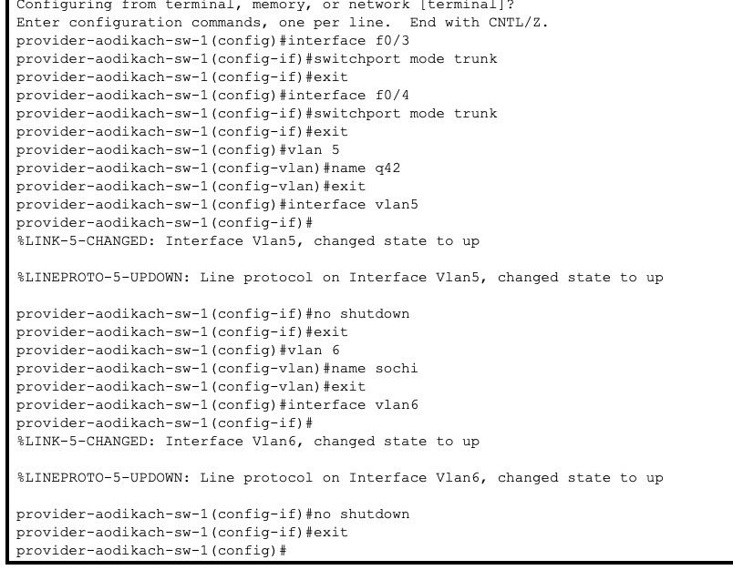
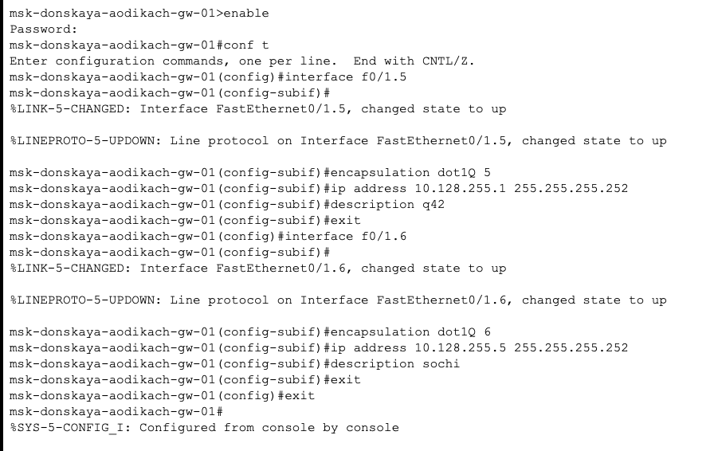
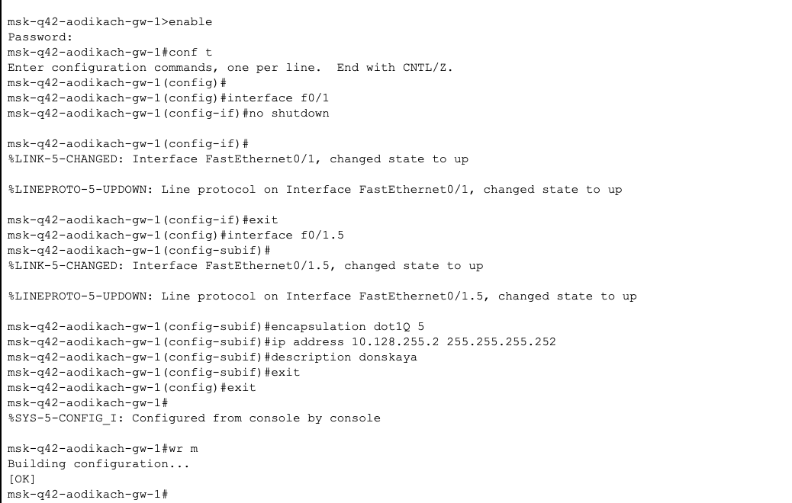
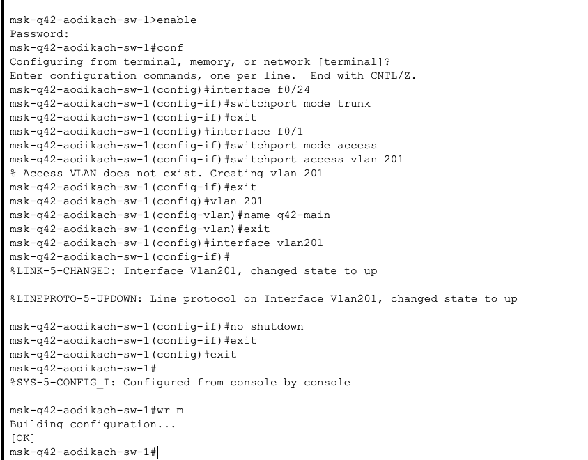
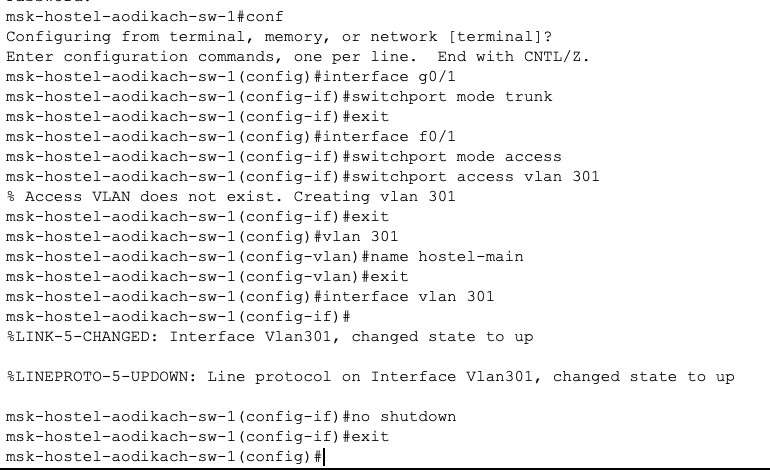
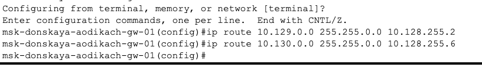
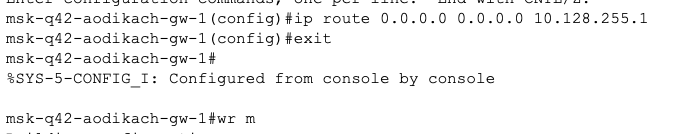
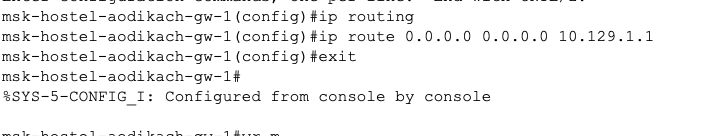
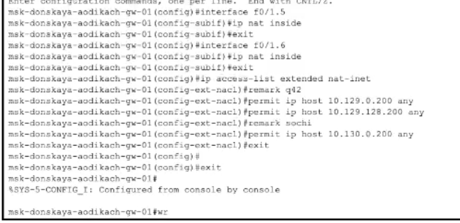

---
## Front matter
lang: ru-RU
title: Лабораторная работа №14
subtitle: Администрирование локальных сетей
author:
  - Дикач А.О.
institute:
  - Российский университет дружбы народов, Москва, Россия
date: 

## i18n babel
babel-lang: russian
babel-otherlangs: english

## Formatting pdf
toc: false
toc-title: Содержание
slide_level: 2
aspectratio: 169
section-titles: true
theme: metropolis
header-includes:
 - \metroset{progressbar=frametitle,sectionpage=progressbar,numbering=fraction}
---

# Информация

## Докладчик

  * Дикач Анна Олеговна
  * НПИбд-01-22 (1132222009)
  * Российский университет дружбы народов
  * <https://github.com/chelibos?tab=repositories>

## Цель работы

Настроить взаимодействие через сеть провайдера посредством статической маршрутизации локальной сети организации с сетью основного здания, расположенного в 42-м квартале в Москве, и сетью филиала, расположенного в г. Сочи.

# Выполнение лабораторной работы

##  Приступая к настройке связи ммежду территориями. Для начала настраиваю интерфейсы коммутатора provider-aodikach-sw-1 

{#fig:001 width=70%}

##  Провожу настройку интерфейсов маршрутизатора msk-donskaya-aodikach-gw-1

{#fig:002 width=70%}

## Провожу настройку интерфейсов маршрутизатора msk-q42-aodikach-gw-1 

{#fig:003 width=70%}

## Провожу настройку интерфейсов коммутатора sci-sochi-aodikach-sw-1 и маршрутизатора sch-sochi-aodikach-gw-1

{#fig:004 width=60%}

##

{#fig:005 width=70%}

## Перехожу к настройке площадки 42-го квартала. Для начала настраиваю интерфейсы маршрутизатора msk-q42-aodikach-gw-1

{#fig:006 width=70%}

##  Далее настраиваю коммутатор msk-q42-aodikach-sw-1

{#fig:007 width=70%}

## Провржу настроку интерфейсов маршрутизирующего коммутатора msk-hostel-aodikach-gw-1 и коммутатора msk-hostel-sw-1

{#fig:008 width=60%}

##

{#fig:009 width=70%}

## Перехожу к настроке площадки в Сочи. Для 'njuj' настраиваю интерфейсы маршрутищатора sch-sochi-aodikch-gw-1 и коммутатора shi-sochi-sw-1 

{#fig:010 width=70%}

{#fig:011 width=70%}

##  Перехожу к настройке маршрутизации между площадками. Для этого настраиваю маршрутизатороы на Донской,  42 квартале и  Сочи

{#fig:012 width=40%}

{#fig:013 width=40%}

##

{#fig:014 width=40%}

## Провожу настройку маршрутизвции на 42 квартале (настраиваю машрутизатор и маршрутизирующий коммутатор)

{#fig:015 width=40%}

{#fig:016 width=40%}

## Настраиваю NAT на маршрутизаторе msk-donskaya-aodikch-gw-1

{#fig:017 width=70%}

## Вывод

Настроила взаимодействие через сеть провайдера посредством статической маршрутизации локальной сети организации с сетью основного здания.

