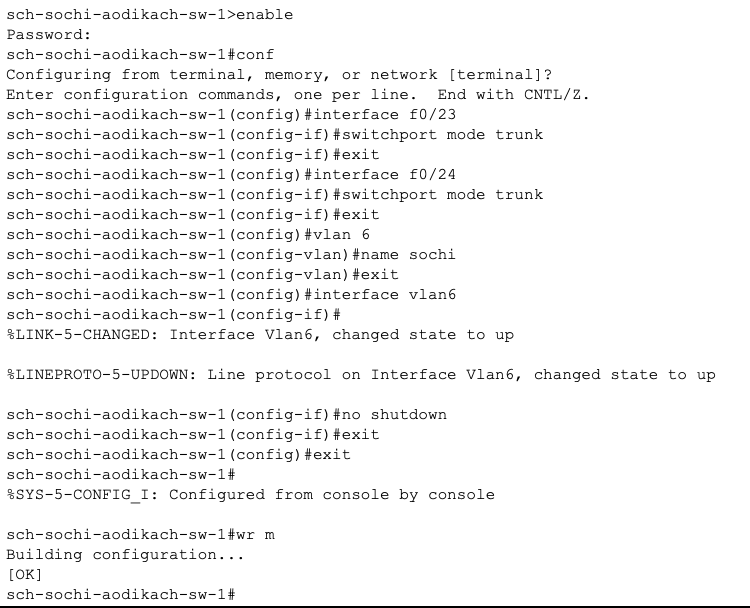
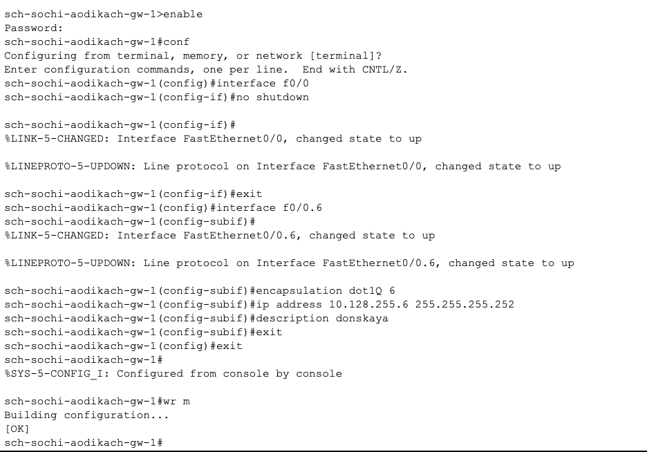
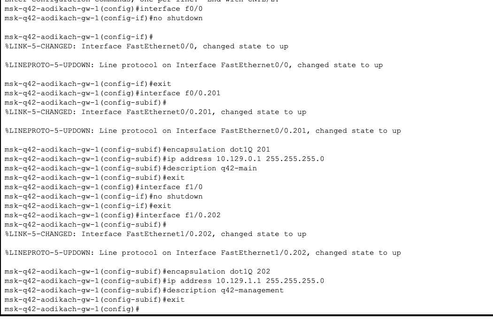
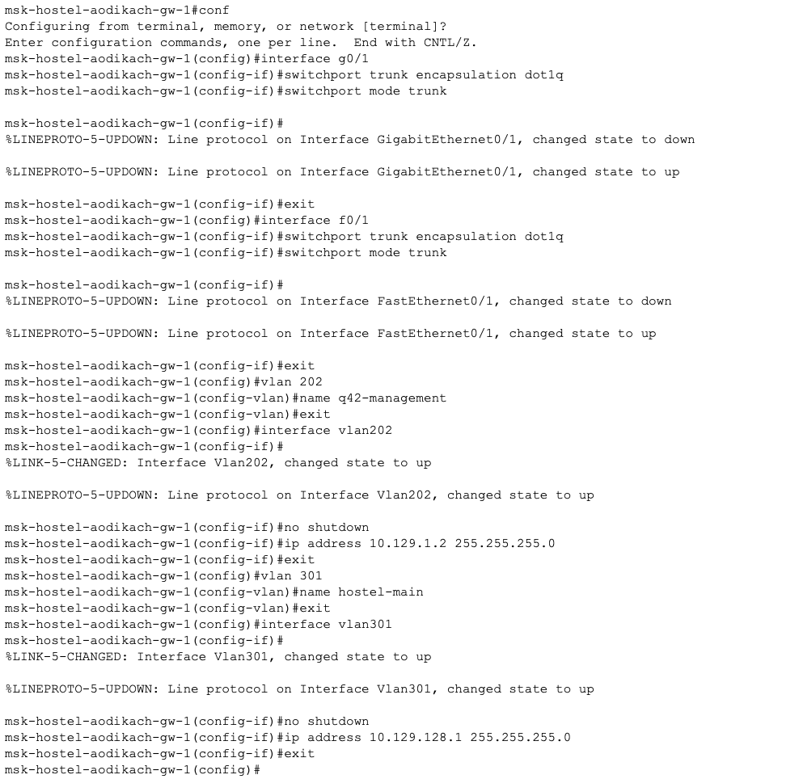
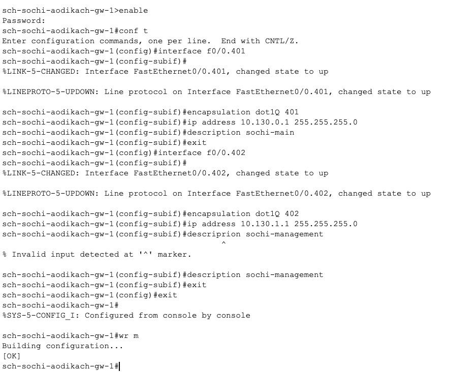
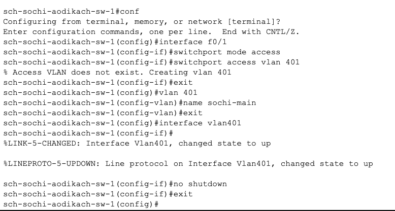
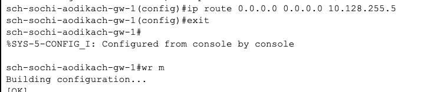
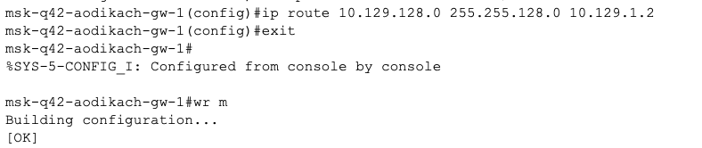

---
## Front matter
title: "Лабораторная работа №14"
subtitle: "Админимстрирование локальных сетей"
author: "Дикач Анна Олеговна НПИбд-01-22"

## Generic otions
lang: ru-RU
toc-title: "Содержание"

## Bibliography
bibliography: bib/cite.bib
csl: pandoc/csl/gost-r-7-0-5-2008-numeric.csl

## Pdf output format
toc: true # Table of contents
toc-depth: 2
lof: true # List of figures
lot: true # List of tables
fontsize: 12pt
linestretch: 1.5
papersize: a4
documentclass: scrreprt
## I18n polyglossia
polyglossia-lang:
  name: russian
  options:
  - spelling=modern
  - babelshorthands=true
polyglossia-otherlangs:
  name: english
## I18n babel
babel-lang: russian
babel-otherlangs: english
## Fonts
mainfont: IBM Plex Serif
romanfont: IBM Plex Serif
sansfont: IBM Plex Sans
monofont: IBM Plex Mono
mathfont: STIX Two Math
mainfontoptions: Ligatures=Common,Ligatures=TeX,Scale=0.94
romanfontoptions: Ligatures=Common,Ligatures=TeX,Scale=0.94
sansfontoptions: Ligatures=Common,Ligatures=TeX,Scale=MatchLowercase,Scale=0.94
monofontoptions: Scale=MatchLowercase,Scale=0.94,FakeStretch=0.9
mathfontoptions:
## Biblatex
biblatex: true
biblio-style: "gost-numeric"
biblatexoptions:
  - parentracker=true
  - backend=biber
  - hyperref=auto
  - language=auto
  - autolang=other*
  - citestyle=gost-numeric
## Pandoc-crossref LaTeX customization
figureTitle: "Рис."
tableTitle: "Таблица"
listingTitle: "Листинг"
lofTitle: "Список иллюстраций"
lotTitle: "Список таблиц"
lolTitle: "Листинги"
## Misc options
indent: true
header-includes:
  - \usepackage{indentfirst}
  - \usepackage{float} # keep figures where there are in the text
  - \floatplacement{figure}{H} # keep figures where there are in the text
---

# Цель работы

Настроить взаимодействие через сеть провайдера посредством статической маршрутизации локальной сети организации с сетью основного здания, расположенного в 42-м квартале в Москве, и сетью филиала, расположенного в г. Сочи.

# Выполнение лабораторной работы

1. Приступая к настройке связи ммежду территориями. Для начала настраиваю интерфейсы коммутатора provider-aodikach-sw-1 (рис. [-@fig:001]).

{#fig:001 width=70%}

2. Провожу настройку интерфейсов маршрутизатора msk-donskaya-aodikach-gw-1 (рис. [-@fig:002]).

{#fig:002 width=70%}

3. Провожу настройку интерфейсов маршрутизатора msk-q42-aodikach-gw-1 [@wiki] (рис. [-@fig:003]).

{#fig:003 width=70%}

4. Провожу настройку интерфейсов коммутатора sci-sochi-aodikach-sw-1 и маршрутизатора sch-sochi-aodikach-gw-1 (рис. [-@fig:004]) (рис. [-@fig:004]).

{#fig:004 width=70%}

{#fig:005 width=70%}

5. Перехожу к настройке площадки 42-го квартала. Для начала настраиваю интерфейсы маршрутизатора msk-q42-aodikach-gw-1 (рис. [-@fig:006]).

{#fig:006 width=70%}

6. Далее настраиваю коммутатор msk-q42-aodikach-sw-1 (рис. [-@fig:007]).

{#fig:007 width=70%}

7. Провржу настроку интерфейсов маршрутизирующего коммутатора msk-hostel-aodikach-gw-1 и коммутатора msk-hostel-sw-1 (рис. [-@fig:008]) (рис. [-@fig:009]).

{#fig:008 width=70%}

{#fig:009 width=70%}

8. Перехожу к настроке площадки в Сочи. Для 'njuj' настраиваю интерфейсы маршрутищатора sch-sochi-aodikch-gw-1 и коммутатора shi-sochi-sw-1 (рис. [-@fig:010]) (рис. [-@fig:011]).

{#fig:010 width=70%}

{#fig:011 width=70%}

9. Перехожу к настройке маршрутизации между площадками. Для этого настраиваю маршрутизатороы на Донской,  42 квартале и  Сочи (рис. [-@fig:012])(рис. [-@fig:013])(рис. [-@fig:014]).

{#fig:012 width=70%}

{#fig:013 width=70%}

{#fig:014 width=70%}

10. Провожу настройку маршрутизвции на 42 квартале (настраиваю машрутизатор и маршрутизирующий коммутатор) (рис. [-@fig:015])(рис. [-@fig:016]).

{#fig:015 width=70%}

{#fig:016 width=70%}

11. Настраиваю NAT на маршрутизаторе msk-donskaya-aodikch-gw-1 (рис. [-@fig:017]).

{#fig:017 width=70%}

# Вывод

Настроила взаимодействие через сеть провайдера посредством статической маршрутизации локальной сети организации с сетью основного здания.

# Ответ на вопросы

1. Пример настройки статической маршрутизации

Маршрутизатор 1:

bash
ip route 192.168.2.0 255.255.255.0 192.168.1.2
Маршрутизатор 2:

bash
ip route 192.168.1.0 255.255.255.0 192.168.1.1

2. Обращение между VLAN

Трафик идет на шлюз (L3-коммутатор/маршрутизатор).
Шлюз маршрутизирует трафик в другой VLAN.

3. Проверка маршрута

bash
ping 192.168.2.10  # с устройства из VLAN 1
traceroute 192.168.2.10  # путь трафика

4. Просмотр таблицы маршрутизации

bash
show ip route  # Cisco
ip route show  # Linux
route print    # Windows

# Список литературы {.unnumbered}

::: {#refs}
:::

