---
## Front matter
lang: ru-RU
title: Лабораторная работа №15
subtitle: Администрирование локальных сетей
author:
  - Дикач А.О.
institute:
  - Российский университет дружбы народов, Москва, Россия
date: 

## i18n babel
babel-lang: russian
babel-otherlangs: english

## Formatting pdf
toc: false
toc-title: Содержание
slide_level: 2
aspectratio: 169
section-titles: true
theme: metropolis
header-includes:
 - \metroset{progressbar=frametitle,sectionpage=progressbar,numbering=fraction}
---

# Информация

## Докладчик

  * Дикач Анна Олеговна
  * НПИбд-01-22 (1132222009)
  * Российский университет дружбы народов
  * <https://github.com/chelibos?tab=repositories>

## Цель работы

Настроить динамическую маршрутизацию между территориями организации.

# Выполнение лабораторной работы

## Настроиваю динамическую маршрутизацию по протоколу OSPF

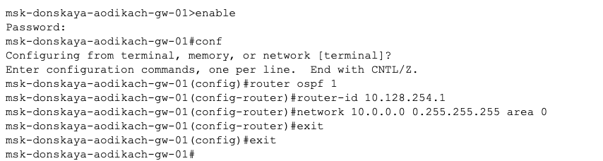{#fig:001 width=70%}

##

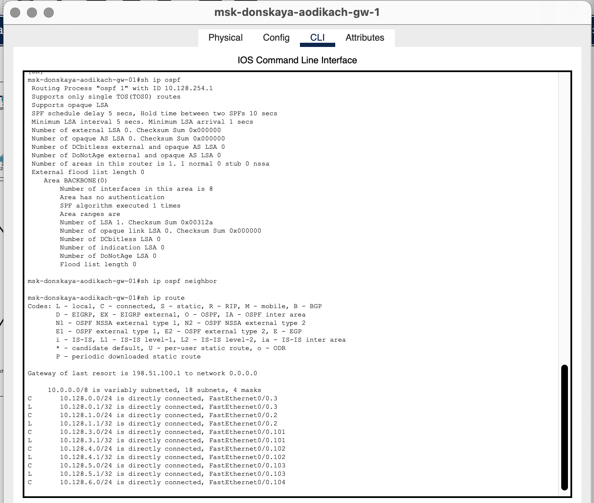{#fig:002 width=70%}

##

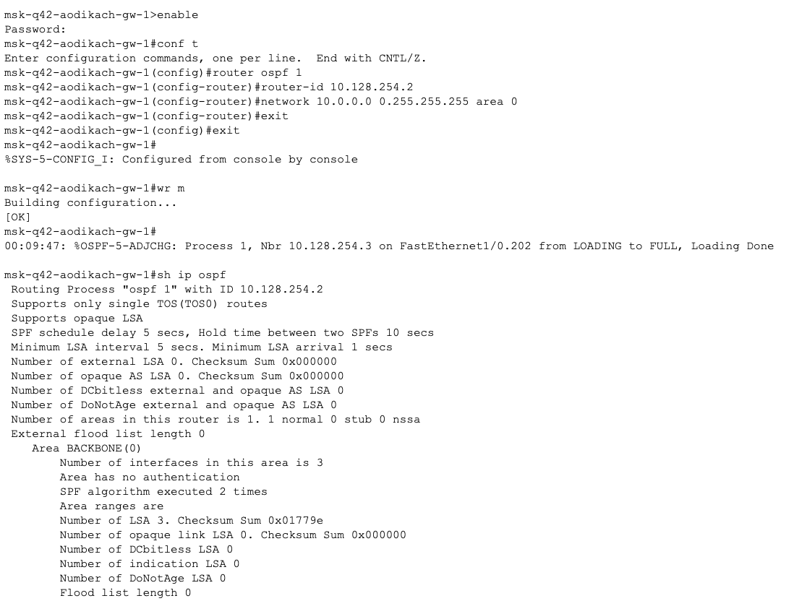{#fig:003 width=70%}

##

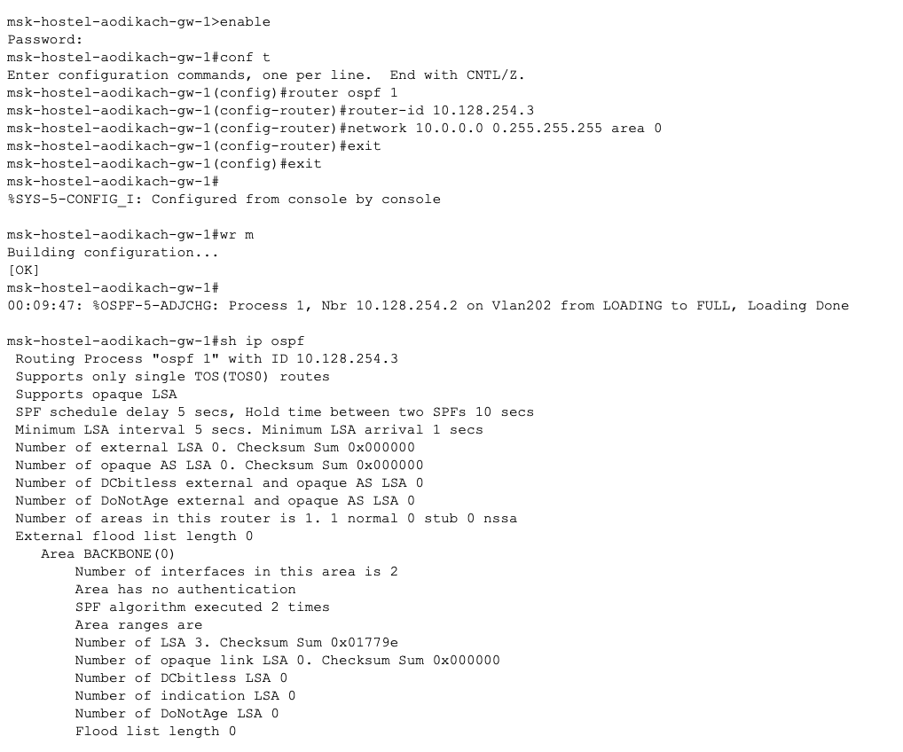{#fig:004 width=70%}

##

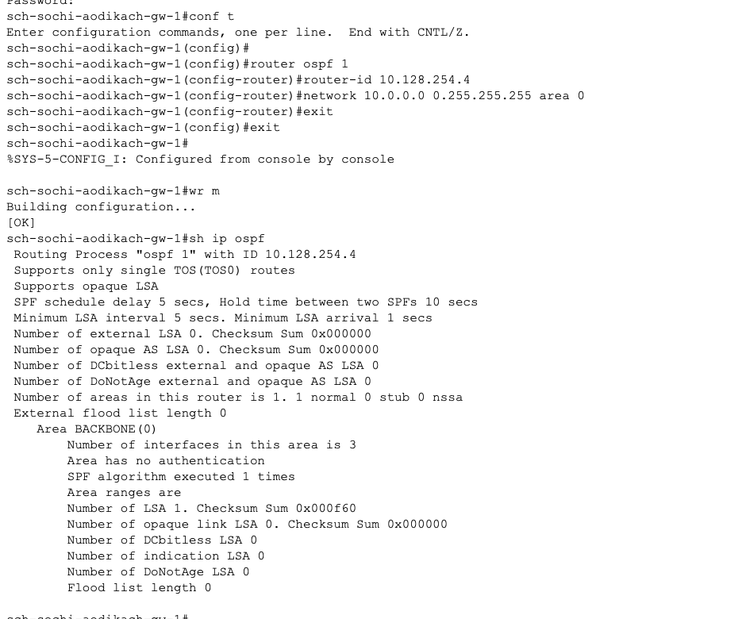{#fig:005 width=70%}

##  Настраиваю связь сети 42 квартала в Москве с сетью филиала в г. Сочи

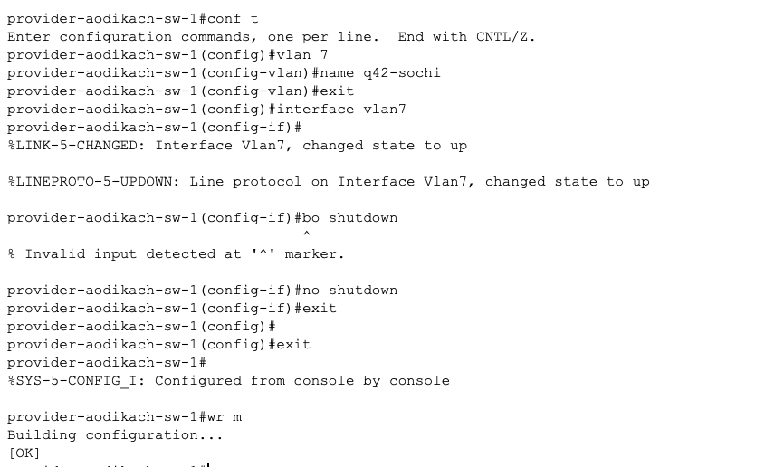{#fig:006 width=70%}

##

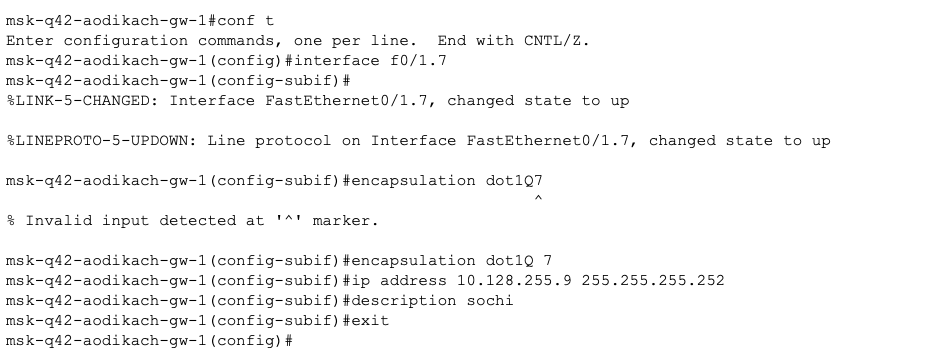{#fig:007 width=70%}

##

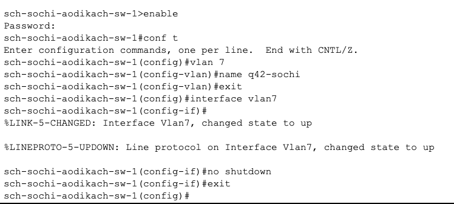{#fig:008 width=70%}

##

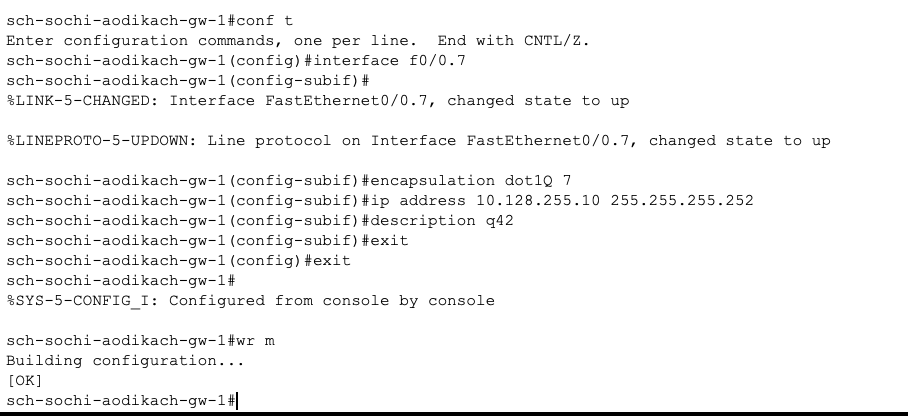{#fig:009 width=70%}

## Просматриваю движение ICMP пакета

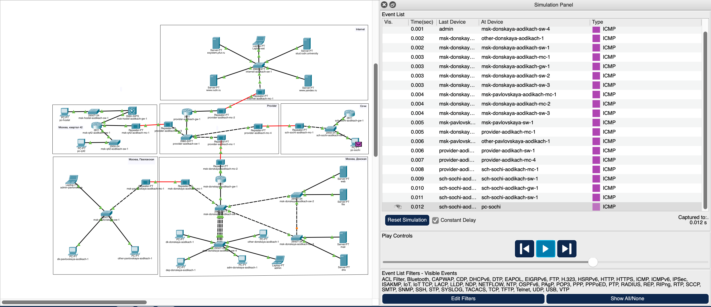{#fig:010 width=70%}

## Отключаю vlan 6 на провайдере и заново запускаю симуляцию

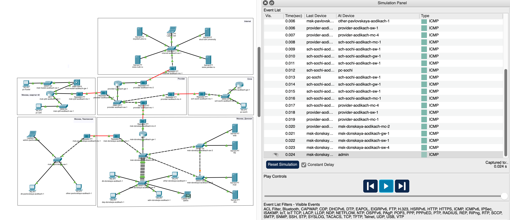{#fig:011 width=70%}

##  Восстанавливаю работу vlan 6 на устрйостве провайдера

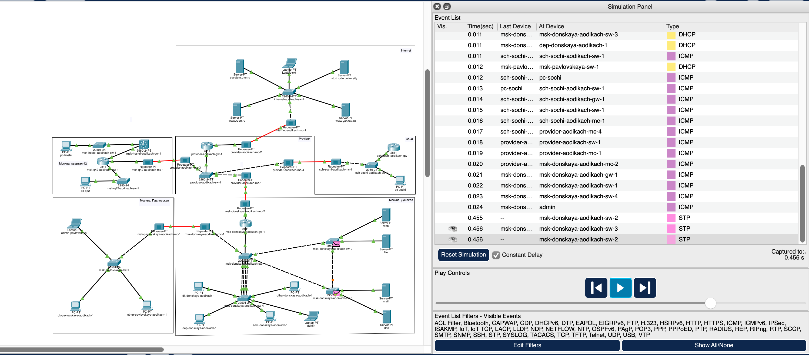{#fig:012 width=70%}

## Вывод

Настроила динамическую маршрутизацию между территориями организации.

