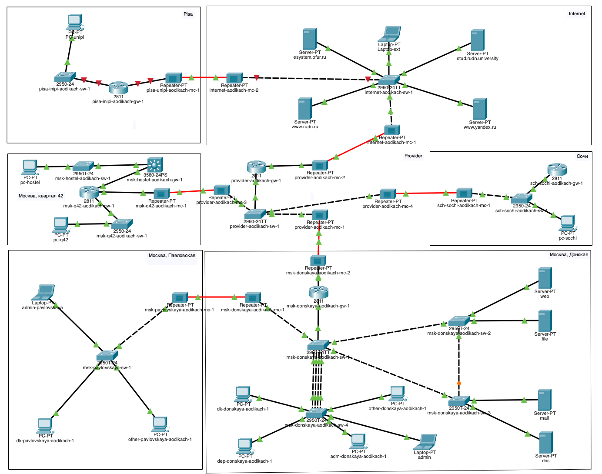
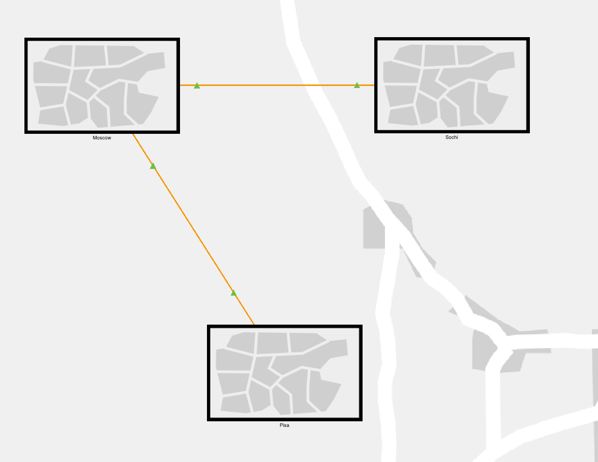
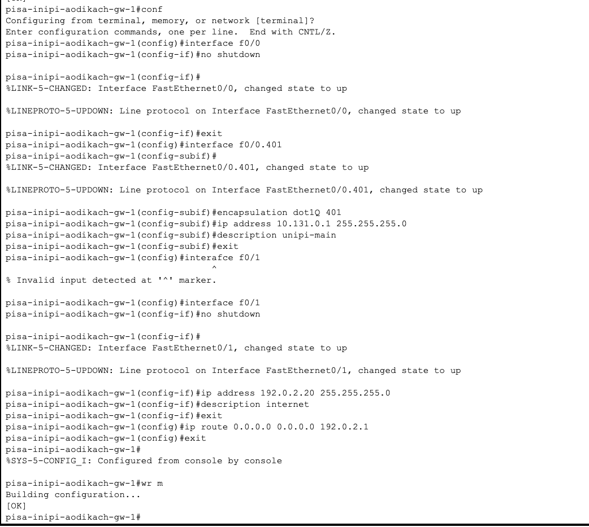
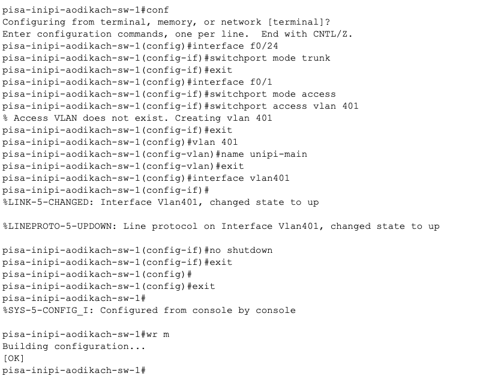
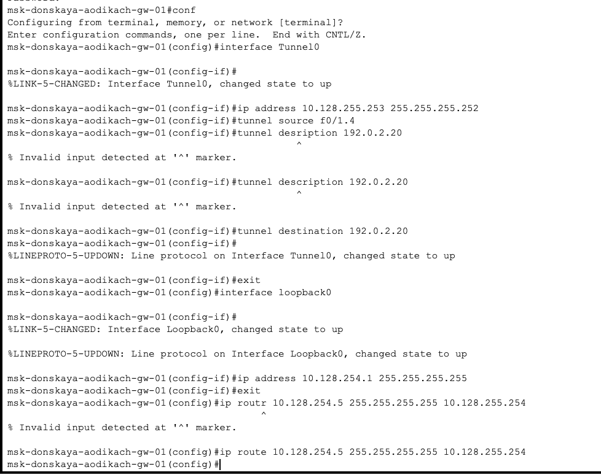
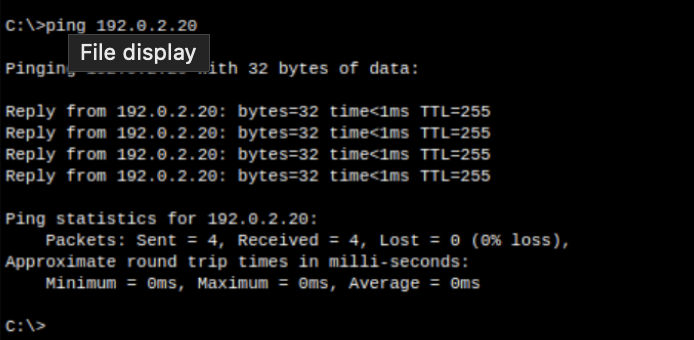

---
## Front matter
lang: ru-RU
title: Лабораторная работа №16
subtitle: Администрирование локальных сетей
author:
  - Дикач А.О.
institute:
  - Российский университет дружбы народов, Москва, Россия
date: 

## i18n babel
babel-lang: russian
babel-otherlangs: english

## Formatting pdf
toc: false
toc-title: Содержание
slide_level: 2
aspectratio: 169
section-titles: true
theme: metropolis
header-includes:
 - \metroset{progressbar=frametitle,sectionpage=progressbar,numbering=fraction}
---

# Информация

## Докладчик

  * Дикач Анна Олеговна
  * НПИбд-01-22 (1132222009)
  * Российский университет дружбы народов
  * <https://github.com/chelibos?tab=repositories>

## Цель работы

Получение навыков настройки VPN-туннеля через незащищённое Интернет соединение.

# Выполнение лабораторной работы

##  Размещаю в рабочей области проекта оборудывание для улицы г. Пиза

{#fig:001 width=70%}

##  В физической чатси создаю новый город Пиза, улицу и переношу всё необходимое оборудывание

{#fig:002 width=25%}

{#fig:003 width=20%}

## Провожу первоначальную настройку площадки города Пиза. Для этого настраиваю маршрутизатор и коммутатор

{#fig:004 width=70%}

##

{#fig:005 width=70%}

## Провожу настройку интерфейсов на маршрутизаторе и коммутаторе

{#fig:006 width=70%}

##

{#fig:007 width=70%}

## Далее перехожу к настройке VPN на основе GRE на маршрутиазторе на улице Донская и маршруизатора в городе Пиза

{#fig:008 width=70%}

## 

{#fig:009 width=70%}

##  Проверяю корректность выполнения с помощью пингования администратором сети Донская узлов университета в городе Пиза

{#fig:010 width=60%}

## Вывод

Получила навыки настрйоки VPN-туннеля через незащщённое Интернет соединение.

