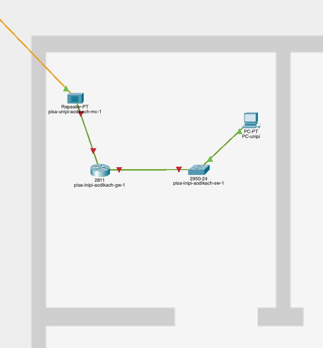
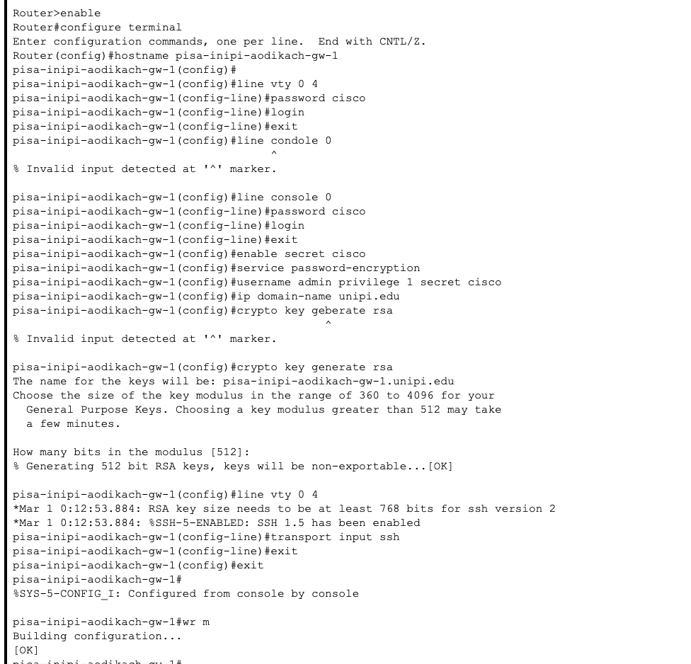
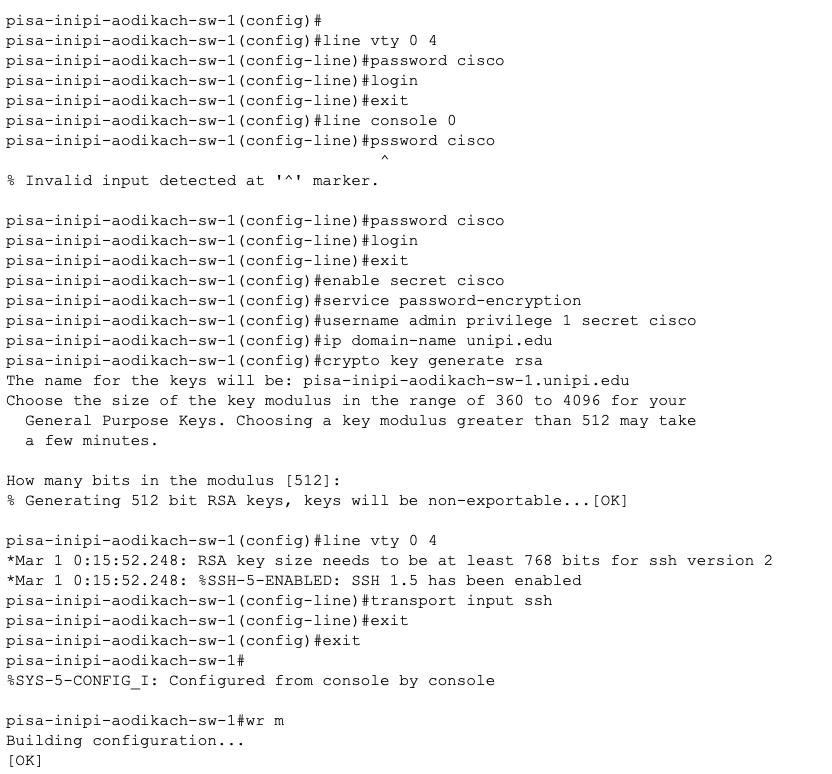
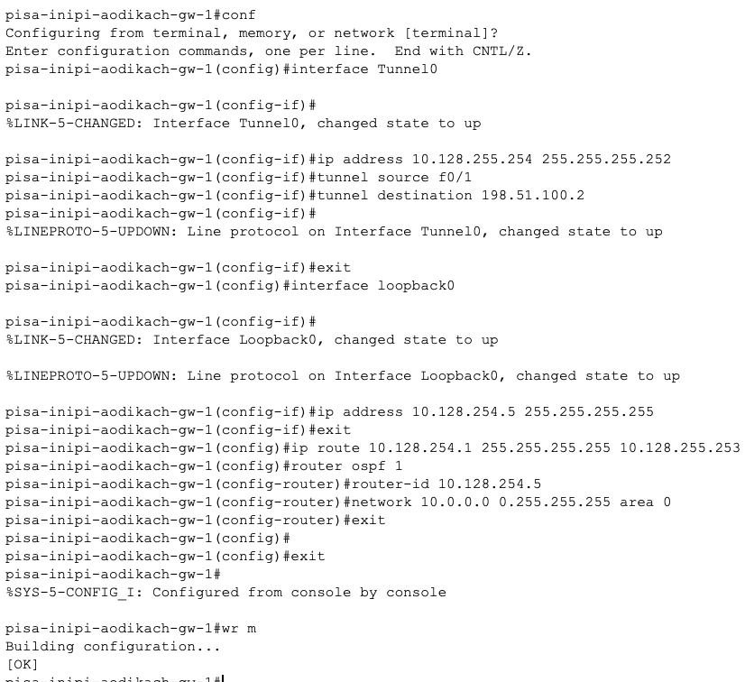

---
## Front matter
title: "Лабораторная работа №16"
subtitle: "Админимстрирование локальных сетей"
author: "Дикач Анна Олеговна НПИбд-01-22"

## Generic otions
lang: ru-RU
toc-title: "Содержание"

## Bibliography
bibliography: bib/cite.bib
csl: pandoc/csl/gost-r-7-0-5-2008-numeric.csl

## Pdf output format
toc: true # Table of contents
toc-depth: 2
lof: true # List of figures
lot: true # List of tables
fontsize: 12pt
linestretch: 1.5
papersize: a4
documentclass: scrreprt
## I18n polyglossia
polyglossia-lang:
  name: russian
  options:
  - spelling=modern
  - babelshorthands=true
polyglossia-otherlangs:
  name: english
## I18n babel
babel-lang: russian
babel-otherlangs: english
## Fonts
mainfont: IBM Plex Serif
romanfont: IBM Plex Serif
sansfont: IBM Plex Sans
monofont: IBM Plex Mono
mathfont: STIX Two Math
mainfontoptions: Ligatures=Common,Ligatures=TeX,Scale=0.94
romanfontoptions: Ligatures=Common,Ligatures=TeX,Scale=0.94
sansfontoptions: Ligatures=Common,Ligatures=TeX,Scale=MatchLowercase,Scale=0.94
monofontoptions: Scale=MatchLowercase,Scale=0.94,FakeStretch=0.9
mathfontoptions:
## Biblatex
biblatex: true
biblio-style: "gost-numeric"
biblatexoptions:
  - parentracker=true
  - backend=biber
  - hyperref=auto
  - language=auto
  - autolang=other*
  - citestyle=gost-numeric
## Pandoc-crossref LaTeX customization
figureTitle: "Рис."
tableTitle: "Таблица"
listingTitle: "Листинг"
lofTitle: "Список иллюстраций"
lotTitle: "Список таблиц"
lolTitle: "Листинги"
## Misc options
indent: true
header-includes:
  - \usepackage{indentfirst}
  - \usepackage{float} # keep figures where there are in the text
  - \floatplacement{figure}{H} # keep figures where there are in the text
---

# Цель работы

Получение навыков настройки VPN-туннеля через незащищённое Интернет соединение.

# Выполнение лабораторной работы

1. Размещаю в рабочей области проекта оборудывание для улицы г. Пиза (рис. [-@fig:001]).

{#fig:001 width=70%}

2. В физической чатси создаю новый город Пиза, улицу и переношу всё необходимое оборудывание (рис. [-@fig:002]) (рис. [-@fig:003]).

{#fig:002 width=70%}

{#fig:003 width=70%}

3. Провожу первоначальную настройку площадки города Пиза. Для этого настраиваю маршрутизатор и коммутатор (рис. [-@fig:004]) (рис. [-@fig:005]).

{#fig:004 width=70%}

{#fig:005 width=70%}

4. Провожу настройку интерфейсов на маршрутизаторе и коммутаторе (рис. [-@fig:006]) (рис. [-@fig:007]).

{#fig:006 width=70%}

{#fig:007 width=70%}

5. Далее перехожу к настройке VPN на основе GRE на маршрутиазторе на улице Донская и маршруизатора в городе Пиза (рис. [-@fig:008]) (рис. [-@fig:009]).

{#fig:008 width=70%}

{#fig:009 width=70%}

6. Проверяю корректность выполнения с помощью пингования администратором сети Донская узлов университета в городе Пиза (рис. [-@fig:010]).

{#fig:010 width=70%}

# Вывод

Получила навыки настрйоки VPN-туннеля через незащщённое Интернет соединение.

# Ответ на вопросы

1. Что такое VPN?

VPN (Virtual Private Network) – защищённый туннель между устройствами через интернет, шифрующий трафик и скрывающий реальный IP.

2. Когда использовать VPN?

Доступ к корпоративной сети извне.
Обход блокировок (сайтов, сервисов).
Защита данных в публичных Wi-Fi.
Скрытие IP (анонимность).
3. Как VPN обходит NAT?

Подключение к VPN-серверу – трафик идёт через туннель, а не через локальный NAT.
Сервер подменяет IP – внешние сервисы видят адрес VPN, а не ваш реальный.
Пример:

Вы подключаетесь к VPN (например, OpenVPN/WireGuard).
Ваш запрос к сайту идёт через VPN-сервер.
Сайт видит IP сервера, а не ваш NAT-адрес.
Итог: NAT остаётся на вашей стороне, но в интернете вы "маскируетесь" под VPN-сервер.

# Список литературы {.unnumbered}

::: {#refs}
:::

