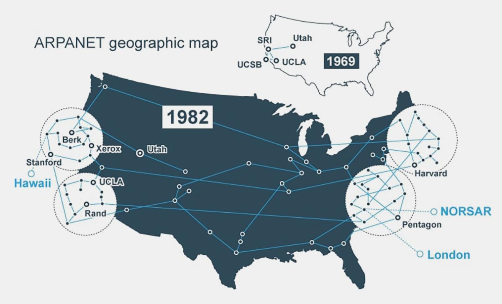
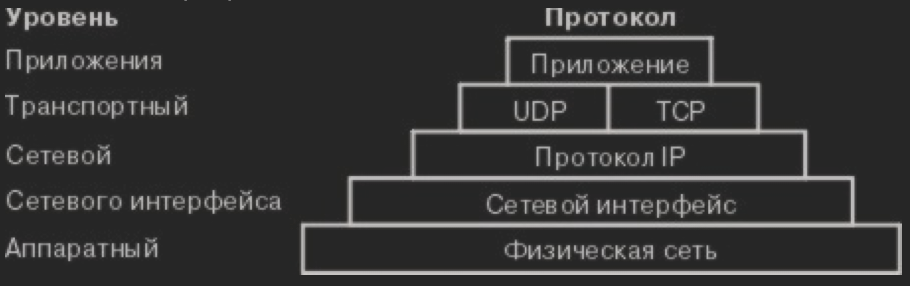
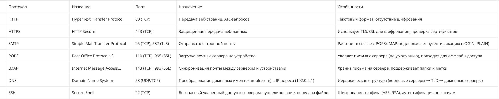
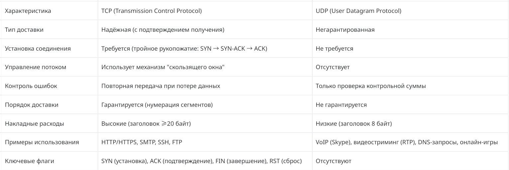
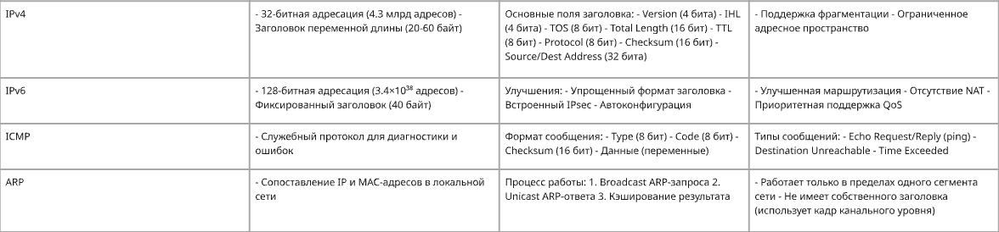
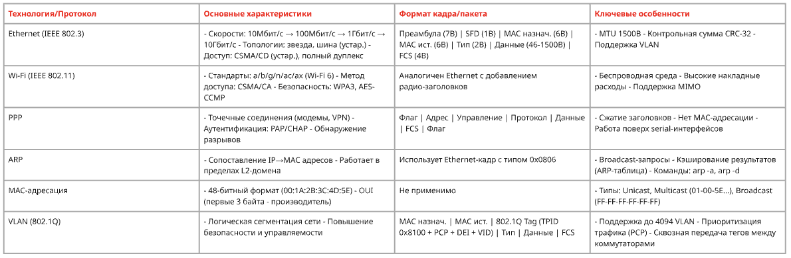

---
## Front matter
title: "Доклад"
subtitle: "Стек протоколов TCP/IP"
author: "Дикач Анна Олеговна НПИбд-01-22"

## Generic otions
lang: ru-RU
toc-title: "Содержание"

## Bibliography
bibliography: bib/cite.bib
csl: pandoc/csl/gost-r-7-0-5-2008-numeric.csl

## Pdf output format
toc: true # Table of contents
toc-depth: 2
lof: true # List of figures
lot: true # List of tables
fontsize: 12pt
linestretch: 1.5
papersize: a4
documentclass: scrreprt
## I18n polyglossia
polyglossia-lang:
  name: russian
  options:
  - spelling=modern
  - babelshorthands=true
polyglossia-otherlangs:
  name: english
## I18n babel
babel-lang: russian
babel-otherlangs: english
## Fonts
mainfont: IBM Plex Serif
romanfont: IBM Plex Serif
sansfont: IBM Plex Sans
monofont: IBM Plex Mono
mathfont: STIX Two Math
mainfontoptions: Ligatures=Common,Ligatures=TeX,Scale=0.94
romanfontoptions: Ligatures=Common,Ligatures=TeX,Scale=0.94
sansfontoptions: Ligatures=Common,Ligatures=TeX,Scale=MatchLowercase,Scale=0.94
monofontoptions: Scale=MatchLowercase,Scale=0.94,FakeStretch=0.9
mathfontoptions:
## Biblatex
biblatex: true
biblio-style: "gost-numeric"
biblatexoptions:
  - parentracker=true
  - backend=biber
  - hyperref=auto
  - language=auto
  - autolang=other*
  - citestyle=gost-numeric
## Pandoc-crossref LaTeX customization
figureTitle: "Рис."
tableTitle: "Таблица"
listingTitle: "Листинг"
lofTitle: "Список иллюстраций"
lotTitle: "Список таблиц"
lolTitle: "Листинги"
## Misc options
indent: true
header-includes:
  - \usepackage{indentfirst}
  - \usepackage{float} # keep figures where there are in the text
  - \floatplacement{figure}{H} # keep figures where there are in the text
---

# Введение 

Современные компьютерные сети являются основой информационного обмена в глобальном масштабе. Одной из ключевых технологий, обеспечивающих работу интернета и локальных сетей, является стек протоколов TCP/IP. Данный набор протоколов определяет правила передачи данных между устройствами и обеспечивает надежную коммуникацию в разнородных сетевых средах.

В данном докладе рассматриваются основные принципы работы стека TCP/IP, его уровни и ключевые протоколы, а также их роль в сетевых технологиях.

# История возникновения

Протокол был создан Министерством обороны США в 1972 году, и его запустили в ARPANET, глобальной сети этого министерства.
По аналогии с моделью OSI (Open System Interconnection), которая описывает уровни или уровни стека протоколов, хотя на практике она не совсем соответствует модели в Интернете.
TCP / IP является преемником программы управления сетью (NC) и первым был представлен в RFC 791, RFC 7923 и РF 7934 в сентябре 1981 года. План перехода был представлен в ноябре 1983 года RFC 8015 (рис. [-@fig:006]).

{#fig:006 width=70%}

# Понятие стека протколов TCP/IP

Протоколом называется набор правил, задающих форматы сообщений и процедуры, которые позволяют компьютерам и прикладным программам обмениваться информацией. Эти правила соблюдаются каждым компьютером в сети, в результате чего любой хост-получатель может понять отправленное ему сообщение. 

**Стек протоколов TCP/IP (Transmission Control Protocol / Internet Protocol)** — это набор сетевых протоколов, который определяет стандарты передачи данных и содержит подробные соглашения о маршрутизации и межсетевом взаимодействии. TCP/IP широко используется в сети Интернет, поэтому с его помощью пользователи могут общаться с пользователями из исследовательских институтов, школ, университетских учреждений или промышленных предприятий.

В протоколе TCP/IP строго зафиксированы правила передачи информации от отправителя к получателю. 

В отличие от модели OSI (7 уровней), стек TCP/IP использует упрощенную четырехуровневую модель (рис. [-@fig:001]):

- Прикладной уровень (Application)
- Транспортный уровень (Transport)
- Сетевой уровень (Internet)
- Канальный уровень (Link) 

{#fig:001 width=70%}

# Уровни стека TCP/IP и их функции

## Прикладной уровень (Application Layer)

**Прикладной уровень (Application Layer)**  — это верхний уровень стека TCP/IP, который обеспечивает взаимодействие сетевых служб и приложений с пользователем. В отличие от нижних уровней, которые занимаются транспортировкой данных, этот уровень обеспечивает сетевые сервисы и интерфейсы для приложений.

### Функции 

Данный уровень обеспечивает интерфейс между пользовательскими приложениями и сетью, определяя форматы данных и правила их обработки (такие как HTTP для веб-страниц или SMTP для почты). Он также управляет сеансами связи между клиентом и сервером и может поддерживать аутентификацию, шифрование и сжатие данных.

### Основные протоколы

- HTTP/HTTPS — передача веб-страниц
- FTP — передача файлов
- SMTP, POP3, IMAP — работа с электронной почтой
- DNS — преобразование доменных имен в IP-адреса
- SSH — безопасный удаленный доступ (рис. [-@fig:002])

{#fig:002 width=70%}

## Транспортный уровень (Transport Layer)

## Назначение и функции

**Транспортный уровень**  выполняет несколько ключевых функций, обеспечивающих надежную и эффективную передачу данных. 

*Во-первых*, он осуществляет **сегментацию данных**, разбивая большие блоки информации от прикладного уровня на пакеты (сегменты для TCP или датаграммы для UDP). *Во-вторых*, он отвечает за **управление доставкой**, предоставляя либо гарантированную передачу (как в TCP), либо более простую, но менее надежную (как в UDP).

Кроме того, транспортный уровень обеспечивает **мультиплексирование и демультиплексирование**, позволяя передавать данные нескольких приложений через один сетевой интерфейс с использованием портов. Также он выполняет **контроль ошибок**, обнаруживая и исправляя поврежденные данные (или запрашивая их повторную передачу). Наконец, важной функцией является управление потоком, которое предотвращает перегрузку сети, особенно в протоколе TCP.

### Основные протоколы

- TCP (Transmission Control Protocol)
- UDP (User Datagram Protocol) (рис. [-@fig:003])

{#fig:003 width=70%}

## Сетевой уровень (Internet Layer)

## Назначение и функции

**Сетевой уровень (Internet Layer)** играет фундаментальную роль в стеке TCP/IP, выполняя три основные группы функций:

1. *Логическая адресация*
Уровень обеспечивает систему уникальной идентификации узлов в сети через:
- Назначение IP-адресов (как IPv4, так и IPv6)
- Логическую организацию адресного пространства (разбиение на подсети и объединение в суперсети)
- Поддержку специальных адресов (широковещательных, multicast)

2. *Маршрутизация пакетов*
Ключевая функция уровня включает:
- Определение оптимальных маршрутов передачи данных через сеть
- Обеспечение межсетевого взаимодействия между различными сетями
- Поддержку протоколов маршрутизации (OSPF, BGP, RIP и др.)
- Принятие решений о пересылке пакетов на основе таблиц маршрутизации

3. *Фрагментация и сборка*
Уровень решает проблемы, связанные с:
- Адаптацией размера пакетов к различным MTU (Maximum Transmission Unit) сетевых интерфейсов
- Разделением пакетов на фрагменты при передаче через сети с разными MTU
- Корректной сборкой фрагментированных пакетов на стороне получателя

*Дополнительно сетевой уровень может обеспечивать:*

- Качество обслуживания (QoS)
- Базовые механизмы безопасности
- Поддержку multicast-трафика

### Основные протоколы

(рис. [-@fig:004])

{#fig:004 width=70%}

## Канальный уровень (Link Layer)

## Назначение и функции

**Канальный уровень (Link Layer)** представляет собой нижний уровень стека TCP/IP, который отвечает за физическую передачу данных между непосредственно соединенными узлами в пределах одной сети. Этот уровень выполняет несколько критически важных функций: обеспечивает передачу данных через физическую среду, используя аппаратную адресацию с помощью MAC-адресов для идентификации устройств в сети.

Одной из ключевых задач канального уровня является **обнаружение и коррекция ошибок передачи данных**, что реализуется через различные механизмы контроля целостности информации. Кроме того, данный уровень управляет доступом к общей среде передачи, например, в технологиях Ethernet, регулируя порядок и очередность передачи данных между устройствами в сети. Эти функции делают канальный уровень фундаментальным для надежной передачи информации на самом нижнем уровне сетевого взаимодействия.

### Основные протоколы

(рис. [-@fig:005])

{#fig:005 width=70%}

# Принципы работы TCP/IP

## Пакетная коммутация

TCP/IP использует принцип пакетной коммутации, при котором:

- Данные разбиваются на отдельные пакеты
- Каждый пакет содержит адресную информацию
- Пакеты могут передаваться разными маршрутами
- На стороне получателя происходит сборка исходных данных

## Многоуровневая архитектура

Стек протоколов организован по принципу разделения ответственности между уровнями.

## Сквозная архитектура (End-to-End Principle)

Принцип сквозной архитектуры является концепцией TCP/IP, которая предполагает минимальную функциональность самой сети, перенося основную логику обработки данных на конечные узлы. Согласно этому подходу, сеть выступает лишь как среда передачи, обеспечивающая базовые транспортные функции, в то время как такие важные аспекты как контроль ошибок, обеспечение безопасности и управление соединением реализуются конечными точками связи. Такая архитектура позволяет сохранить простоту и гибкость сетевой инфраструктуры, делегируя сложную логику приложениям и конечным устройствам.

# Преимущества стека TCP/IP

## Универсальность и совместимость

1. *Независимость от платформ*

TCP/IP работает на любых операционных системах (Windows, Linux, macOS) и устройствах (компьютеры, смартфоны, IoT-устройства). Это обеспечивает:

- Кросс-платформенное взаимодействие
- Поддержку гетерогенных сетей
- Простую интеграцию новых устройств

2. *Агностичность к физическим технологиям*

Стек функционирует поверх:

- Ethernet
- Wi-Fi
- Оптоволоконных линий
- Сотовых сетей (4G/5G)
- Спутниковых каналов связи

## Масштабируемость

**Мастшабируемость** позволяет поддерживать сети любого размера - от небольших локальных сетей (LAN) до глобального интернета. Это стало возможным благодаря нескольким фундаментальным принципам:

*Иерархическая система адресации*, которая организует пространство IP-адресов в логическую структуру, упрощающую маршрутизацию.
*Децентрализованная маршрутизация*, где каждый маршрутизатор принимает решения независимо, что исключает единые точки отказа.
Автоматическая настройка через протокол DHCP, значительно упрощающая подключение новых устройств.
Гибкость архитектуры TCP/IP проявляется в:

- Возможности плавного добавления новых узлов без необходимости кардинального изменения сетевой структуры
- Способности поддерживать работу миллионов одновременно подключенных устройств
- Эффективной адаптации к постоянно растущему сетевому трафику

Такая масштабируемая архитектура сделала TCP/IP универсальным стандартом, способным развиваться вместе с экспоненциальным ростом интернета и появлением новых типов сетевых устройств.

## Надёжность передачи данных 

Протокол TCP обеспечивает **надежную доставку данных** через комплекс механизмов, гарантирующих целостность и последовательность информации. Основу этой системы составляют:

*Механизмы гарантированной доставки:*
- Система подтверждения получения (ACK) позволяет отправителю убедиться в успешной доставке данных
- Автоматическая повторная передача потерянных или поврежденных пакетов
- Строгий контроль последовательности для правильной сборки данных получателем
- Технология "скользящего окна" (Sliding Window) для эффективного управления потоком и предотвращения перегрузок

*Система отказоустойчивости:*
- Интеллектуальная маршрутизация с автоматическим выбором альтернативных путей при обрывах связи
- Устойчивость к частичным отказам сети благодаря децентрализованной архитектуре
- Динамическая адаптация к изменениям топологии сети и условиям трафика

Эти механизмы работают в комплексе, обеспечивая бесперебойную передачу данных даже в условиях нестабильных сетевых соединений. 

## Эффективность работы

Система оптимизирует использование ресурсов за счет:

- минимальных накладных расходов при передаче данных,
- рационального распределения полосы пропускания,
- поддержки механизмов QoS (Quality of Service) для приоритетной обработки критически важного трафика.

Также важную роль играет четкое **разделение ответственности между уровнями**, где каждый выполняет строго определенные функции.

## Безопасность 

**Многоуровневая система защиты**

Архитектура предусматривает встроенные средства безопасности:

- На сетевом уровне реализована поддержка IPSec, обеспечивающая сквозное шифрование и аутентификацию пакетов
- Транспортный уровень защищается протоколами TLS/SSL, гарантирующими конфиденциальность и целостность передаваемых данных
- Системы аутентификации и авторизации позволяют точно контролировать доступ к сетевым ресурсам

**Адаптивная система безопасности**

TCP/IP поддерживает гибкое внедрение различных механизмов защиты:

- Технологии VPN для создания защищенных туннелей через публичные сети
- Многоуровневые брандмауэры для фильтрации и контроля сетевого трафика
- Интеллектуальные системы обнаружения и предотвращения вторжений (IDS/IPS)
- Возможность тонкой настройки политик безопасности под конкретные требования

Такая многослойная система защиты позволяет эффективно противостоять современным киберугрозам, обеспечивая при этом гибкость и адаптируемость к различным сценариям использования. 

## Открытость и стандартизация

1. *Публичные спецификации*
Все технические детали протоколов TCP/IP открыто документируются в RFC (Request for Comments) — специальных документах, которые проходят публичное обсуждение. Это обеспечивает:

- Демократичный процесс разработки, где каждый может внести свой вклад;
- Полную прозрачность технологий, исключающую скрытые механизмы;
- Свободу независимых реализаций, благодаря чему TCP/IP поддерживается на любых устройствах и платформах.

2. *Всемирная поддержка*
Благодаря открытости TCP/IP сформировал глобальную экосистему:

- Производители сетевого оборудования выпускают устройства с полной совместимостью;
- Накоплена обширная база знаний — от официальной документации до практических руководств;
- Огромное сообщество экспертов постоянно развивает и совершенствует технологии.

## Поддержка современных технологий

Современные реализации стека TCP/IP активно развиваются, предлагая поддержку передовых сетевых технологий.

1. *IPv6* — новое поколение интернет-протокола
IPv6 кардинально решает ключевые проблемы своего предшественника:

- Гигантское адресное пространство (128-битные адреса) устраняет дефицит IP-адресов
- Оптимизированная система маршрутизации с более эффективной агрегацией префиксов
- Встроенные механизмы безопасности, включая обязательную поддержку IPSec

2. *Инновационные протоколы нового поколения*
Архитектура продолжает развиваться благодаря:

- HTTP/3 на базе QUIC, обеспечивающему молниеносную передачу данных за счёт уменьшения задержек
- Специализированным IoT-версиям протоколов, адаптированным для работы с ограниченными устройствами
- Технологиям SDN (Программно-определяемых сетей), добавляющим гибкость в управление сетевыми ресурсами

Эти инновации демонстрируют способность TCP/IP-стека эволюционировать, сохраняя при этом обратную совместимость и отвечая вызовам цифровой эпохи

# Заключение

Стек протоколов TCP/IP является фундаментом современных сетевых технологий. Его гибкость, надежность и универсальность позволяют обеспечивать глобальную связь между миллиардами устройств. Понимание принципов работы TCP/IP необходимо для администрирования сетей, разработки сетевых приложений и обеспечения кибербезопасности.

# Список литературы {.unnumbered}

::: {#refs}
:::

